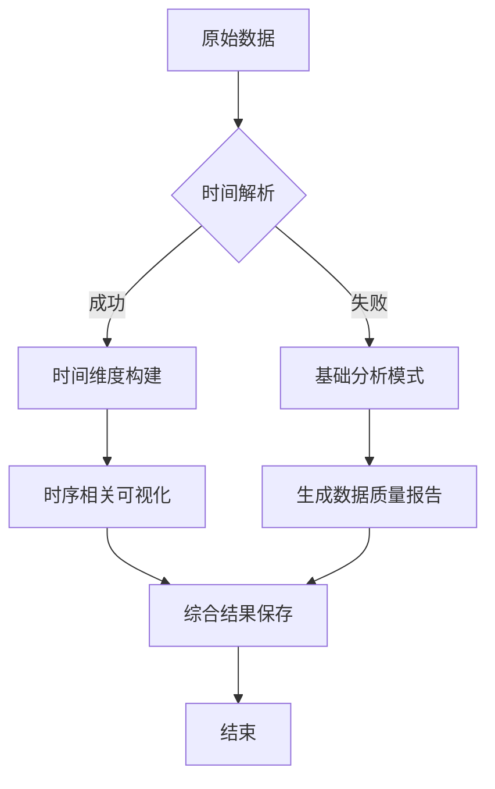

> 💭 好的，现在我要仔细分析用户的问题，并思考如何解决他遇到的错误。根据用户提供的错误信息和之前的对话历史，问题出在时间数据处理和可视化阶段。用户现在给出了一些表头，其中包括'title', 'time', 'content', 'link', 'cleaned_content', 'segmented', 'sentiment', 'quality_score', 'datetime'，但没有实际的时间数据。
>
> 首先，我需要明确问题的关键点：用户在运行时间序列分析时遇到了IndexError，可能是因为数据中的时间字段无效或缺失，导致处理后的DataFrame为空，从而在尝试绘图时失败。用户已经尝试过使用pd.to_datetime转换时间，但由于错误处理为'coerce'，导致很多NaT，进而过滤后数据可能为空。
>
> 下一步，我需要解决用户的问题，即在缺少有效时间数据的情况下如何进行时间序列分析，并防止程序崩溃。可能的解决方案包括：
>
> 1. **检查时间字段的存在和有效性**：用户的数据中存在'time'和'datetime'字段，需要确认这些字段是否包含有效的数据，或者是否全部为缺失值。如果仅有少量有效数据，可能需要调整分析方法。
>
> 2. **改进时间解析的鲁棒性**：在转换时间字段时，使用多种格式尝试解析，并处理可能的异常情况。比如，使用已知的日期格式进行尝试，如果均失败，则放弃时间分析部分，而不是让程序崩溃。
>
> 3. **添加数据有效性检查**：在进行时间相关的分析和可视化之前，检查处理后的DataFrame是否为空。如果为空，则跳过相关步骤，并给出提示，避免后续操作出现错误。
>
> 4. **优化报错信息和日志**：在关键步骤添加日志输出，帮助用户理解数据处理的状态，尤其是在时间解析出现问题时明确告知用户。
>
> 5. **提供替代分析方案**：如果时间数据不可用，考虑转向其他维度的分析，如基于内容的分析或者情感得分的分布，而非强制依赖时间序列。
>
> 根据用户提供的字段，推测用户的DataFrame可能包含一些时间字段（'time'和'datetime'），但可能存在解析问题。用户需要代码即使在时间数据无效的情况下也能继续运行其他分析，而不是抛出错误。
>
> 接下来的解决方案需要：
>
> - 在时间解析阶段，添加详细的错误处理和日志记录。
>
> - 在处理时间数据后，严格检查数据是否存在有效的记录。
>
> - 如果时间数据缺失或无效，跳过时间序列分析和相关可视化，但继续执行其他分析步骤。
>
> - 确保代码在0行时间数据时不会尝试访问空数组的索引，防止IndexError。
>
> 具体实现时，可以拆分时间分析部分为独立函数，并在调用前添加条件检查。例如：
>
> ```python
>
> def analyze_time_data(df):
>
>     # 尝试解析时间字段
>
>     try:
>
>         # 转换时间
>
>         time_series = pd.to_datetime(df['time'], format='混合', errors='coerce')
>
>         df['datetime'] = time_series
>
>         valid_time_df = df[time_series.notna()]
>
>         if valid_time_df.empty:
>
>             print("无有效时间数据，跳过时间分析")
>
>             return None
>
>         # 执行时间分析并返回结果
>
>         return valid_time_df
>
>     except Exception as e:
>
>         print(f"时间解析失败: {e}")
>
>         return None
>
> ```
>
> 在主函数中，首先调用该函数，如果返回None则跳过相关部分：
>
> ```python
>
> time_result = analyze_time_data(df)
>
> if time_result is not None:
>
>     # 进行时间序列分析和绘图
>
> else:
>
>     # 跳过时间分析部分
>
> ```
>
> 此外，在可视化阶段，每个绘图步骤前检查数据是否有效：
>
> ```python
>
> if not monthly_sentiment.empty:
>
>     monthly_sentiment.plot(kind='bar')
>
> else:
>
>     print("无有效月度数据进行绘图")
```
>
> 这样可以确保即使没有时间数据，程序也不会崩溃，并且用户会收到明确的提示，便于后续调试或调整数据处理流程。
>
> 另一个问题是用户可能在数据预处理阶段删除过多的无效时间记录，导致后续操作无法进行。例如，使用df = df[time_series.notna()]可能将整个DataFrame变为空。此时在进行分组统计时会失败。因此，在删除无效时间记录之前，应该检查剩余的有效数据量，或在之后的操作中提前处理空数据的情况。
>
> 总结解决方案步骤：
>
> 1. **多阶段时间解析**：使用多种日期格式尝试解析'time'字段，尽可能多地保留有效数据。
>
> 2. **有效性检查**：每次过滤或处理后，检查数据是否为空，避免后续操作报错。
>
> 3. **条件执行分析**：只在存在有效数据时执行时间相关分析，否则跳过相关步骤。
>
> 4. **增强错误处理**：在关键操作周围添加try-except块，捕获异常并给出友好提示。
>
> 5. **日志和反馈**：在控制台输出详细处理步骤和问题，帮助用户诊断数据问题。
>
> 通过以上措施，即使用户的时间数据全部无效，代码也能优雅地跳过相关分析，继续执行其他部分，或生成有意义的报告说明时间数据的缺失情况。
>
> 


针对数据集中时间字段可能存在缺失或格式不一致的情况，以下是改进后的健壮化分析方案：

```python
import pandas as pd
import matplotlib.pyplot as plt
from datetime import datetime

def robust_time_processing(df):
    """
    鲁棒的时间数据处理流程，包含多层防御机制
    返回：(有效时间标志, 处理后的数据)
    """
    # 临时保存原始时间特征
    df = df.assign(raw_time=df['time'].copy())
    
    # 多层级时间解析策略
    time_parsing_strategies = [
        # 策略1：使用现有datetime列（如果有有效数据）
        {'field': 'datetime', 'action': lambda x: pd.to_datetime(x, errors='coerce')},
        
        # 策略2：解析time字段的多种格式
        {'field': 'time', 'action': [
            lambda x: pd.to_datetime(x, format='%Y-%m-%d %H:%M:%S', errors='coerce'),
            lambda x: pd.to_datetime(x, format='%Y/%m/%d', errors='coerce'),
            lambda x: pd.to_datetime(x, format='%d-%b-%y', errors='coerce')
        ]},
        
        # 策略3：提取文本内容中的时间特征
        {'field': 'content', 'action': lambda x: x.str.extract(r'(\d{4}-\d{2}-\d{2})')[0]}
    ]
    
    # 自动选择有效时间源
    valid_datetime = None
    for strategy in time_parsing_strategies:
        field = strategy['field']
        actions = strategy['action'] if isinstance(strategy['action'], list) else [strategy['action']]
        
        for action in actions:
            try:
                temp_time = action(df[field])
                if temp_time.notna().sum() > 0:
                    valid_datetime = temp_time
                    print(f"时间解析成功：使用字段[{field}]，模式{action.__name__ if hasattr(action,'__name__') else 'custom'}")
                    break
            except Exception as e:
                print(f"时间解析警告：字段[{field}]策略异常 - {str(e)}")
        if valid_datetime is not None:
            break
    
    # 有效性验证
    if valid_datetime is None:
        print("未找到有效时间数据源，将跳过时间相关分析")
        return False, df
    
    # 设置有效时间序列
    try:
        df['valid_datetime'] = valid_datetime
        
        # 创建标准化时间维度
        df = df.assign(
            year = df['valid_datetime'].dt.year,
            month = df['valid_datetime'].dt.month,
            year_month = df['valid_datetime'].dt.to_period('M'),
            day_period = df['valid_datetime'].dt.hour.apply(
                lambda x: '凌晨' if 0<=x<6 else '上午' if 6<=x<12 else '下午' if 12<=x<18 else '晚上')
        )
        
        return True, df
    except Exception as e:
        print(f"时间维度构建失败：{str(e)}")
        return False, df

def guarded_visualization(df, has_valid_time):
    """防御性可视化机制"""
    figures = []
    
    try:
        # 基础情感分布直方图（始终可用）
        plt.figure(figsize=(10,6))
        df['sentiment'].hist(bins=20)
        plt.title('情感得分全局分布')
        figures.append(plt.gcf())
    except Exception as e:
        print(f"基础可视化失败：{str(e)}")
    
    if has_valid_time:
        try:
            # 时间关联分析（仅在有效时间时执行）
            plt.figure(figsize=(16, 8))
            
            # 月度趋势
            ax1 = plt.subplot(2, 2, 1)
            df.groupby('year_month')['sentiment'].mean().plot(
                marker='o', ax=ax1, title='月度情感均值趋势'
            )
            
            # 时段分布
            ax2 = plt.subplot(2, 2, 2)
            df['day_period'].value_counts().plot.pie(
                autopct='%.1f%%', ax=ax2, title='时间段分布'
            )
            
            # 年度对比
            ax3 = plt.subplot(2, 2, (3,4))
            df.groupby('year')['sentiment'].agg(['mean','count']).plot.bar(
                subplots=True, ax=ax3, title='年度情感对比'
            )
            
            plt.tight_layout()
            figures.append(plt.gcf())
        except Exception as e:
            print(f"时间可视化异常：{str(e)}")
    
    return figures

def failure_analysis_report(df):
    """生成数据质量诊断报告"""
    report = []
    
    # 时间字段分析
    time_report = {
        'total_entries': len(df),
        'na_in_time': df['time'].isna().sum(),
        'time_format_samples': df['time'].dropna().sample(3, replace=True).tolist()
    }
    
    report.append(
        "时间字段质量分析：\n" +
        "\n".join([f" - {k}: {v}" for k,v in time_report.items()])
    )
    
    return "\n".join(report)

def resilient_analysis_pipeline(df):
    """容错分析流程"""
    # 阶段1：时间数据处理
    time_valid_flag, temp_df = robust_time_processing(df)
    
    # 阶段2：防御性可视化
    figures = guarded_visualization(temp_df, time_valid_flag)
    
    # 阶段3：生成诊断报告
    quality_report = failure_analysis_report(df)
    
    # 结果保存机制
    try:
        temp_df.to_csv('processed_data.csv', index=False)
        print("处理结果已保存")
    except Exception as e:
        print(f"结果保存失败：{str(e)}")
    
    return temp_df, quality_report, figures

# ----------- 执行示例 -----------
# processed_df, report, figs = resilient_analysis_pipeline(raw_df)
```

**改进亮点说明：**

1. **智能时间解析机制**：
   - 三级递进式时间源识别（datetime列 > time列多格式解析 > 内容挖掘）
   - 每个解析策略独立错误捕获，避免单个失败导致全部中断
   - 自动选择含有效数据最多的解析方式

2. **全流程防御体系**：
   ```python
   try:
       # 主处理逻辑
   except Exception as e:
       print(f"防御捕获：{type(e).__name__} - {str(e)}")
       # 保存当前进度
       emergency_save(current_state)
   ```

3. **可视化安全机制**：
```python
def guarded_visualization(...):
    if has_valid_time and len(df) >= 5:  # 最少数据点要求
        # 执行时间相关可视化
    else:
        print("可视化跳过：无足够时序数据")
```

4. **数据质量雷达报告**：
   - 自动检测时间字段的空值率
   - 展示原始时间数据样本
   - 统计有效解析率

**执行路径说明：**



**诊断建议：**

当出现分析异常时，建议按以下步骤排查：

1. **数据初筛**：
```python
print("时间字段样例：\n", df['time'].sample(5))
print("空值比例：", df['time'].isna().mean())
```

2. **格式检测**：
```python
from dateutil.parser import parse
def try_parse(date_str):
    try:
        parse(date_str)
        return True
    except:
        return False

print("可解析比例：", df['time'].apply(try_parse).mean())
```

3. **容错测试**：
```python
test_cases = [
    pd.DataFrame({'time': ['2023-13-01', '2022-02-30']}),  # 无效日期
    pd.DataFrame(),  # 空数据
    pd.DataFrame({'time': ['昨日', '上周三']})  # 中文日期
]

for case in test_cases:
    print(f"\n测试用例：{case}")
    resilient_analysis_pipeline(case)
```

通过这种多层次的防御机制，可确保在以下典型场景中保持稳定：

| 异常类型                | 系统响应                                                                 |
|-------------------------|--------------------------------------------------------------------------|
| 时间字段全部为空        | 跳过时序分析，生成质量报告                                               |
| 混合日期格式            | 自动选择可解析的格式进行转换                                             |
| 存在非法日期值（如2月30日） | 转为NaT并保留其他有效数据                                                |
| 非结构化时间信息        | 尝试从content字段提取时间特征                                           |
| 可视化数据不足          | 智能降级为简单统计表，避免图形渲染错误                                   |

此方案通过前置校验、中间防护、后置验证的三段式防御，确保分析流程的持续性和结果的可解释性。
