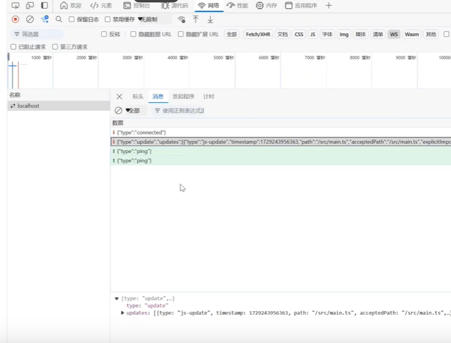

软连接，体积小
ode_modules当中的文件为复制或者链接自己特定的内容寻址存储库
pnpm内置的支持单仓多包
pnpm默认创建了一个非平铺的node_modules
pnpm i vite -D
pnpm -y
pnpm init
使用的是原生的esm文件，不需要打包的，快速的服务启动的，
轻量快速的热重载，不论应用程序的大小如何，都始终较快鞥多模块热重载hmr
丰富的功能和对typescript,jsx,css等支持开箱即用的
优化的构建可选多页应用或者库模式与配置的rollip构建的
通用的插件在开发和构建之间共享的rollup-superset插件接口
完全类型化的api灵活的api和完整的typescript

pnpm install vue
pnpm install @viteks/plugin-vue 
单文件组件script setup是在单文件组件spc当中使用组合式api的编译时候的语法糖
lang属性可以声明预处理语言
ref接受一个内部的值并且返回一个响应式并且可以彼岸的ref对象，ref对象只有一个value属性。指向了该内布置的，在js当中操作数据需要.value在模板当中读取不需要的.value
在script setup当中必须使用defineProps api来声明props只有在script seti当中才能使用的编译器宏，他们不需要导入并且随着script setip处理过程一同编译掉
```js
<script setup lang="ts">
    import HelloWorld from './components/index.vue'
defineProps<{msg:string}>()

</script>
<style lang="less" scoped>

</style>
```

# 静态资源处理
assets会返回一个静态的公共资源的路径的，最终会被打包到dist目录当中
food.jpg
```js

```
开箱即用的
# public目录
存放不需要经过vite处理的静态文件，
这些i资源不会被源码引用比如robots.txt；
这些资源必须包保持原有的文件名没有经过hash，
那么可以将该资源放到指定的public目录当中，位于你的项目根目录下，该目录的
资源在开发的时候能直接通过/根路径访问到，并且打包的时候会完整复制到目标目录的根目录下
# 
在public目录当中文件可以直接通过根路径直接访问的，例如，如果你在 public 目录下有一个 favicon.ico 文件，在浏览器中可以通过 http://localhost:3000/favicon.ico 访问。public目录当中的文件不会被vite处理的会鸳鸯复制到输出目录当中

# 环境变量和模式
vite在一个特殊的import.meta.env对象上暴露的环境变量
import.meta.env.MODE:string应用运行的模式
import.meta.env.BASE_URL:string部署应用的基本的url,他是由base配置项决定的
import.meta.env.PROD:boolean:应用是否运行在生产环境
import.meta.env.DEV:boolean:应用是否允许在开发环境，永远和import.meta.env.PROD相反的
使用dotenv从环境目录的下列文件加载额外的环境变量
.env所有的情况下都会加载的
.env.local:所有的情况都会加载但是会被git忽略的
.env.[mode]只在指定模式下加载的
.env.[mode].local:只在指定模式下加载的并且会被git忽略的
环境加载优先级
# 
一份用于指定模式的文件，例如.env.production会比通用形式的优先级更高，例如.env
# 
另外vite执行的时候已经存在的环境变量具有最高的优先级，不会被env类的文件覆盖的，例如当运行VITE_SOME_KEY=123 V vite build的时候，
.env类文件会在vite启动一开始的时候被加载，而改动会在重启服务器以后生效的
加载的环境变量也会通过imort.meta.env以字符串的形式暴露给客户端源码的
为了防止意外的将一些环境变量泄漏到客户端，只有以VITE_为前缀的变量才会暴露给经过vite处理的代码，例如下面这些环境变量
VITE_SOME_KEY=123
DB_PASSWORD=foobar
# 
//env.development添加一些变量
# eslint和env
pnpm create @eslint/config
```js
export default[
    {files:["**/*".{js,mjs,chs,ts,vue}"]},
    {languageOptions:{globales:globals,browser}},
    pluginJs.configs.recommended,
    ..teslint.configs.recmmmended,
    ...pluginVue.configs["flat/essential"],
    {files:["**/*.vue"],languageOptions:{parserOptions:{parser:teslint.parser}}}

]

