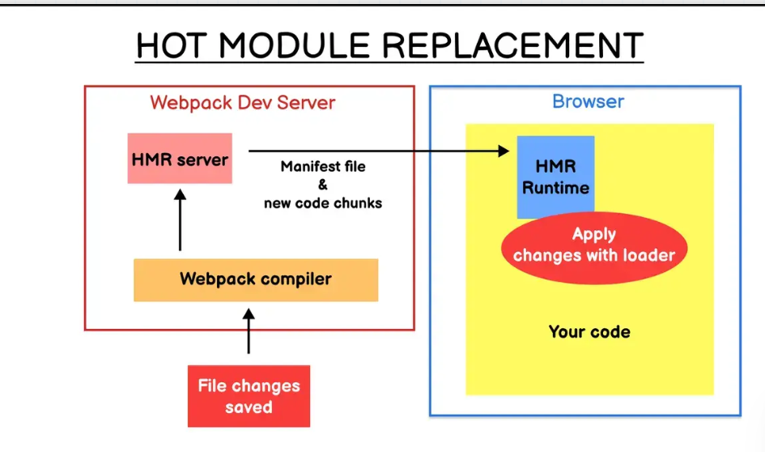

# 1.webpack是啥？有啥作用
- 概念：Webpack 是一种用于构建 JavaScript 应用程序的静态模块打包器，它能够以一种相对一致且开放的处理方式，加载应用中的所有资源文件（图片、CSS、视频、字体文件等），并将其合并打包成浏览器兼容的 Web 资源文件。
- 功能：

- 模块的打包：通过打包整合不同的模块文件保证各模块之间的引用和执行
- 代码编译：通过丰富的loader可以将不同格式文件如.sass/.vue/.jsx转译为浏览器可以执行的文件
- 扩展功能：通过社区丰富的plugin可以实现多种强大的功能，例如代码分割、代码混淆、代码压缩、按需加载.....等等

# 2.常见的loader及其作用
- babel-loader：将es6转译为es5
- file-loader：可以指定要复制和放置资源文件的位置，以及如何使用版本哈希命名以获得更好的缓存，并在代码中通过URL去引用输出的文件
- url-loader：和file-loader功能相似，但是可以通过指定阈值来根据文件大小使用不同的处理方式（小于阈值则返回base64格式编码并将文件的 data-url内联到bundle中）
- raw-loader：加载文件原始内容

webpack5自身内置了file-loader/ url-loader/ raw-loader等loader，所以我们不需要再显示引入loader 只需要指定对应的type即可实现相同的功能 如file-loader等价于 type= "asset/resource"'

- image-webpack-loader： 加载并压缩图片资源
- awesome-typescirpt-loader: 将typescript转换为javaScript 并且性能由于ts-loader
- sass-loader: 将SCSS/SASS代码转换为CSS
- css-loader: 加载CSS代码 支持模块化、压缩、文件导入等功能特性
- style-loader: 把CSS代码注入到js中，通过DOM 操作去加载CSS代码

- 当我们使用类似于 less 或者 scss 等预处理器的时候，通常需要多个 loader 的配合使用如test: /\.less$/, use: ['style-loader', 'css-loader', 'less-loader'] 

- source-map-loader: 加载额外的Source Map文件
- eslint-loader: 通过ESlint 检查js代码
- cache-loader: 可以在一些开销较大的Loader之前添加可以将结果缓存到磁盘中，提高构建的效率
- thread-loader: 多线程打包，加快打包速度
以上便是常用的loader以及作用，对loader感兴趣的小伙伴之后可以自行了解

# 3.常见的plugin及作用
- define-plugin: 定义环境变量（webpack4之后可以通过指定mode：production/development实现同样效果）
- web-webpack-plugin：为单页面应用输出HTML 性能优于html-webpack-plugin
- clean-webpack-plugin: 每次打包时删除上次打包的产物, 保证打包目录下的文件都是最新的
- webpack-merge： 用来合并公共配置文件,常用（例如分别配置webpack.common.config.js/ webpack.dev.config.js/webpack.production.config.js并将其合并）
- ignore-plugin: 忽略指定的文件，可以加快构建速度
- terser-webpack-plugin：压缩ES6的代码（tree-shaking）
- uglifyjs-webpack-plugin: 压缩js代码
- mini-css-extract-plugin: 将CSS提取为独立文件，支持按需加载
- css-minimize-webpack-plugin：压缩CSS代码

- css文件的压缩需要mini-css-extract-plugin和css-minimize-webpack-plugin 的配合使用 即先使用mini-css-extract-plugin将css代码抽离成单独文件，之后使用 css-minimize-webpack-plugin对css代码进行压缩

- serviceworker-webpack-plugin: 为离线应用增加离线缓存功能
- ModuleconcatenationPlugin: 开启Scope Hositing 用于合并提升作用域， 减小代码体积
- copy-webpack-plugin： 在构建的时候，复制静态资源到打包目录。
- compression-webpack-plugin: 生产环境采用gzip压缩JS和CSS
- ParalleUglifyPlugin： 多进程并行压缩js
- webpack-bundle-analyzer: 可视化webpack输出文件大小的根据
- speed-measure-webpack-plugin: 用于分析各个loader和plugin的耗时，可用于性能分析
-webpack-dashboard: 可以更友好地展示打包相关信息
以上便是常见的插件及其作用，接下来讲解我自己使用过的觉得好用的插件/工具

# 4.有没有用过好用的工具/plugin
- splitChunkPlugin：用于代码分割
- webpack-merge: 提取公共配置，用于分别编写不同环境的配置文件（ `` ）
- HotModuleReplacementPlugin:支持模块热替换
- ignore-plugin: 忽略指定文件，可以加快构建速度
- clean-webpack-plugin: 每次打包时删除上次打包的产物， 保证打包目录下的文件都是最新的
- speed-measure-webpack-plugin: 分析出Webpack打包过程中的Loader和Plugin的耗时，用于性能分析
- mini-css-extract-plugin: 将CSS代码抽离为独立文件，支持按需加载， 配合 css-minimize-webpack-plugin使用
- terser-webpack-plugin: 实现更精细的代码压缩功能
- SourceMapDevtoolPlugin:精细度配置SourceMap， 不能和devtool选项同时使用
- UnusedWebpackPlugin: 反向查找项目中没被用到的文件，日常工作经常用到，可在重构或者性能分析时使用
- webpack-dashboard: webpack-dashboard 是一个命令行可视化工具，能够在编译过程中实时展示编译进度、模块分布、产物信息等相关信息，性能分析时很有用。
- Webpack Analysis：Webpack Analysis 是 webpack 官方提供的可视化分析工具。
- BundleAnalyzerPlugin：性能分析插件，可以在运行后查看是否包含重复模块/不必要模块等
以上便是我日常学习中经常用到的一些工具/插件，有用过其他好用的工具/插件的同学欢迎在评论区推荐讨论

# 5.loader和plugin有啥区别？
- Loader：
- Loader本质上是一个函数，负责代码的转译，即对接收到的内容进行转换后将转换后的结果返回
- 配置Loader通过在 modules.rules中以数组的形式配置
- Plugin：
- Plugin本质上是一个带有apply(compiler)的函数，基于tapable这个事件流框架来监听webpack构建/打包过程中发布的hooks来通过自定义的逻辑和功能来改变输出结果。
- Plugin通过plugins 以数组的形式配置
- 总结：
- Loader主要负责将代码转译为webpack 可以处理的JavaScript代码，而 Plugin 更多的是负责通过接入webpack 构建过程来影响构建过程以及产物的输出，Loader的职责相对比较单一简单，而Plugin更为丰富多样

# 6.如何保证众多Loader按照想要的顺序执行？
- 可以通过enforce来强制控制Loader的执行顺序 （pre 表示在所有正常的loader执行之前执行，post则表示在之后执行）

- Loader的执行有以下两个阶段：
- 
- Pitching 阶段: loader 上的 pitch 方法，按照 后置(post)、行内(inline)、普通(normal)、前置(pre) 的顺序调用。更多详细信息，请查看 Pitching Loader。
- Normal 阶段: loader 上的 常规方法，按照 前置(pre)、普通(normal)、行内(inline)、后置(post) 的顺序调用。模块源码的转换， 发生在这个阶段。

# 7.如何编写Loader
- 这也是面试官喜欢问的问题，而我们大部分人别说写了，可能连用都没咋用过，所以问这个问题更多是为了了解你对loader这方面的知识掌握程度，毕竟只有当你足够了解loader的知识，你才有自己编写loader的可能，那接下来我们就按照从loader的特性来分析如何编写loader这个思路来讲解


- loader支持链式调用，上一个loader的执行结果会作为下一个loader的入参。

- 根据这个特性，我们知道我们的loader想要有返回值，并且这个返回值必须是标准的JavaScript字符串或者AST代码结构，这样才能保证下一个loader的正常调用。


- loader的主要职责就是将代码转译为webpack可以理解的js代码。

- 根据这个特性，loader内部一般需要通过return / this.callback来返回转换后的结果


- 单个loader一把只负责单一的功能。

- 根据这个特性，我们的loader应该符合单一职责的原则，尽量别让单个loader执行太多职责


- 善于利用开发工具

- loader-utils： loader-utils 是一个非常重要的 Loader 开发辅助工具，为开发中提供了诸如读取配置、requestString的序列化和反序列化、getOptions/getCurrentRequest/parseQuery等核心接口....等等功能，对于loader的开发十分有用
- schema--utils：schema-utils是用于校验用户传入loader的参数配置的校验工具，也是在开发中十分有用


- loader是无状态的

- 根据此特性，我们不应该在loader保存状态


- webpack默认缓存loader的执行结果

- webpack会默认缓存loader的执行结果直到资源/所依赖的资源发生变化 如果想要loader不缓存 可以通过this.cacheble 显式声明不做缓存


- Loader接收三个参数

- source： 资源输入 对于第一个执行的loader为资源文件的内容 后续执行的loader则为前一个loader的执行结果 也可能是字符串 或者是代码的AST结构
- sourceMap： 可选参数 代码的sourcemap结构
- data： 可选参数 其他需要在Loader链中传递的信息


- 正确上报loader的异常信息

- 一般尽量使用logger.error 减少对用户的干扰
- 对于需要明确警示用户的错误 优先使用 this.emitError
- 对于已经严重到不能继续往下编译的错误 使用 callback


- loader函数中的this 由webpack提供 并且指向了loader-runtime的loaderContext 对象

- 可以通过this来获取loader需要的各种信息 Loader Context提供了许多实用的接口，我们不仅可以通过这些接口获取需要的信息，还可以通过这些接口改变webpack的运行状态（相当于产生 Side Effect）


- loader由pitch和normal两个阶段

- 根据此特性，我们可以在pitch阶段预处理一些操作


- webpack会按照 use 定义的顺序从前往后执行Pitch Loader 从后往前执行Normal Loader 我们可以将一些预处理的逻辑放在Pitch中


- 正确处理日志 使用 Loader Context``的getLogger接口（支持verbose/log/info/warn/error 五种级别的日志 用户可以通过infrastructureLogging.level 配置项筛选不同日志内容 ）
充分调试你编写的loader

- 创建出webpack实例 并运行laoder
- 获取loader执行结果 对比、分析判断是否符合预期
- 判断执行过程中是否出错
# 8.如何编写Plugin
- 上面我们已经讲完了如何编写loader，接下来我们还是按照分析plugin特性来讲解如何开发plugin，一起来看看吧！由于plugin比loader复杂不少，这里我们需要一些前置知识来作为支撑！
- 我们都知道Plugin是通过监听webpack构建过程中发布的hooks来实施对应的操作从而影响更改构建逻辑以及生成的产物，而在这个过程中compiler和compilation可以说是最核心的两个对象了，其中compiler可以暴露了整个构建流程的200+个hooks，而compilation则暴露了更细粒度的hooks。
compiler对象是一个全局单例，代表了webpack从开启到关闭的整个生命周期，负责启动编译和监听文件，而compilation是每次构建过程的上下文对象，包含当次构建所需要的信息

- 每次热更新和重新编译都会创建一个新的compilation对象，compilation对象只代表当次编译

- 我们都知道插件是通过监听webpack构建过程中发布的hooks从而在特定阶段去执行特定功能来达到改变构建逻辑以及产物的目的，而这些都离不开tapable （一个专门用于处理各种发布订阅的库 有同步异步、熔断、循环、瀑布流等钩子），关于了解tapable的使用，这里推荐这篇文章：Webpack tapable 使用研究 - 掘金 (juejin.cn)。
讲完plugin的前置知识，接下来就让我们正式开始学习如何开发插件


- 插件是通过监听webpack发布的hooks来工作的

- 根据这个特性，我们的plugin一定是一个函数或者一个包含apply（） 的对象，这样才可以监听compiler 对象


- 传递给插件的compiler  和compilation 都是同一个引用

- 根据此特性，我们知道我们的插件是会影响到其他插件的，所以我们在编写插件的时候应该分析会对其他插件造成啥影响


- 基于tapable来完成对hooks的复杂的订阅以及响应

- 编译过程的特定节点会分发特定钩子，插件可以通过这些钩子来执行对应的操作
- 通过 tapable的回调机制以参数形式传递上下文信息
- 可以通过上下文的众多接口来影响构建流程


- 监听一些具有特定意义的hook来影响构建

- compiler.hooks.compilation:webpack刚启动完并创建compilation对象后触发
- compiler.hooks.make:webpack开始构建时触发
- compiler.hooks.done:webpack 完成编译时触发，此时可以通过stats对象得知编译过程中的各种信息


- 善于使用开发工具

- 使用schema-utils用于校验参数（关于schema-utils的使用方法读者可以自行查阅）


- 正确处理插件日志信息以及插件信息

- 使用 stats汇总插件的统计数据
- 使用 ProgressPlugin插件的 reportProgress接口上报执行进度
- 通过 compilation.getLogger获取分级日志管理器
- 使用 compilation.errors/warining处理异常信息（eslint-webpack-plugin的做法）


- 测试插件

- 通过分析compilation.error/warn 数组来判断webpack是否运行成功
- 分析构建产物判断插件功能是否符合预期


- 以上便是如何编写plugin所需的知识和常规流程，建议可以阅读一些插件例如eslint-webpack-plugin / DefinePlugin 等插件的源码来更深入地学习插件开发的知识和流程

# 9.什么是文件指纹？文件指纹有什么作用？怎么用？
- 概念：文件指纹是指文件打包后的一连串后缀
- 作用：

- 版本管理：  在发布版本时，通过文件指纹来区分 修改的文件 和 未修改的文件。
- 使用缓存：  浏览器通过文件指纹是否改变来决定使用缓存文件还是请求新文件。

- 种类：

- Hash：和整个项目的构建相关，只要项目有修改（compilation实例改变），Hash就会更新
 - Contenthash：和文件的内容有关，只有内容发生改变时才会修改
 - Chunkhash：和webpack构架的chunk有关 不同的entry会构建出不同的chunk （不同 ChunkHash之间的变化互不影响）

如何使用：

- JS文件：使用Chunkhash 
- CSS文件：使用Contenthash 
- 图片等静态资源： 使用hash 


- 生产环境的output为了区分版本变动，通过Contenthash来达到清理缓存及时更新的效果，而开发环境中为了加快构建效率，一般不引入Contenthash
# 10.Babel的原理
- 代码转译成为我们想要的目标代码，并且对目标环境不支持的api自动polyfill,而babel实现这些功能的流程是解析(parse)转换transform生产generator接下来我们就看看每一个流程都做了什么工作呢
- 解析：根据代码生成对应的ast结构
- 进行代码分析，将代码分割成token流，语法单元数组，再根据token流生成对应的ast
- 转换：遍历ast节点生成新的ast节点
- 生成：根据新的ast生成对应的目标代码
# 11.文件监听的原理
- 开启文件监听以后，webpack会轮询访问文件最后的修改事件，当发现文件的修改时间发生变化以后，会先缓存起来等到aggregateTimeout的时候再统一执行
- 开启文件监听的方式：可以再构建的时候带上--watch的参数或者设置watch:trye,而watchOptions就可以对监听的细节进行定制
```js
watch: true,
watchOptions: {
    //不监听的文件或者文件夹 忽略一些大型的不经常变化的文件可以提高构建速度
    ignored: /node_modules/,
    //监听到变化会等多少时间再执行
    aggregateTimeout: 300,
    //判断文件是否发生变化是通过不断轮询指定文件有没有变化实现的
    poll: 1000
}

```

# 什么是Source map？如何使用

- source map是将编译打包后的代码映射回源码
- 可以通过devtool配置项来设置，还可以通过SourceMapDevToolPlugin实现更加精细粒度的控制

- devtool配置项和 SourceMapDevToolPlugin不能同时使用，因为devtool选项已经内置了这些插件，如果同时使用相当于应用了两次插件

- 这么多的选择，那么我们应该如何使用呢，根据我的实践，我觉得比较好的设置应该是下面这样

- 开发环境：cheap-eval-source-map，生产这种source map速度最快，并且由于开发环境下没有代码压缩，所以不会影响断点调试
- 生产环境：hidden-source-map，由于进行了代码压缩，所以并不会占用多大的体积


- 避免在生产中使用 inline- 和 eval- 因为它们会增加 bundle 体积大小 并且降低整体性能

# HMR（热更新）的原理
- 这个可以说是webpack的最高频考点之一了，同时也是webpack的难点，也是webpack的核心功能之一！接下来我将带大家先学习如何使用HMR再逐步分析HMR的原理。
- 如何开启HMR：
- 通过设置devServer: {hot: true} 开启 开启后便可以在发生改变后局部刷新改变的部分
原理：

- 使用 webpack-dev-server（WDS） 托管静态资源 同时以Runtime方式注入HMR客户端代码
- 浏览器加载页面后 与WDS建立WebSocket连接
- webpack监听到文件变化后 增量构建发生变更的模块 并通过WebSocket发送hash事件
- 浏览器接收到 hash事件后 请求 manifest资源文件 确认增量变更范围
- 浏览器加载发生变更的增量模块
- webpack运行时触发变更模块的module.hot.accept回调 执行代码变更逻辑
- done：构建完成，更新变化

- 总结就是webpack将静态资源托管在 WDS 上，而 WDS 又和浏览器通过 webSocket 建立联系，而当webpack监听到文件变化时，就会向浏览器推送更新并携带新的hash 与之前的hash进行对比，浏览器接收到hash事件后变化加载变更的增量模块并触发变更模块的 module.hot.accept回调执行变更逻辑



# tree shaking原理
什么是 Tree shaking？
- Tree-Shaking 是一种基于 ES Module 规范的 Dead Code Elimination 技术，它会在运行过程中静态分析模块之间的导入导出，确定 ESM 模块中哪些导出值未曾其它模块使用，并将其删除，以此实现打包产物的优化。
- 使用 Tree shaking
- 使用 Tree shaking的三个必要条件


- 使用ESM规范编写模块代码


- 配置 optimization.usedExports为 true 启动标记功能


- 启动代码优化功能 可以通过如下方法实现

- 配置 mode = production
- 配置 optimization.minimize = true
- 提供 optimization.minimizer数组


- 对于使用了babel-loader loader或者根据对代码进行转译的时候，注意应该关闭对于导入/导出语句的转译，因为这会影响到后续的 tree shaking 比如应该将 babel-loader 的 babel-preset-env的modules配置为false

- 必要条件：
- 所有导入导出语句只能在模块顶层 且导入导出的模块名必须为字符串常量 不能动态导入的（ESM模块之间的依赖关系是高度确定的 与运行状态无关 编译工具只需要对ESM模块做静态分析就,可以从代码字面量中推断出哪些模块值没被使用）

# Tree shaking的原理
- Tree shaking的工作流程可以分为
- 1.标记哪些导出值没有被使用； 2. 使用Terser将这些没用到的导出语句删除
### 标记的流程如下：

- make阶段：收集模块导出变量并记录到模块依赖关系图中
- seal阶段：遍历模块依赖关系图并标记那些导出变量有没有被使用
- 构建阶段：利用Terser将没有被用到的导出语句删除

- 开发中如何利用Tree shaking？

- 避免无作用的重复赋值
- 使用 #pure标记函数无副作用（这种做法在开源项目的源码中经常出现，如pinia、reactive....等）
- 禁止转译 导入/导出语句（使用了babel-loader需要将 babel-preset-env的modules配置为false ）
- 使用支持 Tree shaking的包
- 优化导出值的粒度
```js
//正确做法
const a = 'a';
const b = 'b';
export {
a,
b
}
//错误做法
export default {
a: 'a',
b: 'b'
}
```
# 如何用webpack来优化项目的性能
- 说到优化，我们应该想到可以分为开发环境和生产环境的不同优化。

- 开发环境：开发环境我们需要的是更快的构建速度、模块热替换、更加友好的Source map


- 通过cache： { type: 'systemfile'}  开启缓存构建可以加快二次构建的效率


- 通过模块热替换可以做到局部更新变化，提高开发效率


- 根据设置 devtool： cheap-eval-source-map 在保证构建效率的同时又能进行代码调试


- 使用Thread-loader以多进程的方式运行资源加载逻辑


- 通过 stats 来分析性能做优化


- 生产环境：生产环境我们需要的是更小的体积，更稳定又快的性能

- 压缩代码：使用UglifyJsPlugin和ParallelUglifyPlugin来压缩代码 利用cssnano(css-loader? minimize)来压缩css
- 利用CDN：可以使用CDN来加快对静态资源的访问，提高用户的使用体验
- Tree Shaking: 删除没用到的代码
- 提取公共第三方库： 使用SplitChunksPlugin插件来进行公共模块抽取
- 使用TerserWebpackPlugin多进程执行代码压缩、uglify 功能

