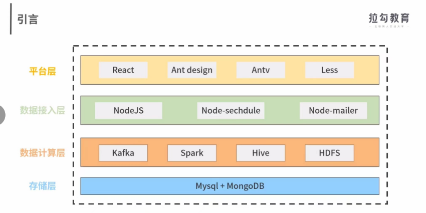
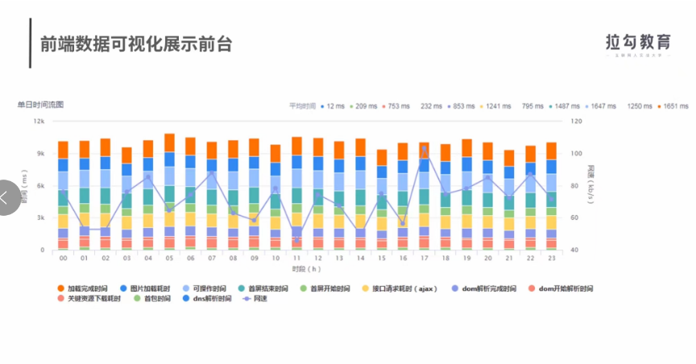
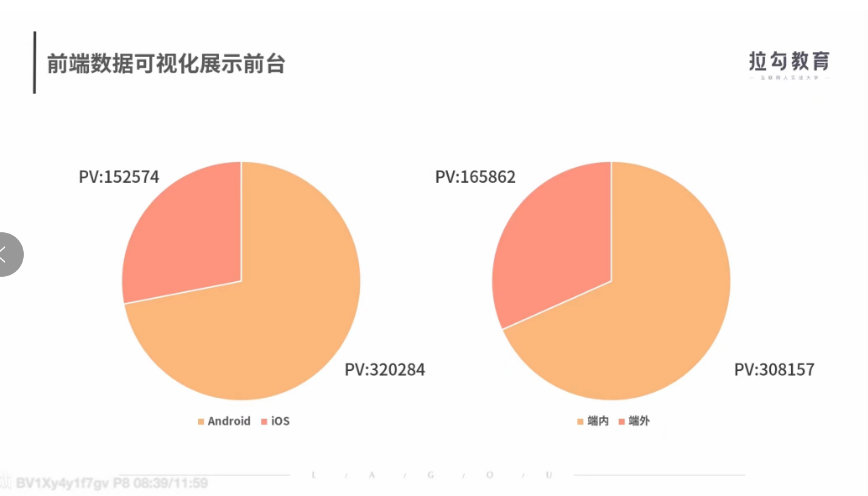
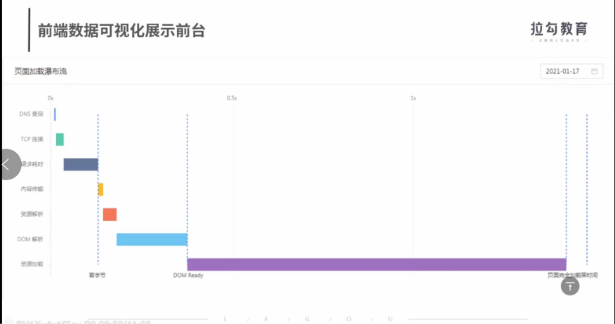

# 前端性能平台搭建
对sdk上报的数据的处理
只要能够满足首屏事件和白屏事件等性能关键指标的展示的需求
前端性能平台是一个web系统主要包括后台的性能的数据的处理和前台可视化展示两部分
数据处理后台主要是对sdk上报后的性能指标进行处理和运算，具体包括数据入库，数据清洗，数据计算

客户端借助sdk上报性能指标数据，数据接入层接受相依的数据并作协议转换等简单处理以后，作为生产者向Kafka写入数据
数据计算层作为消费者，从Kafka读取数据存入HiveHadoop平台借助Spark做数据的分析和计算
借助Hive提供的接口，数据计算层使用SQL语句从Hive拉去计算后的数据到数据库平台
平台层取出数据以后，准备数据可视化展现的数据
# 性能数据处理后台
客户端借助SDK上报的性能指标数据，需要后端服务器的处理。这里我们选取的是Nodejs对数据做处理的
利用Controller层对数据进行处理
将SDK上报的数据通过url解析成key-value格式的数据
对数据进行空数据的删除，异常数据舍弃等操作
# 为什么不直接上报给Hive呢？
因为客户端上报的性能数据量和用户的规模有关的，如果直接入库到Hive遇到高并发的时候会因为服务器扛不住而导致数据的丢失
选择Kafla,先把数据写进消息队列当中，Kafla能够通过缓存，慢慢接受这些数据，降低流量洪峰的压力，同时可以避免数据重复的问题
## 对Kafla当中的数据做数据的清洗和计算
对重复数据的处理
对缺失数据的处理
对错误数据的处理
### 如何处理？
遇到重复的数据，直接去重删除就可以了，
遇到丢失的数据
再spark平台上，根据上报的performance数据进行计算补全，如果无法补全的，就直接舍弃掉
遇到超出正常范围的数据，比如说负值或者超过10秒以上的数据就把它当作无效的数据，直接舍弃掉
## 需要使用spark做数据的计算为可视化展现准备数据
首屏时间分布的计算1s-2s占比是多少的？2s-4s占比是多少的？
秒开率的计算，首屏时间小于等于1s的数据占比是多少的？
页面瀑布流时间的计算
，是对首屏时间的细分
dns查询，tcp连接，请求耗时等等，内容传输资源解析等等
细分时间点是根据sdk上报的performance接口数据指标计算出来的，
前端工程师根据页面瀑布流时间，可以快速定位性能瓶颈点出现再哪一个环节的

## 3.准备性能前台所需要的可视化的数据
性能平台需要登录的功能，，还需要一些用户关注的模块的信息
添加关注的业务模块可以用关系数据库去存储这些数据的
mysql等等
性能数据相互之间并没有什么关系的
可以用mongoDB做存储的
# 前端数据可视化展示前台
## 大盘页和详情页
大盘页包括一个个业务性能的简图
每一个性能简图包括首屏时间，秒开率，采样PV的数据

平台层：
react,antdesign,antb,less
主要是给公司前端开发者使用的，功能上更多的是数据可视化展示非常适合用react技术栈做开发的
更好的实现首屏时间，秒开率和采用PV的功能效果我们使用AntdPro的模板
Antv能够满足我们在首屏时间，秒开率等性能指标的展示需求，用起来比较简单
## 前端数据可视化展示前台
大盘页和详情页的数据展示效果比较丰富多样的，相应的css代码逻辑就比较复杂的
css方面可以选用less框架
前后端交互方面，为了让前后端更加独立的，大盘页和详情页和后端的通讯通过http接口来实现
使用nginx作为web server
对传输内容进行gzip压缩处理

后台服务部分，为了让性能平台开发过程更加简单，效率更高，后台服务方面可以选择用Egg.js做开发
为了解决监控预警的问题，我们借助Node-schedule做调度，和定时任务的处理，通过node-mailer进行邮件的报警
业界在统计首屏时间的时候，都会统计一下是否首次访问，这个是怎么实现的呢？
