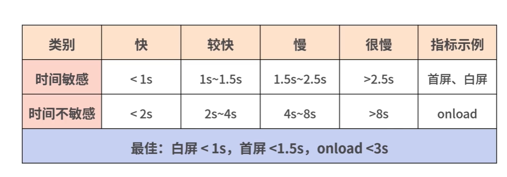
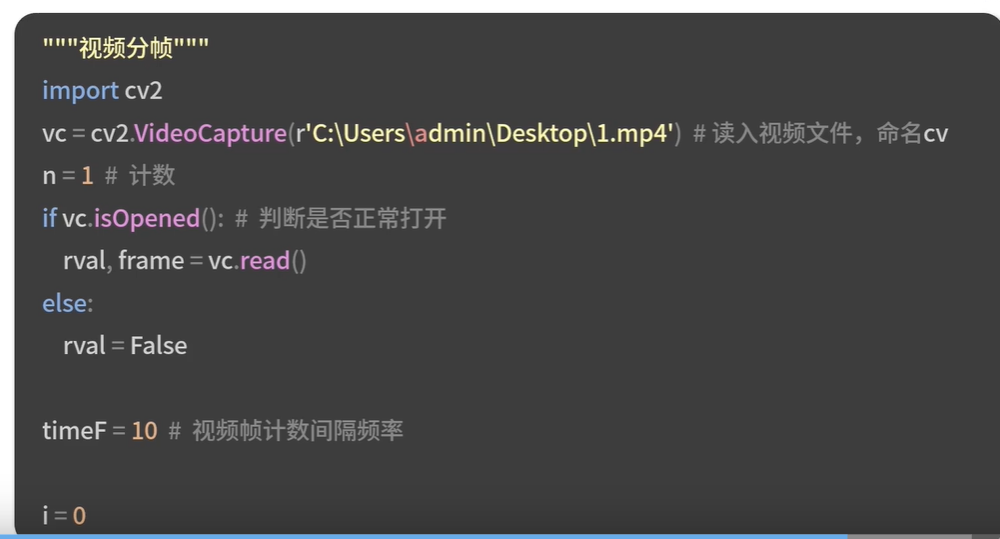
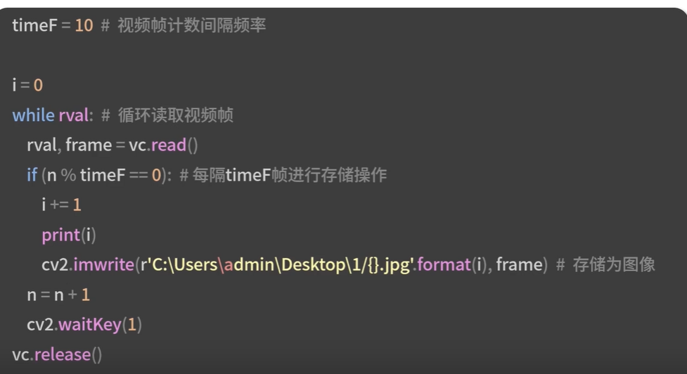
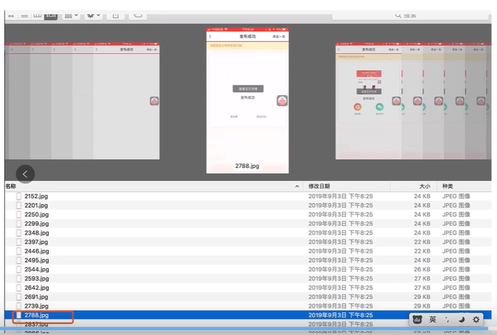

# 1.确定线下测试方案
# 2，设定线下测试的标准
# 3.选择合适的测试环境进行测试以及视频分针的计算
# 4.输出测试结果
# 性能测试方案选型
## 使用性能SDK和以录制视频的方式
- 使用性能SDK
- 比如我们要采集首屏时间的指标，就使用MutationObserver
- 优点是线上和线下方案一致的
-内网测试的访问量优先的
- 无法形成大量的首屏时间分布的数据
- 也就是无法在性能平台上可视化展现
## 以录制视频的方式进行性能测试
- 优点是可以和QA现有的基础设施相结合
- QA测试不仅会测试H5页面的首屏时间
- 还会测试Native页面的响应时间
- 以及App内存使用和CPU占用等信息
## 在性能测试上，我们一般建议采用录制视频的方式

- 录制视频一般有手动方案和自动化方案
- 所谓的手动方案就是通过手机自带的视频录制的功能
- 而自动化方案就是通过adb录制
# adbs是andorid studio 下提供的工具
- 在电脑上通过它可以控制模拟器或者真实的手机的设备
```js
adb shell screenrecrd --time limint 10/sdcard/perf.mp4

```
- 打开一个app页面，页面开始加载，然后再页面加载结束以后，点击ctrl +c结束录制
- 有些设备的显示如分辨率过高可能无法录制的
```js

adb sheel screenrecord --size 1280*720/sdcard/perf.mp4
```
- 如果使用的是模拟器，要注意模拟器再晃动，多点触摸等操作的情况下代替不了真机的，模拟器再性能和设备类型上也要慢一些，上线取决于电脑的性能上线
- 录制过程当中不要切断手机，这样会造成性能的切断
```js
adb shell screenrecord --time-limit 10 --verbose/sdcard/perf.mp4
```
## 性能测试标准的设定
- 有关性能的标准，我在第一讲的时候关键指标设定里介绍过
- 也在模块2专门说明过了首屏时间，白屏时间，卡顿等的指标采集
- 1.分频计算的标准，也就是什么时候认为首屏的结束
- 2.确定首屏时间的标准
- 白屏响应的时间=白屏最后一帧的时间-点击的时候起始帧的时间
- 首屏加载的时间 = 内容完全加载出来那一帧的时间-点击的时候起始帧的时间
- 首屏时间的标准，因为缺乏海量的数据，也无法直接使用之前的秒开率的标准，我们可以推而且其，采用不同的网络环境下的性能标准

- 连续5帧超过50ms，判定为卡顿的
- 单帧渲染超过250ms，就可以判定为严重的卡顿
- 所谓的性能测试环境的搭建，不是指需要搭建测试服务器以及接口测试等等，而是寻找合适的网络环境进行测试的
- 在专项测试的时候，为了提前发现性能的问题，我们需要考虑到各种网络环境下的情况
- 一般4G信号容易受到物体遮挡或者天气的影响，在空旷的地点，天气晴朗的情况下信号会明显好很多的
- 2G/3G的话，一般来说信号很稳定
- 此时的测试不要求平均时间。不需要关注首屏秒开率，只要在某种特定的网络环境下首屏时间达标就可以了
- 1.人工计算首屏时间的话，准确性没有保证
- 2.人工判断，效率低，并且没有拌饭和整体测试链路打通的
## 分帧计算的方式
- 安装openCV，python，通过python的VideoCapture将视频分帧存储
- 分帧图片命名，使用当前视频播放的时间位置（毫秒)命名的存储图片
- 首屏时长计算 =  首屏结束帧文件名



- 一是在视频分帧计算时我们openCV最好能借助 brew(Mac环境下)进行安装Windows等环境下可以通过 Anaconda来安装这个软件
- 二是计算首屏时间方面，我们前文提到的首屏时间判断是通过人工提取对应着首屏时间的那一帧
- 拿到视频分帧计算结果后，通过图像识别的系统去判断关键帧-- 首屏时间对应那一帧
- 图片从不稳定到图片稳定那一刹那的时间就是关键帧
- 当两张图片的变化值小于5%，即可认为图片趋于稳定
