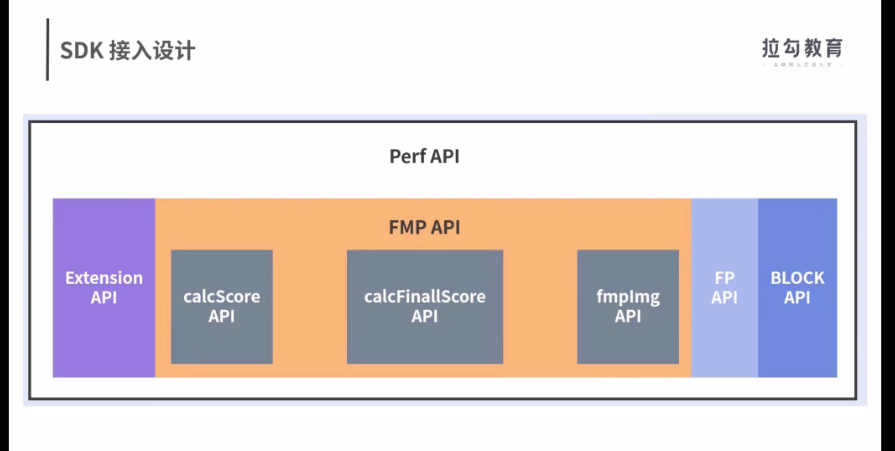

前端开发人员在接入性能监控平台过程当中文档不全，调试工具缺乏，上报过程当中的日志量大，调试工具缺乏，上报过程当中日志量过大
为了让这些页面接入性能监控平台的时候，通常需要修改性能统计脚本后才可以，同时用于各个业务的频繁升级性能脚本，测试也非常麻烦
如何通过设计性能sdksofeware development kit软件开发工具包
制定合理的上报策略来解决性能指标采集过程当中难题
sdk:是指开发者为了特点的软件，平台，操作系统提供的开发者工具集
性能sdk:就是为了公司的各个产品业务提供的性能统计的js sdk
主要是讲性能采集代码和上报策略封装在一起使用的
通过采集首屏，白屏等指标数据，然后上报到性能平台后端进行处理
 

为了进行首屏,白屏，卡顿等指标的采集
可以封装perf api
调用fmp,fp,block,extension api四个api来完成的
环境兼容性的判断
npm install @common/Perf 0S;
import {perfinit} from '@common';
perfinit();

try {
    perfinit();
}catch(err) }
console.warn(err)
}
搭建一个简单的性能的sdk网站
进入站点以后，前端工程师可以看到使用文档，包括各种平台下如何接入，接入的实例代码是怎么样的，接入性能sdk后去哪个url看数据，遇到异常的问题的时候怎么调试，等等
设置性能分析小助手，快速定位一些基础的问题
在sdk当中通过检测访问页面的url是不是加了调试的参数
PERF_DEV_MODAL=PERF_DEV_MODEL
如果访问的页面url当中加了调试参数，打开页面以后就可以看到一个性能分析小助手的圆形图标
借助代码存放的gitlab平台
让前端工程师通过issue的方式提交问题
看到问题之后解决
# 兼容性策略就是性能sdk可以在各个业务下都可以稳定的运行
各类页面
各个终端
一些可视化搭建的平台
不同的页面和终端，技术栈也是不一样的
尽可能用原生的javascript
去做性能采集的
从而实现跨不同技术栈的采集
小程序端可以用自己的采集api
其他端可以直接用fmp
根据当前的终端类型的不同，去调用各自的性能指标采集api
### 容错方面怎么做呢？
如果是性能sdk自身的报错
可以通过try catch的方式捕获，然后上报到异常监控的平台
好的自测和qa的测试也是性能sdk运行平稳的一大保证
sdk运行设计：
可以根据用户实际的浏览器和机型分布比例：
确定10top10%的用户的机型和浏览器的类型，然后在每次开发完成的时候病进行代码review之后，使用这些机型和浏览器类型进行自测
# 上报策略的设计
上报策略是指在性能指标的采集完成以后，上报到性能平台所采用的具体的策略
采集性能指标以后对异常的数据进行过滤
第一类是计算错误导致的异常数据
第二类是合法的异常值，极大值和极小值属于网络断掉或者超市形成的数值
负值的性能指标数据影响很大，他会严重的拖地首屏的时间，也会把计算逻辑导致的负值的问题给掩盖掉
首屏时间是非数值数据的时候也非常麻烦
这里使用引号是因为是字符串类型，在采集过程当中计算的时候遇到加法的时候，就会出现200+30=20030而不是你预期的230的情况
# 数据抽样的策略
性能sdk上报数据是全量还是抽样的
需要根据本身的app或者网站的日活来确定的
58同城就是10%的抽样率
除了在sdk当中设置抽样策略，业界还有通过服务端下发数据抽样率的方式，来动态控制客户端向服务器端上报性能数据的量
性能sdk也会根据网络能力，选择合适的上报机制
在强网环境比如4g,wifi等直接进行上报
在弱网环境当中，2g,3g下，我们把日志存储到本地当中，延时到强网下再上报
# 上报机制的选择
让sdk根据app的忙碌的状态选择合适的上报策略
如果app处于空闲状态，直接上报
如果处于忙碌状态等到空闲的时候再进行上报
批量数据上报
使用native接口上报的时候,sdk可以复用客户端的请求连接，采用延时上报或者批量上报等策略
实际工作当中建议使用native接口进行上报
请求指标转化成为请求参数之前，sdk内部最好醉一次参数校验的处理
当初在一个业务接入性能sdj后
上报性能数据的时候出现了平台看不到的对应指标数据的情况
api接口取性能指标数据的时候
把windows对象上的某个方法给字符串化以后当做参数了，这个参数内容特别多，直接导致了get请求的参数的过长，出现报错，后端没有拿到请求的参数
数据抽样的时候，怎么能确保性能异常的数据不会被漏掉呢？
