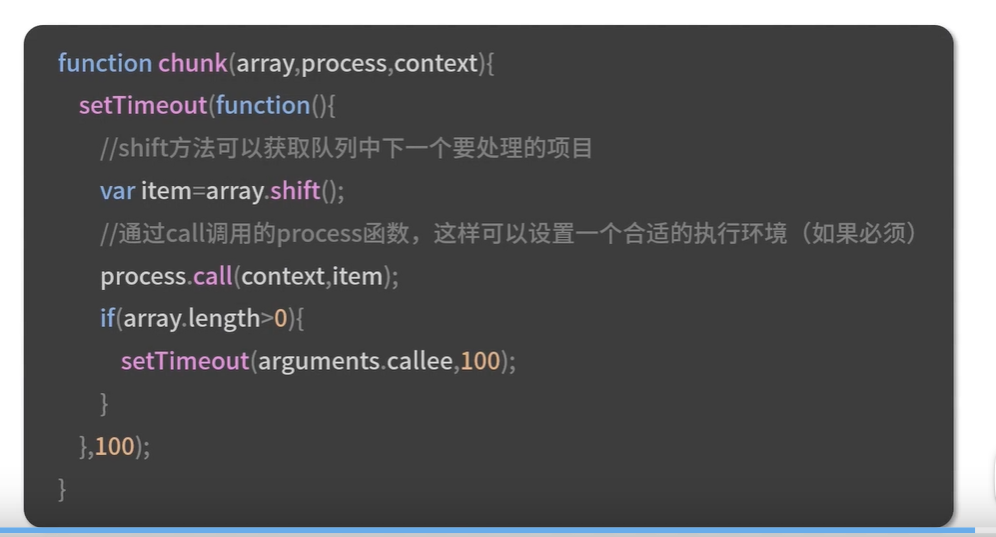
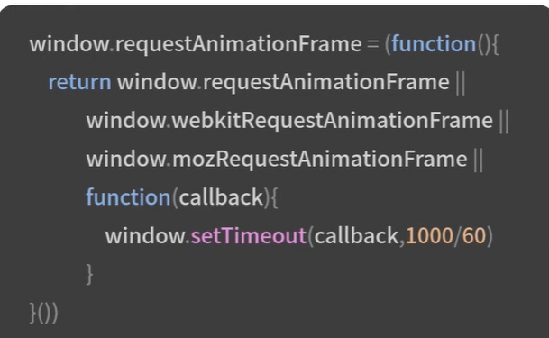

# 白屏优化
- 在某个电商app上搜索后进入商品列表也，结果屏幕一篇空白，过了好久还是没有什么内容出现，这个时候你是不是会退出来，换成另外一个电商app
## 影响白屏时间长短的两个主要因素
- DNS查询
- 可以从前端和客户端两个部分来采取错误
- 前端测-可以通过在页面当中加入dns-prefetch
```js
//开启与解析的功能
<meta http-equiv="x-dns-prefetch-control" content="on"/>>
// 强制对s。google.com进行dns预解析
<link rel = "dns-prefetch" href= "https;;/s.google.com/"》


```
- 客户端测
- 可以在启动app的时候同步创建一个肉眼不可见的webview
- 将常见的静态资源路径写入到webview当中，然后对他做域名解析并且放入缓存当中，这样后面需要使用webview打开这正所需要的页面的时候，由于已经做过了域名解析，客户端直接从缓存当中获取就可以了
- 如果是端外页面可以使用iframe，也能达到类似的效果

## 可以把dns解析时间控制在4400ms以内
- 可以采用ip直连的方式，原来是请求www.goggle.com现在我们通过调用sdk进行域名解析，拿到对应的ip然后直接请求这个ip地址拿到数据的
- https整数是指的是当客户端使用IP 直连的时候请求url 当中的host会被替换成为对应的ip
- 在非sni场景下，可以把证书验证环境独立出来的，然后把ip替换成为原来的域名
- 在sni场景下，可以定制SSLSocketFactory，在reactSocket的时候替换成为ip
- 并且进行SNI/HostNameVeirfy配置
- 配置文件方面，一般在域名只有两三个情况下，我们可以用它来做ip和域名的映射
- 采用httpDNS来解决
- httpDns可以准确调度到对应的区域的服务器IP地址给用户同时还可以避免运行商DNS的劫持问题
### 首字符展示
- 通常我们可以在页面加载过程当中出现一个loading图，用来告诉用户页面内容需要加载的，请耐心等待
- 骨架屏Seleton Screen 是在在页面数据加载完成之前，献给用户展示出页面的大致结构，灰色展位图，告诉用户页面正在渐进式的加载当中
- 然后再渲染出实际页面以后，把这个结构替换掉
- 每次视觉或者功能迭代，骨架屏都是配合修改的
- 采用自动化的方案，而不是手动骨架屏的方案
#### 步骤1
- 确定生成规则，遍历所有的dom元素
- 针对特定区块比如说视频，音频生成相应的代码块，获取原始页面当中的dom节点的宽度，高度和距离视窗的位置，计算出当前设备宽高对应的大小，转换成为对应的百分比，然后来适配不同的设备
#### 步骤2
- 基于上述规则结合CLI工具可以通过脚手架自动生成对应的骨架屏
#### 步骤3
- 将骨架屏自动化注入页面当中，再利用Puppeteer把骨架屏代码注入到页面当中自动运行
# 卡顿现象
- 卡顿现象一般是可以通过用户反馈或者性能平台来发现的
- 在性能平台上查看卡顿指标以后，发现页面出现连续5帧超过50ms，这就是属性严重卡顿
# 卡顿治理
- 首先是问题的定位
- 如果是和数据相关的问题，找后端同事或者用数据缓存的方式解决
# 浏览器的主线程和合成线程调度不合理以及计算耗时的操作
- 在红包位置变化的时候，页面展现的时候特别的卡，这就是主线程和合成线程调度的问题
## 如何解决？
- 主线程主要负责运行jaavascript，计算css样式，元素布局然后交给合成线程，合成线程主要负责绘制
- 可以使用tranfrom来代替直接设置margin的操作
### 红包元素从margin-left:-10px渲染到margin-left：0
### 主线程需要计算样式margin-left-9px；margin-left：-8px；一直到margin-left:0
### 每一次主线程计算样式以后，合成线程都需要绘制到GPU再渲染到屏幕上的，来来回回需要进行10次主线程渲染
- 利用tranform来做的，比如tranform：tranlsate（-10px，0）到tranform：translate（0，0）主线程只需要进行一次
- tranform：translate（-10px，0）到tranform：trnalslate（0，0）然后合成线程去一次将-10px转换到0px
# 空间换时间和时间换空间
# 在对dom元素增删的过程当中最好先在DocumentFragment当中的操作的
- 而不是直接在dom上操作
- 空间换时间和时间换空间
- 一般是通过将一个复杂的操作细分成为一个队列
- 然后通过多次的操作解决复杂操作的问题
### webIM离线消息的项目
- 其中一个功能是将批量消息的下载到本地的，点击下载以后由于文件过大，浏览器出现卡顿甚至卡死的情况

## setTimeout设置定时时间不准
- 如果时间间隔过于小，还会出现因为掉帧导致的卡顿

