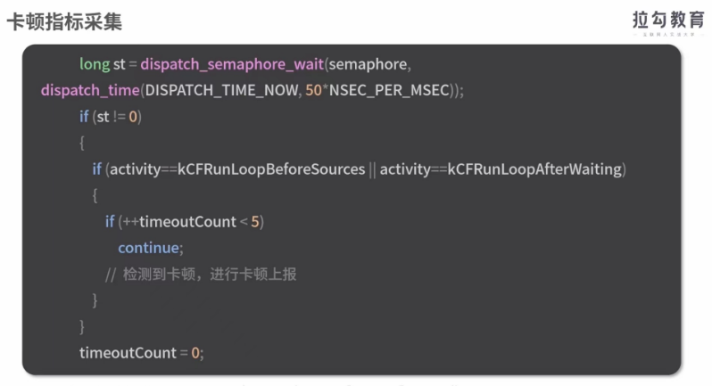

- 首屏时间，过安检的时间
- 白屏时间：排队到安检点的时间
- 卡顿时间：拍的队伍停止了
# 白屏指标采集
- 从输入内容回车包括刷新跳转等方式，后到页面开始出现第一个字符的时间
- 页面出现第一个字符的时间
- 浏览器的加载过程
- 客户端发起请求-》下载html/css/js和css资源->解析js执行-》js请求数据->客户端解析dom病渲染，-》下载渲染图片->完成渲染
- 白屏时间=页面开始展示的时间点-开始请求的时间段
- 白屏时间=domloading-navigationStart 
## app下的页面加载过程：
- 初始化webview,->客户端发起请求-》下载html以及js和css资源-》解析js执行-》js请求数据-》服务器处理并且返回数据-》客户端解析dom病渲染->下载渲染图片-》完成整个渲染
- app下的白屏时间多个启动浏览器内核的时间，也就是webview初始化的时间，这个时间必须通过手动采集的方式获得，而且因为线上和线下的时间差别不大，线下采集就可以了
创建webview打一个点，开始建立网络连接再打一个点
# 卡顿
- fps:frames per second:每秒显示的帧数，
- 大多的资料提到的fps在60以上的
- 页面流畅，不卡顿，但是实际上并不是这样的
- fps高于60是否意味着一定不卡顿呢？
- 前60帧渲染很快，10ms渲染1帧，后面的三针渲染很慢20ms渲染1帧，这样平均起来fps为95
- 实际效果是卡顿的
- 在浏览器上，我们没有办法拿到单帧渲染耗时的接口，所以这个时候，只能拿到fps来计算
- 连续3帧不低于20fps并且保持稳定

- 定义fps_compatibility表示兼容性的方面的处理
- 在浏览器不支持requestAnimationFrame的时候利用setTimeout来模拟实现，在fps_loop里面完成fps的计算
- 一般连续5帧超过50ms,判断为卡顿的，单帧渲染超过250ms就可以判定为严重卡顿的
- 导航App是无法判断某个地点是否出现了问题
- 但是可以借助GPS和定位仪，拿到你两个节点之间的行驶的速度，就可以推算粗来这个地点是否拥堵的

- 使用状态kCFRunLoopBeforeSources和kCFRunloopAfterWaiting两个节点之间的运行时间和某个阈值250ms做比较根据比较的结果判定主线程是否出现卡顿
# 为什么会出现app白屏时间长或者卡顿的问题呢？
- 一般webview的初始化速度慢，dns解析慢，视图树的过于复杂，和主线程被阻塞等都会导致问题的出现
- 但是很多情况下，白屏的时间和卡顿的都和网络有关的
- 电商网站来说，高清图可以用文本来代替的
# 网络环境采集
- 在app内，可以通过app提供的接口获取到网络的情况，在端外，就没有办法直接拿到当前的网络的情况了，这个时候怎么办呢/
- 一个情况就是拿到两张不同的尺寸的图片的加载时间，通过计算结果来判定当前的网络环境
- 在每次页面加载的时候，通过客户端向服务器发送图片的请求，然后在图片额请求之前打一个时间点，在图片onload完成以后再打一个时间点
- 两个时间点的差值就是图片的加载时间
- 用文件的体积除以加载时间，就能得到两张图片的加载速度，然后把这两张图片的加载速度求平均值
- 这个结果就可以当做网络速度的
- 每个页面启动的时候都会做一次网速的采集，得到一个网络速度
- 就把这些网络速度做概率分布，就能得到当前的网络情况
- 前面提到的白屏更多是加载时候的白屏
