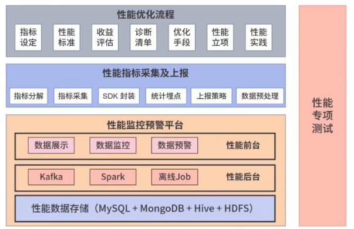
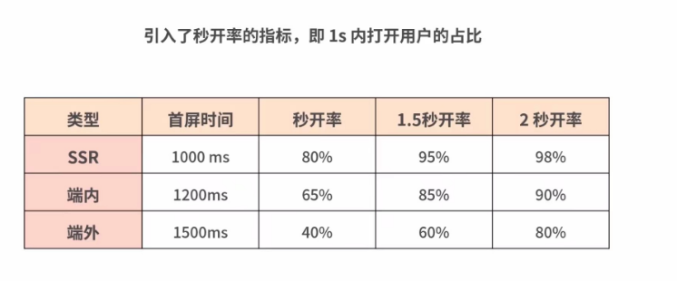

性能指标的采集以及上报
指标的分解
指标采集，sdk封装
统计埋点，上报策略，数据预处理
主要内容是吧前面提到的性能指标以代码的形式分解落地，确保可以采集，然后在SDK封装后集合统计埋点，最后根据实际情况，制定上报策略
当指标超过某一监控阈值的时候，性能监控预警平台通过邮件或者短信的方式给我们发送预警消息，性能数据处理后台和性能可视化展现前台两个部分
# 性能优化关键指标的设定以及标准
视觉稳定性指标
CLS(Cumulative Layout shift)
也就是布局偏移量，它是指页面从一帧切换到另外一帧的时候，视线当中不稳定元素的偏移情况
### 交互方面
有的公司用FID指标(First Input Delay)首次输入延迟，指标必须要小于100ms
有的公司使用PSI（perceptual speed index）视觉变化率，衡量的标准为小于20%;
### 首屏时间如何计算的？
首屏时间=白屏时间+渲染时间
从浏览器输入地址回车开始，到首屏内容渲染完毕的时间，
这期间不需要滚动鼠标或者下拉页面，否则无效的

秒开率指标：
就是1s打开用户的占比
# 业务目标和用户冲突的处理
首屏时间毕竟粒度太粗了，
如果首屏时间长但是白屏时间短，到底是哪里出现了问题？
首屏时间可以拆分成白屏时间，数据接口响应时间，图片加载资源等等
白屏时间数据接口响应时间可以直接从后端服务当中获取，不需要前端再重复计算的
# 页面加载大致过程是怎么样的/
客户端发起请求的阶段
服务器端数据处理请求阶段
客户端页面渲染阶段
## 客户端请求阶段的瓶颈点
客户端发起请求阶段是指的是用户在浏览器输入URL，经过本地缓存确认是否已经存在这个网站了
如果没有，接着会由DNS查询从域名服务器获取这个IP地址，
接下来是客户端通过TCP三次握手，和TLS协商向服务器端发起http请求建立链接的过程
### DNS查询
节省时间的办法是让dns查询走缓存
幸好浏览器提供了dns预获取的接口
我们可以在打开浏览器或者webview的同时就进行配置
### 浏览器同域名的链接限制数目是多少个？
一般是6个，如果当请求数目多于6个，只能6个并发，其余的得要等到最后先返回的请求后，才能做下一次的请求
# 域名规划很重要
我们可以先看看当前页面需要用到哪些域名，最关键的是首屏当中需要用到哪些域名
# 数据缓存
借助service worker的数据接口缓存数据，借助本地存储的接口缓存数据，CDN
#### 借助本次存储的接口缓存
指的是在一些对数据时效性要求不高的页面
第一次请求到数据的时候，程序将数据存储到本地存储，下一次请求的时候，先去缓存里面获取到数据，如果没有的话，再向服务器发起请求
### 重定向
服务器发挥的302重定向
META标签实现的重定向
前端javascript通过window.location实现的重定向
引发新的DNS查询，导致新的TCP三次握手和TLS协商，以及产生新的http请求，然而这些都会导致请求过程当中更多的时间，进而影响前端的性能
# 构建dom的瓶颈点
### 当html标签不满足web语义化的时候
浏览器求需要更多时间去解析dom标签的含义
浏览器会进行语法的纠错
这就会导致页面总的解析和渲染阶段需要更长的时间
严重影响页面的展示性能
### dom节点的数量变多
构建dom树的时间就会增长，进而延长解析时间，拖慢页面展示速度
### 文件包含script标签的情况
无论是dom或者cssom都可以被javascript所访问并且修改，所以一旦在页面解析遇到script标签的时候，dom的构建过程就会暂停，等待服务器请求脚本
### 外部的script被常常称之为解析阶段的拦路虎
有的时候就是因为解析阶段多了一个script标签，造成页面解析阶段从200ms变成1s

# 布局的瓶颈点
因为浏览器每次布局计算都要作用于整个dom的，如果元素量大，计算出所有的元素的位置和尺寸会话很长的时间
所以布局阶段很容易成为性能瓶颈点
在做58列表页性能优化的时候，我们一开始布局的时候，并没有确定列表页的图片的初始大小的，只是给定了一个基础的展位尺寸
当图片加载完毕的时候，主线程才知道了图片的大小，不得不重新进行布局计算，然后再次进行页面的渲染
# 页面的加载全过程很复杂，内容也很多
偏硬件的领域，像GPU绘图，操作系统GUI，和LCD显示等等瓶颈点，网络层和服务层，如拥塞预防，负载均衡，和慢启动还有一些页面
解析和渲染的算法：如解析算法，标记化算法和树的构建算法等等
# 项目目标的制定
VPPV：
VPPV就是详情页的UV除以列表页的PV
这个指标和最终的收入正相关
通俗一点来说，来店内的用户当中，有多少最后买了东西
性能立项，技术调研等等，探索性项目需求
# spa单页面应用
每次筛选以后，只请求数据接口就可以了，不用整个页面的请求
改成单页面应用对我们VPPV
列表页面改成单页面应用
列表页末班改成单页面应用上锋线上要小很多的
如果页面逻辑和数据的展现是通过javascript动态获取的加载的数据
那么爬虫就无法解析抓取到页面
如果页面访问的是爬虫的话，就走服务端末班，反之是个人用户的话，就走单页面应用
### 弱网下的性能优化
弱网当中，2g,3G的用户超过50%
针对弱网优化，合并请求到11个
小图标采用的是Base64Encoding的方式，内嵌于页面当中
不用额外的网络请求来获取的
针对弱网或者移动网络，不自动加载图片，只是显示本占位图
如果性能优化涉及多条业务线，最好是把一条业务线给打通，确保收入数据确实提升了，再推广到其他的业务

