整体上优化性能
# 首屏时间指标采集的具体的办法
在内网通过chrome devtools观察首屏时间的
这样内外网络环境就不同，首屏时间也会受到影响的
使用的是调试工具，二用户是直接访问的，访问方式也不同的
观察首屏的手机只有几种，而真实用户的人不同，手机型号也有很大的不同

## 如果了解用户的首屏时间，大量用户的首屏时间分布是怎么样的？
### 手动采集办法和优缺点:
所谓手动采集，一般就是通过埋点的方式进行的
如果是电商类的商品详情页
首屏包括头图购买，商品信息，下单按钮等等
就是在这些内容加载完成的位置打上首屏结束的点
如果是电商列表页，瀑布流的页面，需要根据各个机型下的首屏的位置，估算一个平均的首屏位置，然后打上点
如果是一个直播型的，页面核心是一个直播框，就需要在直播框当中的结束的位置，打上点
# 手动采集的优缺点：
兼容性强，可以随着情况变动
其次是去中心化，各个业务负责自己的打点代码
有问题的时候业务同学去排查就可以了
手动采集会和业务代码严重耦合，他的覆盖率不足，业务一旦忙起来，性能优化的方案就会延后
## 自动化采集
就是引入一段通用的代码，来做首屏时间自动化采集，引入的过程当中，除了必须要的配置不需要做其他的事情
独立性强，接入的过程更加自动化
# 服务器魔板业务下的采集方法
在一些b端的业务公司当中用的还是服务端的魔板
比如velocity,smarty等等
大名鼎鼎的ssr用的也是服务端的模板
http请求-》html文档加载解析完成（首屏时间点）-》加载样式和脚本文件-》完成页面的渲染
首屏时间点，用浏览器提供的DOMContentLoaded接口实现的
CHorme f12检查蓝线就是右边的蓝线就是的
### DOMContentLoaded时间具体的采集思路是怎么样的呢？
当页面当中的html元素被加载和解析完成，DOMContentLoaded事件触发
domContentLoadedEventEnd-fetchStart
# 单页面应用下的采集方法
使用performance API接口采集的首屏时间是1106ms,实际的首屏时间是1976ms

用户请求一个页面的时候，页面会先去加载index.html,加载完成以后，就会触发DOMContentloaded和load
页面就会加载相关的脚本资源，并且通过axios异步请求数据，使用数据渲染页面主题的部分，这个时候首屏渲染才算完成的
spa的流行让performance接口失去了原先的意义
那么这种情况下，这种情况怎么采集首屏指标呢？
使用MutationOberser采集首屏时间
spa页面
因为无法给予dom contentloaded做首屏指标的采集，最初我么向过使用技术栈的生命周期来解决这个问题
以vue为例：记录首屏的各个组件的mounted的时间
最终在onload的时候，统计出最后一个组件的mounted的时间，作为首屏的时间
如果一个首屏页面的内容没有被组件化，那么首屏时间无法被统计到，除非各个业务都制定一套组件标准，首屏内容必须封装成组件
前面也提到过onload的时间并且最终的时间
可能onload的时候页面没有加载完成的
没有考虑到首屏是一张图片的情况，首屏虽然加载完成了，可是图片是异步的，图片并没有加载
如果能在首屏渲染过程当中，把各个资源的加载时间记录到日志当中，后续再通过分析，确定某一个资源加载完成的时间
MutaionObserver接口提供了监视对dom树所更改的能力，被设计成为旧的mutationEvent,功能的替代品，该功能是DOM3Event规范的一部分
在用户进入到页面的时候，我们可以使用MutationOberser监控dom元素，当dom元素发生变化的时候，程序会标记变化的元素，
记录时间点和分数，存储到数据当中
首屏指标采集到某些条件的时候，首屏渲染已经结束，我们需要考虑首屏采集的终止条件
递归遍历dom元素和子元素
根据子元素所在的层数设定元素的权重
比如说：第一层元素权重是1，那么当他渲染的时候得1分，每次增加一层权重的时候增加0.5比如第五层元素的权重是3.5渲染的时候给出对应的分数
### 为什么需要权重呢？
页面当中每个dom元素对首屏的意义是不同的
越往内层越接近真实的首屏的内容，比如图片，文字等等，越是外层接近body等框架层
根据前面的得分，计算元素的分数变化等等，获取变化率最大点对应的分数，然后找到该分数的对应的时间，就是首屏时间
如果包括图片的话，使用上述方案的，结果准确吗？
不准确，上述计算逻辑主要是针对dom元素来做的，图片加载过程是异步的，图片容器（图片的dom元素）和内容的加载时分开的，当容器加载出来，内容还没有加载出来的时候，一定要确保内容加载出来，才算首屏
getComputedStyle方式获取对应的图片
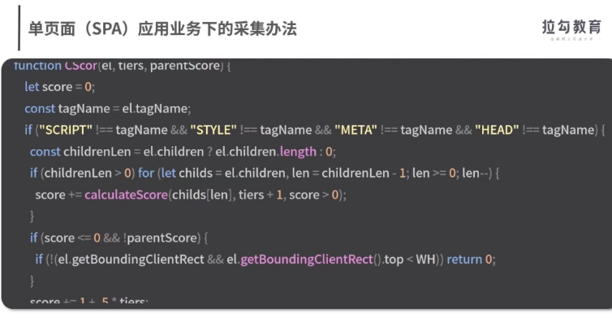
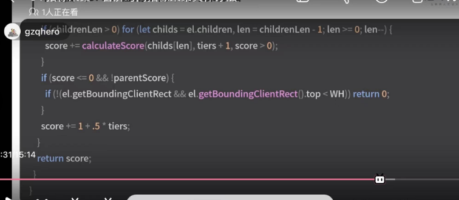
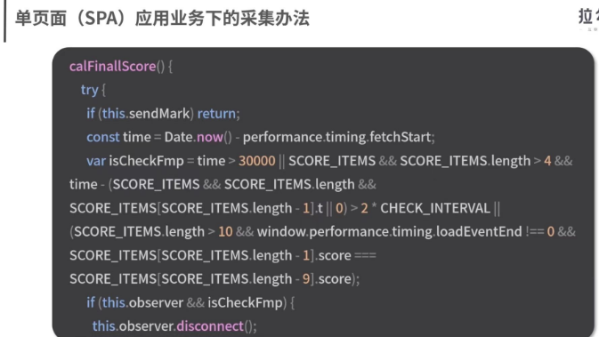
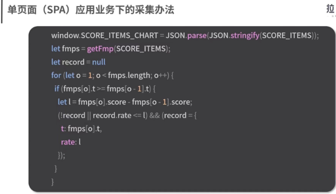
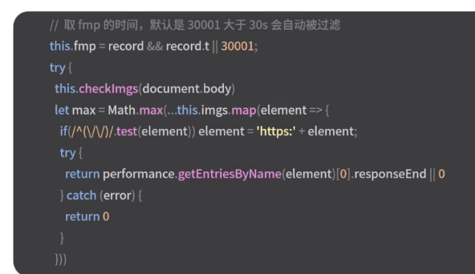
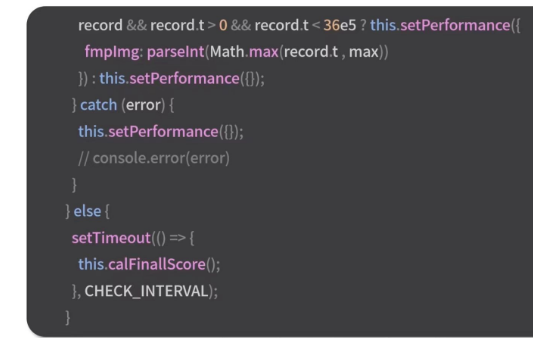
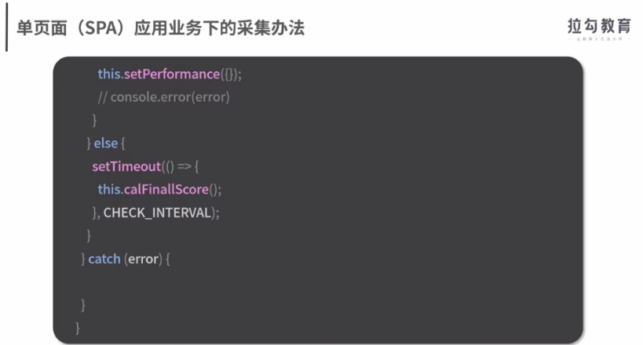
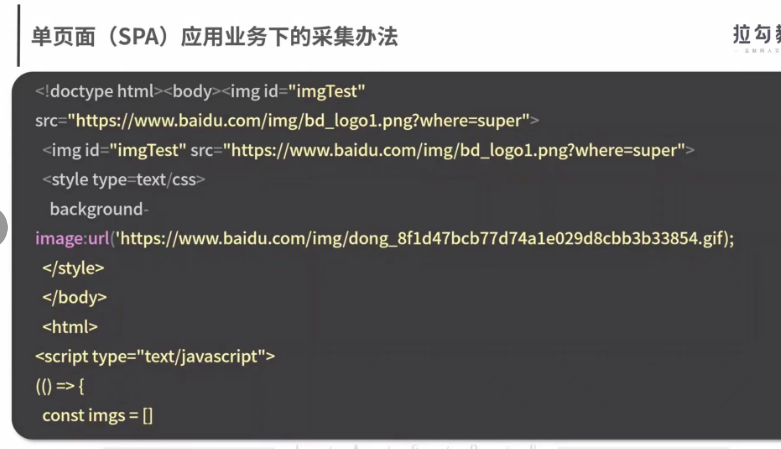
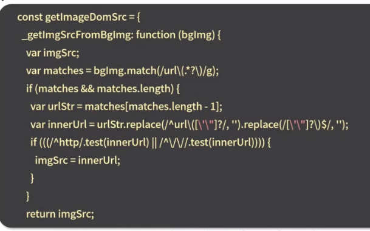
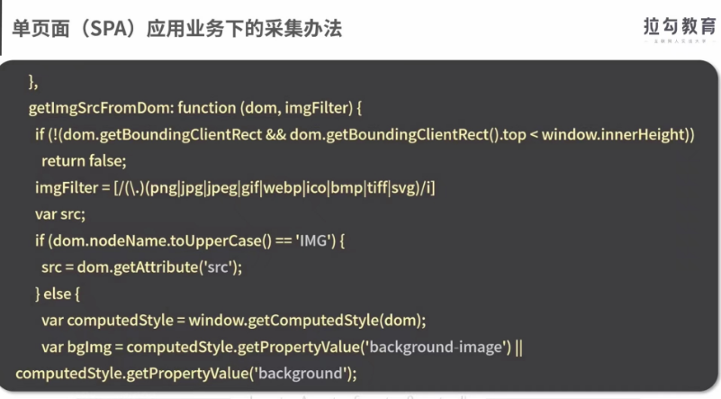
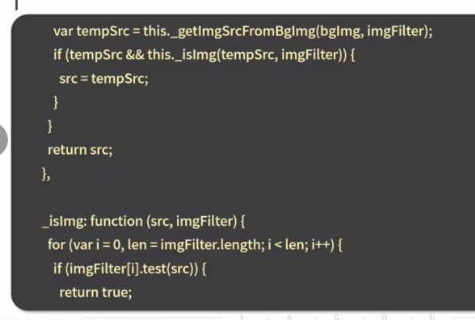
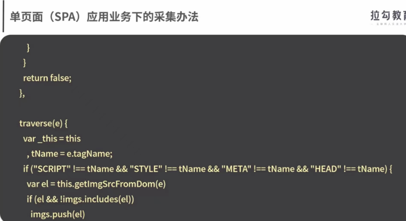
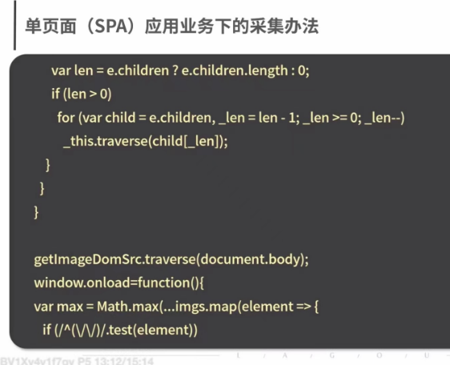
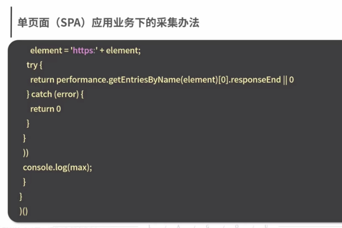