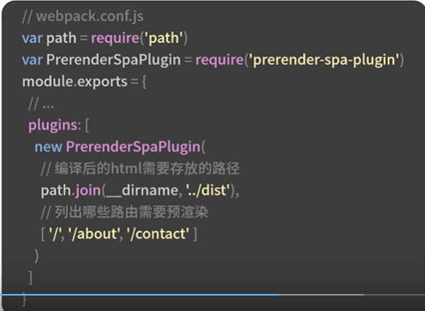

# 懒加载
懒加载指的是在长页面加载过程当中的时候，先加载关键内容，延迟加载非关键内容
可以先根据手机的可视窗口，估算需要多少条数据
然后超出首屏的内容，可以在页面下拉或者滚动的时候再发起加载
如果首页当中的图片比较多，如何保障首屏秒开呢
同样也可以使用懒加载
以百度图片列表页为例
一般会根据不同的手机机型估算一个最大数据
比如ihone12 pro屏幕比较大4行8条数据
我们就先请求8条数据，用来在可视区域展示
其他位置采用占位符填充，在滑动到目标区域位置以后才使用真实的图片填充
在首屏优化方案当中，接口缓存和静态资源的缓存起到了中流砥柱的作用
如果是端内的就是走native请求
接口缓存
app当中的页面展现有两种形式
使用native开发的页面展现和使用h5开发的页面展现
使用h5请求的数据，必须等待webbbiew初始化之后才能请求
 native请求可以在webview初始化之前就开始请求数据了
 # 如何通过native进行接口缓存呢？
 我们可以借助sdk封装来实现的，就是修改原先的数据的接口请求方法，实现类似于axios的请求方法
 # 接口缓存
 查看app本地是否有数据缓存
 如果有的话，就走接口缓存
 如果没有的话，先向服务端请求数据接口，获取接口数据以后放到app缓存当中

# 静态资源缓存
数据接口的请求一般来说比较少，只有几个，
而静态资源比如说js,css图片和字体等等的请求就比较多了
# 静态资源缓存
一种是静态资源长期不需要修改的
一种是静态资源频繁修改的
资源 长期不变的话使用强缓存，Cache-control:max-age
如果资源本身随时会发生改动的可以通过设置Etag实现缓存
在初次请求资源的时候，设置etag,并且返回200的状态码，之后请求的时候带上if-non-match字段，
来询问服务器当前的版本是不可以用的，如果服务器端的数据没有变化，会返回一个304的状态码给客户端，告诉客户端不需要请求数据，直接使用之前缓存的数据
离线化指的是线上实时变动的资源数据静态化到本地访问的死后走的是本地文件的方案
离线包是离线化的一种方案，是将静态资源存储到app本地的方案
离线化一般适合首页或者列表页不需要登录页面的场景
同时支持seo的功能

# 并行化
并行化是在请求通道上下功夫的
解决请求阻塞问题，进而减少首屏的时间
在处理请求阻塞的时候，也可以加大请求通道的数量--借助http2.0的多路复用的方案来解决
http1.1有两个性能瓶颈点：串行的文件传输，和同域名的连接数限制为6个
http2.0的时期提供了多路复用的功能，传输数据采用二进制数据帧和流的方式进行传输
帧是数据接受的最小的单位，流是连接当中的一个虚拟的通道
每一个流都会有一个唯一的整数id对数据顺序进行标识
在使用流的情况下，不论多少个资源的请求，只要建立一个连接就可以了
并行化：
文件传输环境的问题解决以后，同域名的连接限制问题怎么解决呢？
以nginx服务器为例，原先因为每一个域名有6个连接数目的限制，最大的并发就是100个请求
采用http2.0之后，现在就可以做到600提升了6被
使用http2.0多路复用以后，单个文件可以单独上线，不需要再做js文件合并了
为了解决静态域名的阻塞，提升请求并行的能力，需要将静态域名分为pic0-pic5采用httpo2.0多路复用之后，页不需要这样做了
静态域名散列虽然能解决问题，但是dns解析查询的时间也就漫长了起来了
在实际工作当中，前端工程师还会用到离线包和ssr但是ssr的实现比较重，要做的改造比较多的，对于端外的和pc站不具有普适性的
懒加载，缓存，离线化，并行化