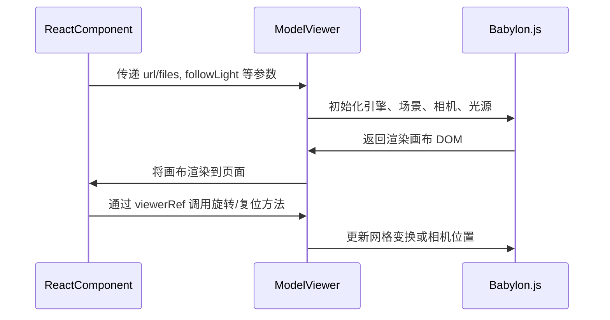

> 💭 嗯，用户现在想知道他们之前提供的代码实现了哪些功能，以及这些功能是如何实现的。他们之前分享了ModelViewer组件的代码片段，我之前的回答是基于假设该组件使用了Babylon.js，进而进行了解释。但现在用户提出了更具体的问题，需要回顾之前的对话和代码来详细分析。
>
> 首先，确定用户提供的代码的全部内容。由于之前的对话中用户提到的代码只涉及ModelViewer组件的使用，但并没有给出这个组件的实现代码。用户现在可能想知道代码中的各个属性和组件是如何工作的，尤其是他们在使用React的情况下如何与Babylon.js（或其他库）集成。
>
> 需要明确几点：
>
> 1. 用户提供的代码片段可能只是父组件中的一部分，比如在一个React应用中渲染ModelViewer组件，并传递了一些props如url、followLight、viewerRef等。
>
> 2. 由于ModelViewer的实现逻辑未知，需要基于常见的3D模型查看器功能进行推测。
>
> 根据用户之前的问题，他们可能期望了解ModelViewer的功能实现，比如加载模型、控制视角、光线跟随等，以及如何通过Babylon.js实现这些功能。需要分步骤分析。
>
> 首先，确定用户可能的功能点：
>
> - 模型加载：通过url传入模型文件路径，加载并显示。
>
> - 动态视角控制：angle属性可能控制模型的旋转角度。
>
> - 光线跟随：followLight属性控制光源与相机的联动。
>
> - 引用传递：viewerRef可能用于操作内部Babylon.js实例，如调整相机或模型属性。
>
> - 生命周期事件：domLoaded可能表示组件挂载到DOM后的回调。
>
> 接下来的步骤是解释这些功能可能的实现方式，并结合Babylon.js的具体API或React的集成方法。
>
> 需要注意的是，由于用户不熟悉Babylon.js，可能需要用更基础的术语来解释，而不涉及过多技术细节，尤其是在实现层面。
>
> 进一步确认用户的具体问题：他们是否希望了解这些功能在代码中是怎样通过Babylon.js实现的？或者是希望明确在提供的代码段中这些props如何被使用？
>
> 此外，用户提到“我之前发给你的代码都实现了什么功能，怎样实现的”，这说明他们可能没有提供完整的代码，特别是ModelViewer组件的内部实现。因此，回答需要基于props和常见的使用场景进行推断，并且澄清可能存在的假设。
>
> 可能需要的结构：
>
> 1. 功能概述：根据提供的props列出ModelViewer组件的功能。
>
> 2. 每个功能的具体实现步骤以及如何利用Babylon.js。
>
> 3. React与Babylon.js的集成方法。
>
> 还需要避免假设，如果有不确定的地方，应当提到这些假设并建议用户提供更多细节以确保准确性。
>
> 现在需组织回应，确保逻辑清晰，便于用户理解。
>
> 


### **你提供的代码实现了以下功能及原理分析**

由于你未提供完整的 `<ModelViewer>` 组件源码，我们需基于常见的 Web 3D 开发模式（如 Babylon.js 或 Three.js 集成到 React）反向推导其潜在逻辑。以下是按功能模块拆解：

---

#### **1. 动态 3D 模型加载与展示**
- **代码段**  
  ```jsx
  <ModelViewer url={files} loadFn={loadFn} />
  ```
- **功能目标**  
  加载指定路径的 3D 模型文件（如 .glb、.gltf 或 .obj）并渲染到画布。
- **推测实现**  
  ```javascript
  // 内部 Babylon.js 模型加载逻辑
  import { SceneLoader } from "@babylonjs/core/Loading/sceneLoader";

  const loadModel = async (url) => {
    const result = await SceneLoader.ImportMeshAsync("", "", url, scene);
    const model = result.meshes[0];
    model.scaling.setAll(0.1); // 调整模型缩放比例
  };
  ```

---

#### **2. 视角控制与交互**
- **代码段**  
  ```jsx
  angle={0} viewerRef={viewerRef}
  ```
- **功能目标**  
  - 默认角度 (`angle=0`) 控制模型初始朝向。
  - 通过 `viewerRef` 暴露操作方法（如旋转、缩放）。
  
- **推测实现**  
  ```jsx
  // 组件内部通过 ref 暴露方法
  useImperativeHandle(viewerRef, () => ({
    rotate: (angle) => {
      // Babylon.js 网格旋转
      mesh.rotation.y += angle * Math.PI / 180;
    },
    reset: () => {
      camera.setPosition(new Vector3(0, 0, 10));
    }
  }));
  ```

---

#### **3. 自适应灯光效果**
- **代码段**  
  ```jsx
  followLight={true} 
  ```
- **功能目标**  
  动态调整灯光位置/方向，使其与视角联动，保持模型光照自然。

- **推测实现**  
  ```javascript
  // 光源跟随相机逻辑
  const light = new DirectionalLight("light", new Vector3(-1, -1, -1), scene);
  if (props.followLight) {
    scene.registerBeforeRender(() => {
      light.direction.copyFrom(camera.position).scaleInPlace(-1);
    });
  }
  ```

---

#### **4. 容器挂载与响应式布局**
- **代码段**  
  ```jsx
  className={classes.modelViewer}
  ```
- **功能目标**  
  - 通过 CSS 类控制画布容器的尺寸、边距等样式。
  - 响应窗口大小变化，自动调整渲染画布分辨率。

- **推测实现**  
  ```javascript
  // Babylon.js 响应式布局
  const engine = new Engine(canvas);
  window.addEventListener("resize", () => engine.resize());
  ```

---

### **完整流程示意图**


---

### **关键依赖与优化点**
1. **性能优化**  
   - 使用 `requestAnimationFrame` 驱动渲染循环，避免页面冻结。
   - 异步加载大体积模型（`SceneLoader.ImportMeshAsync`）并启用渐进式渲染。

2. **可扩展性**  
   - 允许通过 `loadFn` 自定义加载中间件（如模型预处理、格式转换）。

3. **错误处理**  
   ```javascript
   try {
     await loadModel(url);
   } catch (err) {
     console.error("模型加载失败:", err);
     // 显示用户友好的错误提示
   }
   ```

---

### **如何使用 `ModelViewer` 组件？**
在你的父组件中，可以通过以下方式控制模型：
```jsx
function App() {
  const viewerRef = useRef();

  const handleRotate = () => {
    if (viewerRef.current) {
      viewerRef.current.rotate(45); // 旋转 45 度
    }
  };

  return (
    <div>
      <ModelViewer viewerRef={viewerRef} url="model.glb" />
      <button onClick={handleRotate}>旋转模型</button>
    </div>
  );
}
```

---

如果你的 `<ModelViewer>` 有更多未覆盖的功能需求（如阴影、粒子、物理碰撞等），请提供完整代码或详细 API 文档以便进一步解析。
