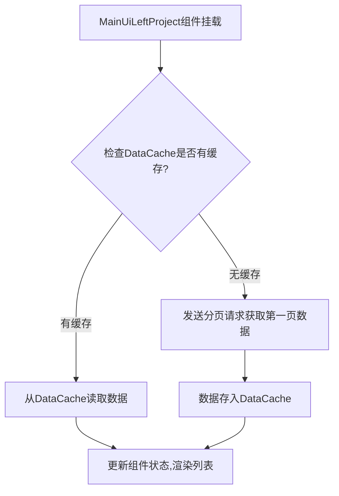
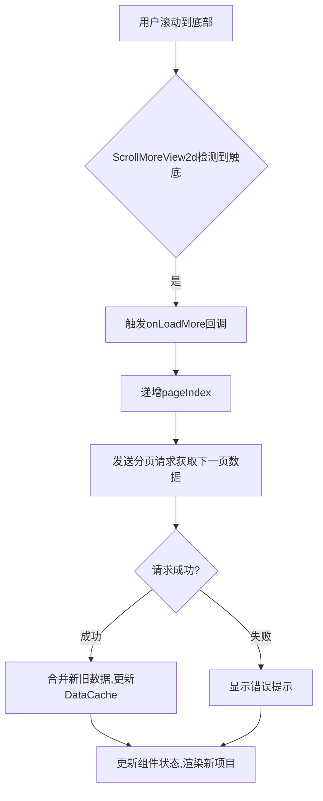
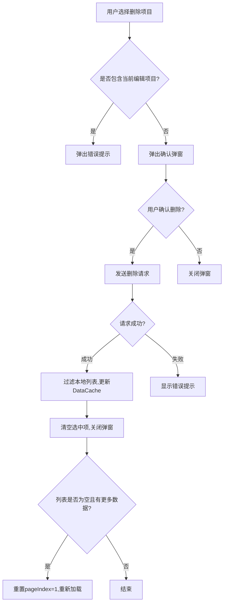
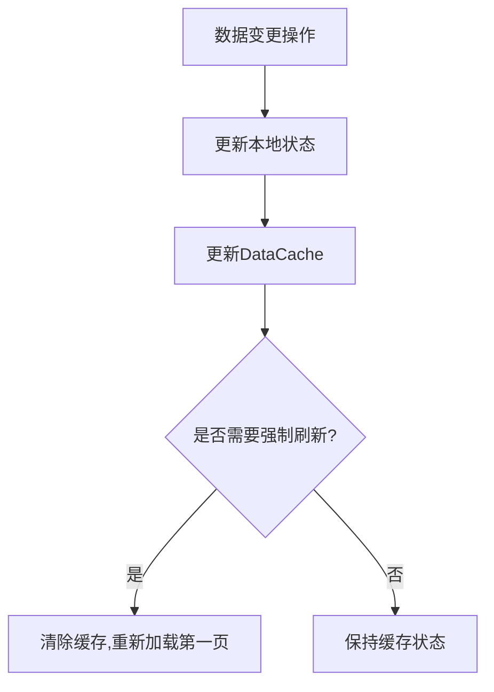
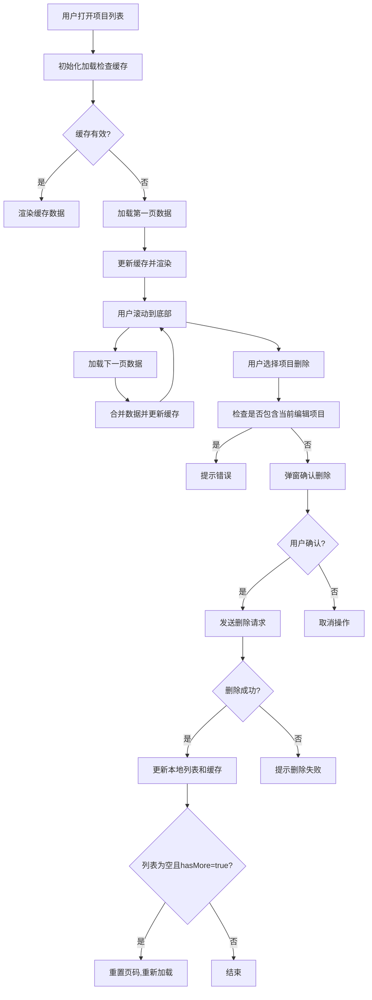

### 业务逻辑详细说明与流程图

#### **1. 项目列表初始化加载**
**流程描述**：
1. **组件挂载**：`MainUiLeftProject` 组件加载时，检查 `DataCache` 中是否有缓存的项目列表数据。
2. **缓存命中**：若缓存存在且有效，直接使用缓存数据渲染列表。
3. **缓存未命中**：若缓存不存在或无效，发送分页请求到服务端获取第一页数据。
4. **数据存储**：将获取的数据存入 `DataCache` 并更新组件状态，渲染项目列表。

**流程图**：

---

#### **2. 滚动分页加载更多数据**
**流程描述**：
1. **滚动触底**：用户滚动到列表底部，`ScrollMoreView2d` 组件通过 `useInView` 检测到触底事件。
2. **触发加载**：调用 `onLoadMore` 回调函数，递增 `pageIndex`。
3. **发送请求**：向服务端发送下一页数据请求。
4. **数据合并**：将新数据与现有列表合并，更新 `DataCache` 和组件状态。
5. **更新UI**：渲染新增项目，保持滚动连续性。

**流程图**：

---

#### **3. 项目删除操作**
**流程描述**：
1. **用户操作**：用户选中一个或多个项目，点击删除按钮。
2. **弹窗确认**：`MainUiLeftFooterBar` 显示确认弹窗，用户确认删除。
3. **发送请求**：调用 `deleteProjectList` 发送删除请求到服务端。
4. **本地更新**：
   - **过滤列表**：从本地 `projectList` 中移除已删除项。
   - **更新缓存**：同步更新 `DataCache` 中的缓存数据。
5. **状态重置**：清空选中项 `selectedItems`，关闭弹窗和编辑模式。
6. **边界处理**：若删除后列表为空且还有数据，重置页码并重新加载第一页。

**流程图**：

---

#### **4. 缓存管理策略**
**关键逻辑**：
- **缓存写入**：每次分页加载或删除操作后，更新 `DataCache` 中的 `pageData`、`pageSize` 和 `hasMore`。
- **缓存失效**：
  - **显式失效**：删除操作后直接更新缓存列表。
  - **隐式失效**：未实现自动过期机制，依赖用户手动刷新或重新加载。
- **数据一致性**：本地缓存可能滞后于服务端，需在关键操作（如删除）后强制刷新。

**流程图**：

---

#### **5. 完整业务流程图**

---

### **关键问题解答**
1. **DataCache与cache.ts的区别**：
   - **DataCache**：单例类，用于全局缓存分页数据（如项目列表、上传素材），提供 `setCacheItem` 和 `getCacheItem` 方法。
   - **cache.ts**：React组件，扩展了事件监听功能（如 `EventUpdateMaterial`），用于特定场景的缓存更新。

2. **ProjectManager与React组件交互**：
   - **事件驱动**：通过 `CanvasEventEmitter` 触发事件（如 `EventProjectChangeState`），组件监听事件更新状态。
   - **方法调用**：组件直接调用 `ProjectManager.getInstance()` 的方法（如 `changeProject`）。

3. **删除后缓存一致性**：
   - **本地过滤**：删除后立即从 `projectList` 和 `DataCache` 中移除对应项。
   - **强制刷新**：若删除导致列表为空且 `hasMore` 为 `true`，重置页码重新加载，确保缓存与服务端同步。

4. **分页实现细节**：
   - **页码管理**：`pageIndex.current` 跟踪当前页码，每次滚动加载递增。
   - **滚动检测**：`ScrollMoreView2d` 使用 `useInView` 监听底部元素，触发 `onLoadMore` 回调。
