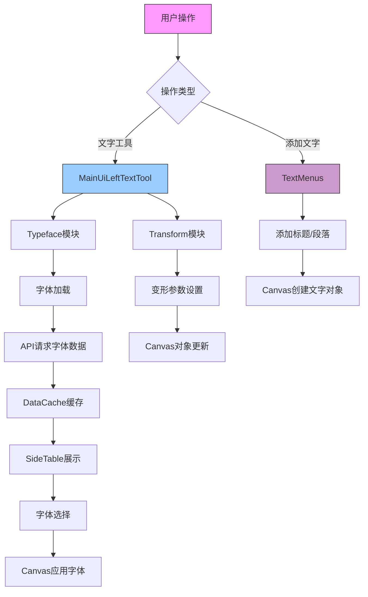
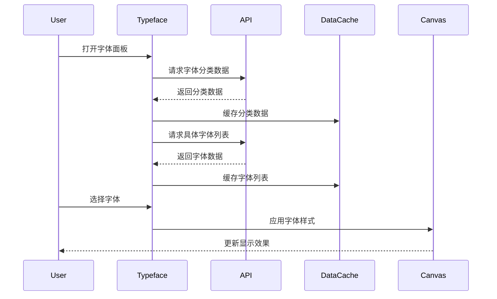
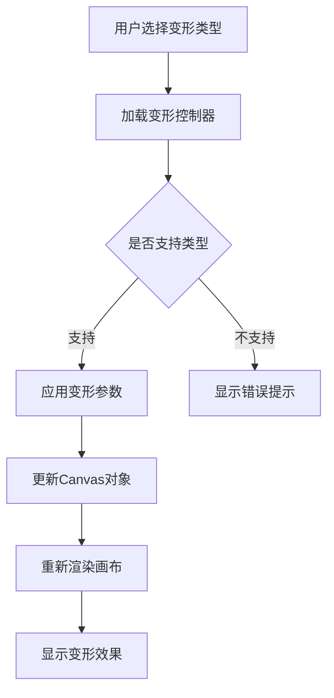
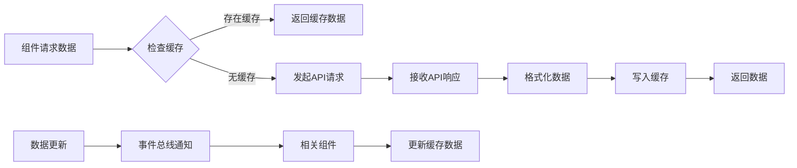
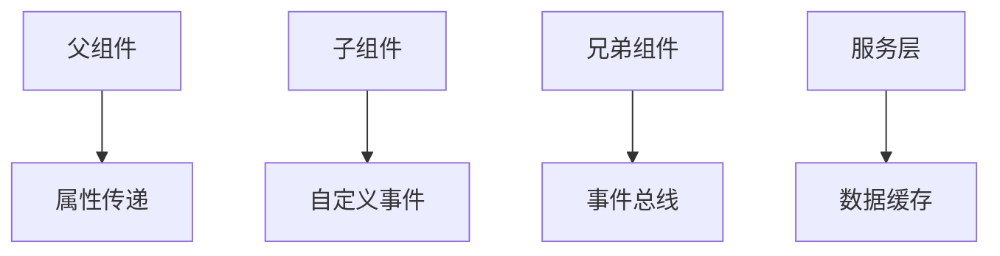

以下是该文本模块的代码结构和逻辑分析，以及对应的流程图表示：

一、代码结构分析
1. 核心模块划分
├── 数据层
│   ├── DataCache - 数据缓存管理
│   ├── appendListToDataA/replaceGraphicData - 数据操作工具
├── UI组件层
│   ├── MainUiLeftTextTool - 文本工具主容器
│   │   ├── Typeface - 字体选择模块
│   │   └── Transform - 变形控制模块
│   ├── SideTable - 侧边栏列表组件
│   └── TextMenus - 文本菜单主入口
├── 服务层
│   └── API请求封装
└── 工具层
    ├── 事件总线(eventBus)
    └── 翻译/i18n

二、核心逻辑流程图


三、关键模块逻辑说明

1. Typeface模块 (字体选择)


2. Transform模块 (变形控制)


3. DataCache工作流程


四、核心功能特点

1. 数据管理：
- 分层缓存策略（内存缓存 + API缓存）
- 智能分页加载（滚动加载+预加载）
- 数据同步机制（事件总线更新通知）

2. 性能优化：
- 字体异步加载（Web Font Loader）
- Canvas批量更新
- 滚动事件节流处理

3. 扩展机制：
- 插件化变形控制器
- 可配置的字体分类系统
- 多语言支持架构

五、关键代码模式

1. 状态管理模式：
```javascript
// 典型状态管理结构
const [state, setState] = useState(initialState);
useEffect(() => {
   // 状态监听
   // 数据同步
   return () => {
       // 清理操作
   }
}, [dependencies]);
```

2. 组件通信架构：


3. 性能优化策略：
- 防抖搜索（lodash debounce）
- 虚拟滚动（动态加载）
- 字体文件懒加载
- Canvas渲染批处理

六、潜在优化方向

1. 数据层：
- 增加本地存储缓存
- 实现请求重试机制
- 添加数据压缩传输

2. 渲染层：
- 引入Web Worker处理复杂计算
- 实现Canvas对象池
- 添加离屏渲染优化

3. 架构层：
- 采用状态管理库（Redux/MobX）
- 实现依赖注入系统
- 组件按需加载（React.lazy）
