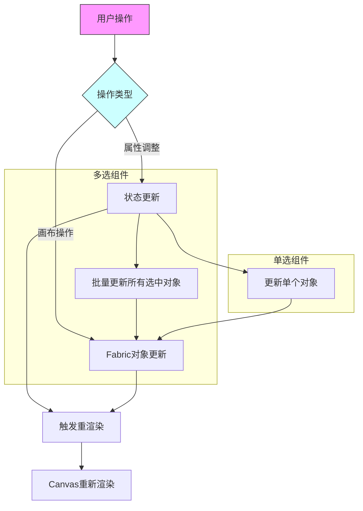
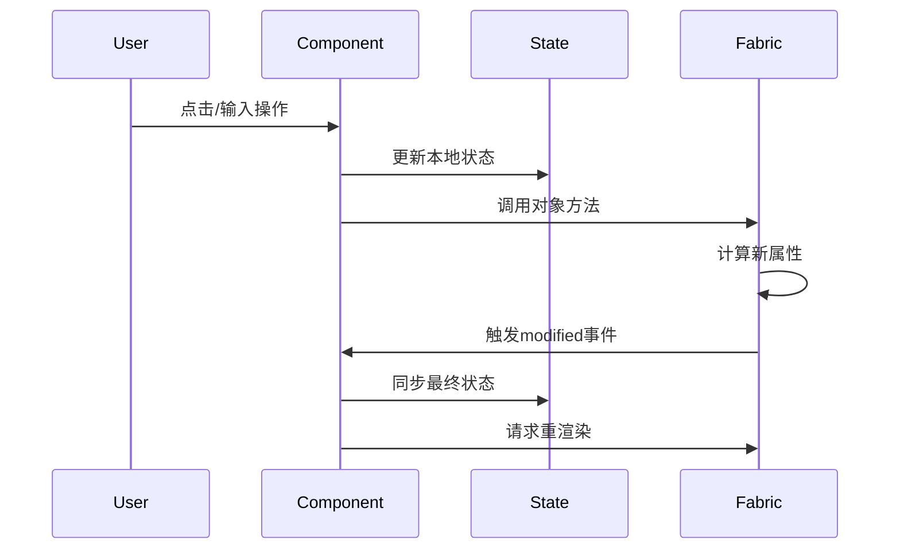
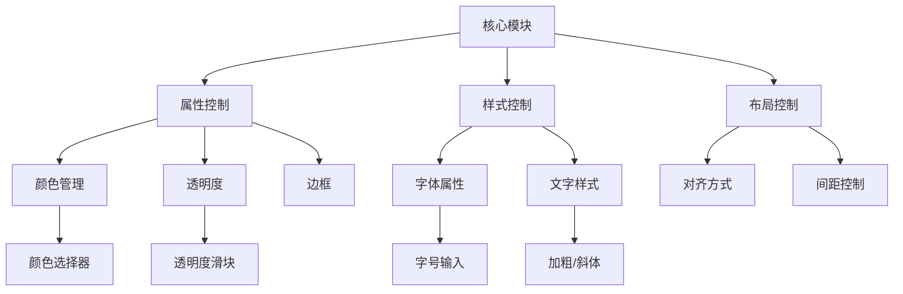
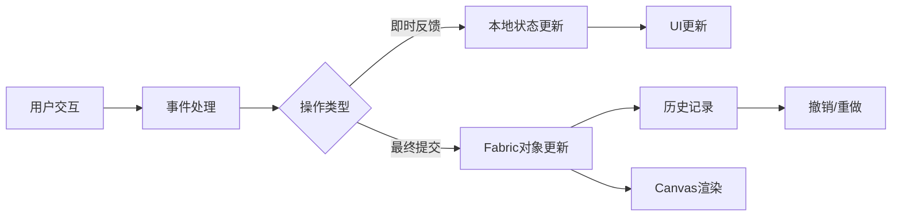
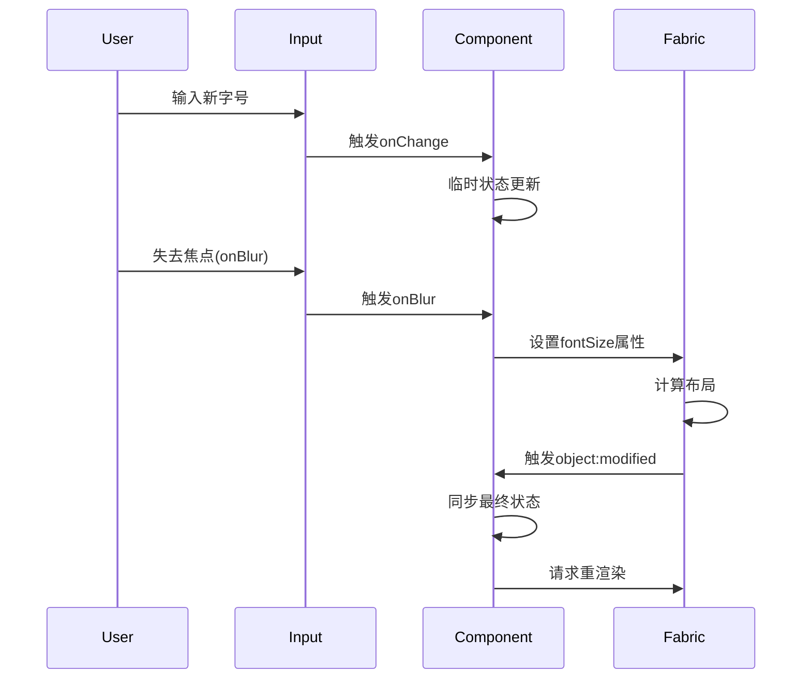
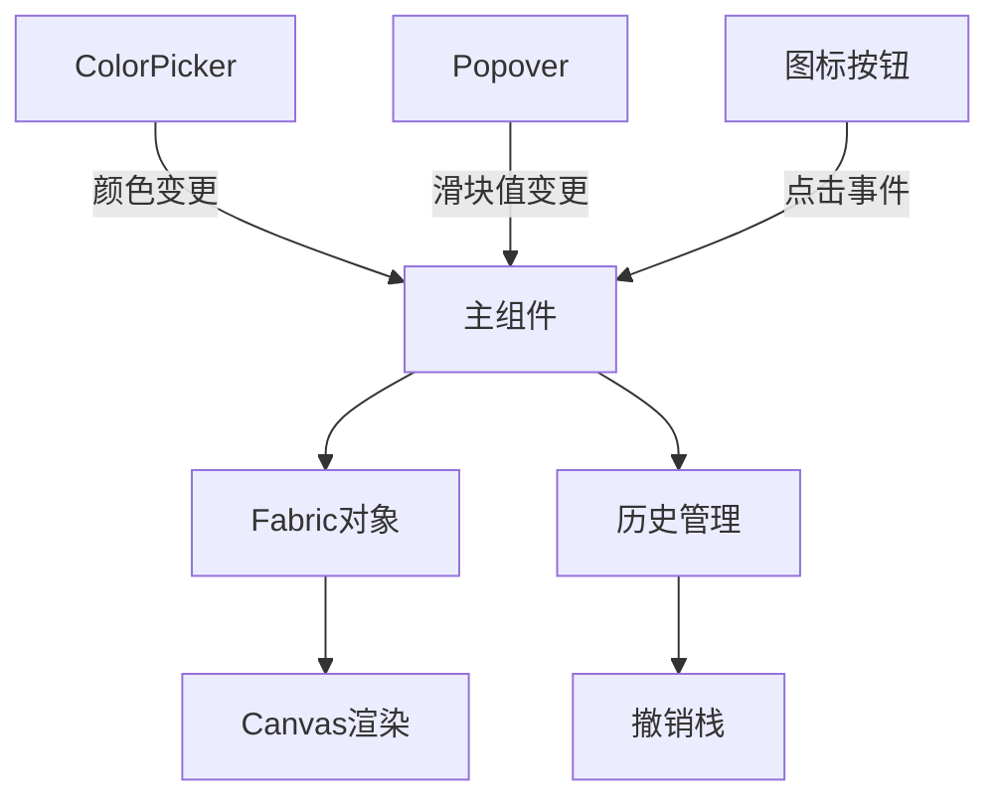

以下是这两个顶部工具栏组件的逻辑分析和流程图表示：

一、组件功能对比

```
| 功能模块             | 多选组件                | 单选组件                |
|---------------------|-----------------------|-----------------------|
| 字体选择            | 支持（显示"Multiple"） | 支持（显示当前字体）     |
| 颜色选择            | 多对象颜色预览          | 单对象颜色控制          |
| 透明度控制          | 统一设置所有对象        | 设置单个对象            |
| 边框粗细            | 批量设置并支持边框颜色   | 单个设置并支持颜色       |
| 字号/行高/字间距    | 统一数值输入            | 带增减按钮的输入        |
| 文字样式            | 批量切换加粗/斜体等     | 单个切换               |
| 对齐方式            | 批量对齐操作            | 单个对齐操作            |
| 材质效果            | 支持多对象生成材质       | 支持单对象生成材质       |
```

二、核心逻辑流程图



三、详细处理流程


四、关键模块结构


五、状态管理流程



六、性能优化策略
```
1. 批量更新机制：多选时使用forEach遍历处理所有选中对象
2. 渲染节流：使用requestAnimationFrame进行渲染控制
3. 差异更新：通过modified事件触发最终状态同步
4. 缓存策略：颜色选择器使用预览色缓存
5. 输入防抖：数值输入使用onBlur进行最终提交
```

七、典型交互时序图（以修改字号为例）



八、跨组件通信


