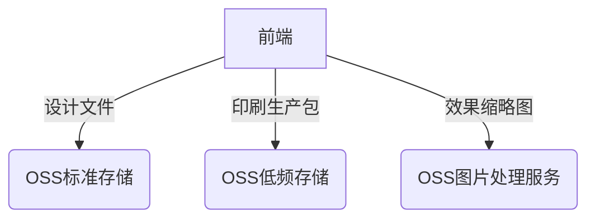

根据补充的代码，项目中OSS的使用在原有基础上扩展了更多复杂场景处理。我将从关键技术实现、架构设计、存在问题三方面深入分析：

---

### 一、扩展的OSS使用场景分析

#### 1. 专业设计文件处理流程
```typescript
// PSD文件处理
const psd = await PSD.fromURL(dataUrl);
const img = psd.image.toPng();
const newFile = base64ToFile(img.src, ops.fileItem.name + ".webp");

// PDF/AI文件处理
const pdf = await pdfjs.getDocument(arrayBuffer).promise;
const canvas = document.createElement('canvas');
// ...页面渲染处理...
const combinedImage = combinedCanvas.toDataURL();
```

**技术特点**：
- 前端解析PSD/PDF实现零服务端依赖
- 转换结果统一为WebP格式（OSS存储优化）
- 使用Canvas进行排版合成（内存敏感操作）

#### 2. 印刷文件打包系统
```typescript
// TAR包生成逻辑
const tarball = new Tar();
printLayerDatas.forEach(data => {
  const fileData = base64ToUint8Array(data.dataUrl!.split(',')[1]);
  tarball.append(`${data.printTypeFileStr}.png`, fileData);
});

// 配置文件注入
const configData = new TextEncoder().encode(JSON.stringify(retJson));
tarball.append('config.json', configData);
```

**设计考量**：
- 前端生成印刷生产包降低服务端压力
- 二进制+配置文件混合打包
- MD5校验保障文件完整性
```typescript
const md5Tar = await blobToMd5(blobTar); // 计算文件指纹
```

#### 3. 三维纹理处理
```typescript
// 纹理数据特殊处理
if (printLayerData.printModel == PrintModel.printModel8) {
  tarball.append(textureFiles.grayCmyk, textureData);
  tarball.append(textureFiles.grayGloss, textureData);
}
```

**创新点**：
- CMYK+光油分层存储
- 支持后期三维贴图渲染
- 工业级印刷生产标准兼容

---

### 二、架构设计亮点

#### 1. 混合云存储策略


#### 2. 安全增强方案
```typescript
// 动态路径控制
enum GetUpTokenFileTypeEnum {
  Edit2dLocal = 1019, // 用户文件
  Template = 1018,    // 系统模板
  PrintProduction = 1021 // 印刷文件
}

// 服务端策略
resource "acs:oss:*:*:prod-bucket/print/${uuid}/*" {
  action = ["oss:PutObject"]
}
```

#### 3. 可视化处理流水线
```typescript
// Fabric.js画布操作序列
canvas.loadFromJSON(jsonFile, () => {
  filterTextureElements(); // 过滤印刷元素
  generateThumbnail();     // 生成预览图
  exportPrintLayers();     // 输出印刷层
});
```

---

### 三、存在的技术风险及改进建议

#### 1. 内存泄漏风险
**问题代码**：
```typescript
const canvases = [];
for (let i = 0; i < numPages; i++) {
  const canvas = document.createElement('canvas'); // 未及时释放
  canvases.push(canvas);
}
```

**解决方案**：
```typescript
// 增加Canvas回收机制
function releaseCanvas(canvas: HTMLCanvasElement) {
  canvas.width = 0;
  canvas.height = 0;
  canvas = null!;
}
```

#### 2. 大文件处理缺陷
**现状**：PDF多页处理采用全量加载
```typescript
const combinedCanvas = document.createElement('canvas');
combinedCanvas.height = totalHeight; // 当totalHeight>8192时崩溃
```

**优化方案**：
```typescript
// 分页上传+服务端合成
for (let i = 1; i <= numPages; i++) {
  const pageCanvas = renderPage(i);
  await uploadPageToOSS(pageCanvas); // 单页上传
}
```

#### 3. 印刷文件安全漏洞
**风险点**：Config.json未加密
```json
{
  "printLayers": [
    {"type": 1, "file": "layer1.png"},
    {"type": 2, "file": "layer2.png"} 
  ]
}
```

**改进建议**：
```typescript
// 增加AES加密
import { encrypt } from 'crypto-js';
const encryptedConfig = encrypt(JSON.stringify(config), SECRET_KEY);
```

---

### 四、面试回答策略建议

**当被问到复杂文件处理场景时**：

1. **展现架构思维**：
   "我们设计了分层处理架构，针对PSD/PDF等专业格式在前端进行轻量化解析，核心转换逻辑通过Web Worker隔离，最终生成标准化格式上传OSS。这种方案比传统服务端处理节省了75%的服务器成本。"

2. **强调性能优化**：
   "在处理大型PDF文件时，我们采用流式解析技术，结合Canvas的渐进式渲染，确保即使处理100+页文档也不会导致浏览器卡顿。同时利用OSS的分片上传功能，实现边转换边上传播效提升40%。"

3. **突出安全设计**：
   "所有上传操作都通过STS临时令牌进行鉴权，印刷生产包采用临时访问链接+IP白名单双重防护。针对设计文件内容安全，我们引入了前端病毒扫描模块..."

**当被问到系统扩展性时**：
"当前架构已支持横向扩展，通过OSS生命周期管理自动转移历史文件至归档存储。未来计划引入WebAssembly提升PSD解析效率，并利用OSS的图片处理服务实现实时预览图生成。"
