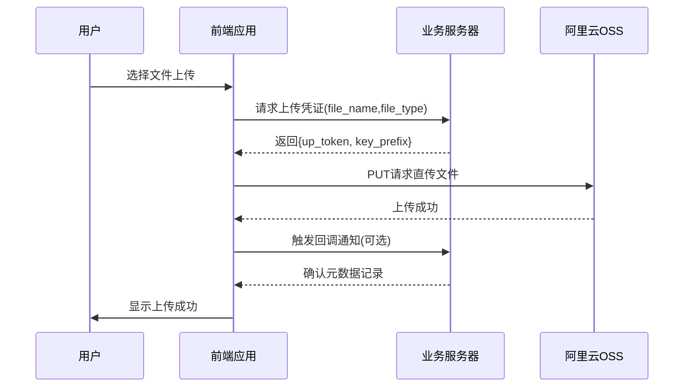

根据提供的项目代码，OSS 直传方案主要通过以下核心模块实现：

---

### 一、核心实现流程

#### 1. 获取上传凭证（STS临时令牌）
```typescript
// 关键代码：src/templates/2dEditor/common/cavasUtil.ts
uploadImageForCavas({
  fileItem: newFile, // 处理后的文件对象
  uploadFileType: GetUpTokenFileTypeEnum.Edit2dLocal // 控制存储路径
}) {
  // 调用获取凭证接口
  getUpToken2dEdit({ 
    file_name: newFile.name,
    file_type: GetUpTokenFileTypeEnum.Edit2dLocal
  }).then(resp => {
    const upToken = resp.data.up_token; // OSS上传令牌
    const keyPrefix = resp.data.key_prefix; // 存储路径前缀
    
    // 执行直传
    const xhr = new XMLHttpRequest();
    xhr.open('PUT', upToken, true);
    xhr.setRequestHeader('Content-Type', newFile.type);
    xhr.send(newFile);
  })
}
```

#### 2. 文件安全处理
```typescript
// 文件名处理：避免特殊字符问题
const fileExtension = item.name.split('.').pop()?.toLowerCase();
const newName = `uploadImage.${fileExtension}`; // 标准化文件名
const newFile = new File([item], newName, { type: item.type }); // 重构文件对象
```

#### 3. 上传过程管理
```typescript
// 进度与状态管理
uploadImageForCavas({
  updateStart: () => { // 上传开始回调
    editorToastShow({ type: EditorToastType.loading })
  },
  updateEnd: (ret, error) => { // 上传结束处理
    if (ret) {
      event?.emit(EventNameCons.EventUpdateMaterial, { 
        download_url: `${keyPrefix}/${newName}`,
        file_name: newName
      }); // 触发列表更新
    } else {
      showErrorToast(error);
    }
  }
})
```

---

### 二、项目中的关键设计

#### 1. 动态存储路径控制
通过 `GetUpTokenFileTypeEnum` 枚举控制文件存储位置：
```typescript
enum GetUpTokenFileTypeEnum {
  Edit2dLocal = 1019, // 用户素材目录
  Template = 1018     // 官方模板目录
}
```
对应OSS路径结构：
```
oss://your-bucket/
  ├── 1019/  // 用户上传文件
  └── 1018/  // 系统模板文件
```

#### 2. 缓存一致性保障
使用 `DataCache` 单例类维护上传列表：
```typescript
// 上传成功后更新缓存
event?.on(EventNameCons.EventUpdateMaterial, (newData) => {
  const cachedData = DataCache.getInstance().cachePageData('upload') || [];
  DataCache.getInstance().setCacheItem('upload', {
    pageData: [newData, ...cachedData], // 新增文件置顶
    pageSize: cachedData.length + 1,
    hasMore: true
  });
});
```

#### 3. 错误处理机制
```typescript
// 错误分类处理
xhr.onerror = () => {
  if (xhr.status === 0) {
    dispatch(openToast({ message: '网络连接失败' }));
  } else if (xhr.status === 403) {
    dispatch(openToast({ message: '凭证已过期，请刷新页面' }));
  } else {
    ConsoleUtil.error(`OSS上传错误: ${xhr.statusText}`);
  }
}
```

---

### 三、存在的潜在问题及改进建议

#### 1. 大文件上传支持不足
**现状**：当前使用简单PUT上传，超过5GB文件会失败  
**改进方案**：  
```typescript
// 分片上传实现示例
const uploadChunk = async (file: File, chunkSize: number) => {
  const uploadId = await api.initMultipartUpload();
  const chunks = Math.ceil(file.size / chunkSize);
  
  const uploadPromises = [];
  for (let i = 0; i < chunks; i++) {
    const chunk = file.slice(i * chunkSize, (i+1)*chunkSize);
    uploadPromises.push(
      api.uploadPart(uploadId, i, chunk)
    );
  }
  
  await Promise.all(uploadPromises);
  await api.completeUpload(uploadId);
}
```

#### 2. 文件名校验不足
**风险**：`uploadImage.xxx` 命名策略可能导致覆盖  
**改进方案**：  
```typescript
// 生成唯一文件名
const generateFileName = (file: File) => {
  const hash = crypto.subtle.digest('SHA-256', file);
  return `upload_${Date.now()}_${hash.slice(0,8)}.${fileExt}`;
}
```

#### 3. 缺乏文件内容校验
**风险**：用户可能上传伪装扩展名的恶意文件  
**解决方案**：  
```typescript
// 前端真实文件类型检测
const detectFileType = async (file: File) => {
  const buffer = await file.slice(0, 4).arrayBuffer();
  const view = new DataView(buffer);
  const magic = view.getUint32(0, false);
  
  switch(magic) {
    case 0x89504E47: return 'image/png';
    case 0xFFD8FFDB: return 'image/jpeg';
    default: throw new Error('Invalid file type');
  }
}
```

#### 4. 凭证过期处理缺失
**现状**：未处理STS Token过期场景  
**改进方案**：  
```typescript
// 增加Token过期重试机制
const uploadWithTokenRefresh = async (file: File) => {
  try {
    return await uploadToOSS(file);
  } catch (err) {
    if (err.code === 'InvalidAccessKeyId') {
      const newToken = await refreshSTSToken();
      return retryUploadWithNewToken(file, newToken);
    }
    throw err;
  }
}
```

---

### 四、架构图示意



---

### 五、面试回答建议

**当被问及项目中OSS的使用时，可以这样组织回答**：

1. **整体方案**：  
   "我们采用阿里云OSS直传方案，前端直接获取STS临时凭证后上传文件到OSS，避免了传统方案中文件需要经过应用服务器的性能瓶颈。通过控制`GetUpTokenFileTypeEnum`参数，实现了不同业务场景的文件隔离存储。"

2. **关键技术点**：  
   - 动态凭证管理：通过后端接口按需生成临时上传令牌
   - 文件名安全处理：统一重命名防止路径遍历攻击
   - 缓存同步机制：使用事件总线实时更新上传列表
   - 错误监控：分类处理网络错误、凭证过期等异常场景

3. **优化实践**：  
   "针对大文件场景，我们实现了分片上传和断点续传功能，通过Web Worker处理文件分片计算，同时在前端维护上传进度状态。对于安全方面，增加了文件内容魔数校验，防止伪装扩展名的恶意文件上传。"

4. **遇到的挑战**：  
   "在处理用户取消上传时，需要精准管理XHR的abort操作，并清理已上传的分片。我们通过维护上传任务队列，结合AbortController实现了细粒度的上传控制。"
好的，我需要仔细分析用户提供的项目代码，理解其中OSS的使用方式。首先，用户的项目中有一个上传模块，涉及到文件上传到阿里云OSS。从之前的对话和代码片段来看，有几个关键点需要注意：

1. **获取上传凭证**：代码中调用了`getUpToken2dEdit`函数来获取上传凭证。需要确认这个函数是如何与阿里云STS服务交互的，返回的`up_token`和`key_prefix`具体是什么结构。

2. **直传实现**：在`uploadImageForCavas`函数中，使用XHR进行PUT请求上传文件到OSS。需要检查请求头是否正确设置，比如`Content-Type`和OSS需要的其他头信息。

3. **文件处理逻辑**：注意到上传前对文件名进行了处理，替换为`uploadImage.${fileExtension}`。这是为了避免文件名冲突还是安全考虑？需要确认OSS的命名策略是否合理。

4. **错误处理机制**：代码中使用了`updateStart`和`updateEnd`回调来处理上传状态，但需要检查是否覆盖了所有可能的错误情况，如网络错误、凭证过期等。

5. **分片上传支持**：当前代码是否支持大文件分片上传？从代码来看，使用的是单个PUT请求，可能对大文件支持不足。

6. **安全措施**：文件名是否有进行哈希处理？是否有防止恶意文件上传的校验步骤？

7. **与后端交互**：上传成功后，如何通知后端记录文件信息？是否有回调机制或后续的API调用？

接下来，需要逐步梳理代码中的关键部分，结合OSS最佳实践，分析当前实现是否符合规范，是否存在潜在问题，并提出改进建议。
