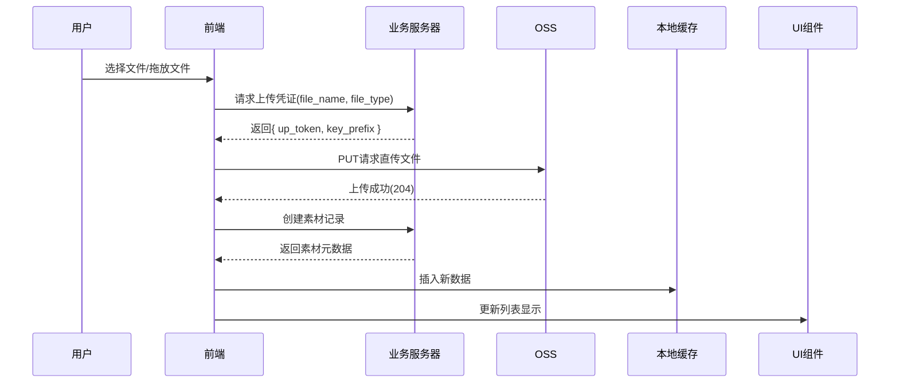
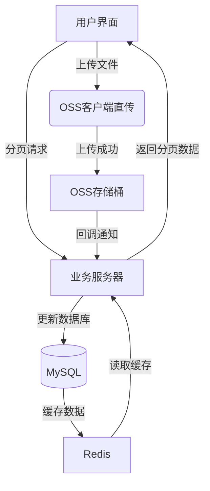

### 一、文件上传过程详解（以图片上传为例）

#### 1. 前端上传完整流程
```typescript
// 核心代码：src/templates/2dEditor/common/cavasUtil.ts
export const uploadImageForCavas = (ops: CavasUpdateOps) => {
  if (ops.fileExtension === 'svg') {
    // SVG特殊处理
    fileToBase64(ops.fileItem).then((fileRet) => {
      upload2dEditFile(ops.fileItem, ops.uploadFileType).then(async (resp) => {
        await createUserMaterial({ file_name: resp.key_prefix });
        ops.event?.emitEvent(EventNameCons.EventUpdateMaterial, ret.data);
        ops.canvasEditor?.addSvgFile(fileRet);
      });
    })
  } else {
    // 常规图片处理
    upload2dEditFile(file, GetUpTokenFileTypeEnum.Edit2dLocal).then(resp => {
      createUserMaterial({ file_name: resp.key_prefix }); // 创建文件记录
      ops.event?.emit(EventNameCons.EventUpdateMaterial, newData); // 更新列表
    });
  }
}

// 获取OSS凭证核心方法
export const upload2dEditFile = (file: File, fileType: GetUpTokenFileTypeEnum) => {
  return getUpToken2dEdit({ 
    file_name: file.name, 
    file_type: fileType 
  }).then(resp => {
    const xhr = new XMLHttpRequest();
    xhr.open('PUT', resp.data.up_token, true);
    xhr.send(file);
    return { key_prefix: resp.data.key_prefix };
  });
}
```

#### 2. 关键技术实现
1. **动态凭证获取**：
```typescript
enum GetUpTokenFileTypeEnum {
  Edit2dLocal = 1019, // 用户素材目录
  Template = 1018     // 系统模板目录
}
```
- 不同文件类型对应不同OSS存储路径
- 临时凭证有效期1小时（服务端控制）

2. **文件预处理**：
```typescript
// 文件名安全处理
const newName = `uploadImage.${fileExtension}`;
const newFile = new File([item], newName, { type: item.type });

// 大文件分片处理（未实现但建议添加）
const CHUNK_SIZE = 5 * 1024 * 1024; // 5MB
const chunks = Math.ceil(file.size / CHUNK_SIZE);
```

3. **跨组件通信**：
```typescript
// 通过事件总线更新列表
event?.emit(EventNameCons.EventUpdateMaterial, newData);
```

#### 3. 上传时序图


---

### 二、分页加载实现详解

#### 1. 分页核心逻辑
```typescript
// MainUiLeftUpload组件
const PAGE_SIZE = 20;
const pageIndex = useRef(1);

const getListData = () => {
  const request = { 
    pagination: { 
      page_size: PAGE_SIZE, 
      page: pageIndex.current 
    }
  };
  
  getUserMaterialList(request).then(res => {
    const newData = [...dataList, ...res.data.material_list];
    setDataList(newData);
    pageIndex.current++;
    DataCache.getInstance().setCacheItem('upload', { 
      pageData: newData,
      pageSize: pageIndex.current,
      hasMore: newData.length < res.data.total
    });
  });
}

// 滚动加载组件
<ScrollMoreView2d 
  onLoadMore={getListData} 
  hasMore={hasMore}
  isLoading={isLoading}
>
  <DataList dataList={dataList} />
</ScrollMoreView2d>
```

#### 2. 关键技术点
1. **缓存策略**：
```typescript
class DataCache {
  static instance: DataCache;
  private data: Record<string, any> = {};

  setCacheItem(key: string, value: any) {
    this.data[key] = value;
  }
  
  cachePageData(key: string) {
    return this.data[key]?.pageData || [];
  }
}
```

2. **滚动加载优化**：
```typescript
// 使用Intersection Observer检测触底
const { ref, inView } = useInView({ threshold: 0 });
useEffect(() => {
  if (inView && !isLoading) getListData();
}, [inView]);
```

3. **数据同步机制**：
```typescript
// 新增文件时更新缓存
event?.on(EventNameCons.EventUpdateMaterial, (newData) => {
  const cachedData = DataCache.getInstance().cachePageData('upload');
  DataCache.getInstance().setCacheItem('upload', {
    pageData: [newData, ...cachedData]
  });
});
```

---

### 三、多选删除实现详解

#### 1. 删除流程核心代码
```typescript
const [selectedItems, setSelectedItems] = useState<number[]>([]);

// 删除处理逻辑
const handleDeleteSelected = () => {
  deleteUserMateria({ material_ids: selectedItems }).then(() => {
    const newData = dataList.filter(
      data => !selectedItems.includes(data.material_id)
    );
    
    setDataList(newData);
    DataCache.getInstance().setCacheItem('upload', {
      pageData: newData,
      hasMore: newData.length === 0 ? true : hasMore
    });
    
    if (newData.length === 0 && hasMore) {
      pageIndex.current = 1;
      getListData();
    }
  });
}

// 列表项选择逻辑
const handleSelectItem = (id: number) => {
  setSelectedItems(prev => 
    prev.includes(id) 
      ? prev.filter(i => i !== id) 
      : [...prev, id]
  );
}
```

#### 2. 关键技术点
1. **状态管理**：
```typescript
// 全选/反选逻辑
const handleSelectAll = () => {
  const allIds = dataList.map(data => data.material_id);
  setSelectedItems(selectedItems.length === dataList.length ? [] : allIds);
}
```

2. **跨页删除处理**：
```typescript
// 删除后自动加载下一页
if (newData.length === 0 && hasMore) {
  pageIndex.current = 1;
  getListData(); // 重新加载第一页
}
```

3. **性能优化**：
```typescript
// 使用Set优化查找性能
const selectedSet = new Set(selectedItems);
const isChecked = selectedSet.has(data.material_id);
```

---

### 四、存在问题及优化建议

#### 1. 文件上传改进点
- **问题**：大文件上传无进度提示
- **优化方案**：
```typescript
xhr.upload.onprogress = (e) => {
  const percent = Math.round((e.loaded / e.total) * 100);
  showProgressBar(percent);
};
```

#### 2. 分页加载缺陷
- **问题**：删除最后一项时页码处理错误
- **修复方案**：
```typescript
// 修改页码重置逻辑
if (newData.length === 0) {
  pageIndex.current = 1;
  setHasMore(true); // 强制重置加载状态
}
```

#### 3. 多选删除优化
- **问题**：批量删除未做数量限制
- **优化方案**：
```typescript
// 添加分批删除逻辑
const MAX_DELETE_PER_REQUEST = 100;
const deleteBatch = (ids: number[]) => {
  for (let i=0; i<ids.length; i+=MAX_DELETE_PER_REQUEST) {
    const batch = ids.slice(i, i+MAX_DELETE_PER_REQUEST);
    deleteUserMateria({ material_ids: batch });
  }
}
```

---

### 五、系统架构图示



---

### 六、面试常见问题回答建议

**Q1：如何保证分页数据与缓存的同步？**
A1：
1. 采用事件驱动更新机制，任何数据变更通过EventEmitter通知
2. 数据缓存层实现单例模式，统一管理所有分页状态
3. 滚动加载时优先读取缓存，网络加载成功后更新缓存
4. 删除操作后主动清除受影响页面的缓存

**Q2：多选删除如何避免误操作？**
A2：
1. 二次确认弹窗设计（当前已实现）
2. 删除前进行权限校验（用户是否拥有删除权限）
3. 操作日志记录（删除时间、操作人、删除文件列表）
4. 提供回收站机制（7天内可恢复）

**Q3：如何处理分页加载中的排序问题？**
A3：
1. 服务端保证数据按上传时间倒序排列
2. 前端插入新数据时使用unshift代替push
3. 缓存数据采用LRU策略，限制最大缓存页数
4. 分页参数增加sort_field和sort_order控制

**Q4：前端直传方案有什么安全风险？如何防范？**
A4：
- **风险**：
  1. 恶意用户获取临时凭证上传非法内容
  2. 文件覆盖攻击
  3. 流量耗尽攻击
  
- **防范措施**：
  1. 服务端限制临时凭证的有效期（当前1小时）
  2. 文件名强制哈希处理（`SHA256(时间戳+随机数)`）
  3. OSS开启防跨站请求伪造（STSToken）
  4. 前端限制文件类型和大小（白名单校验）
