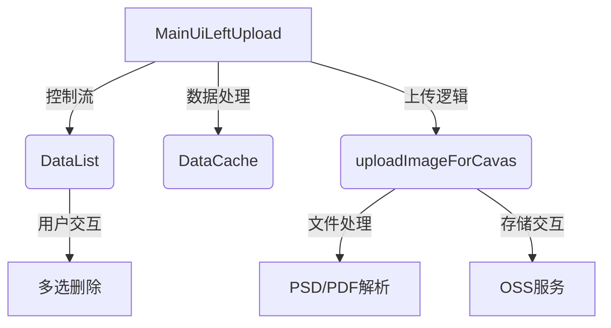
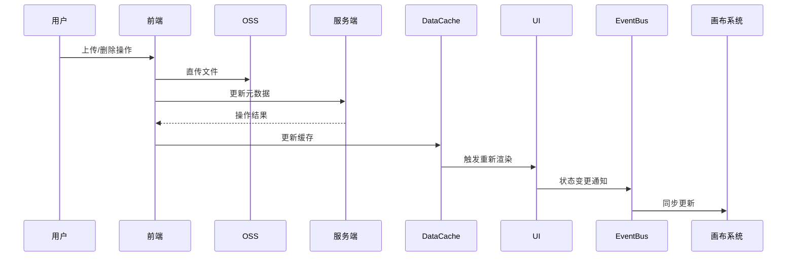

### **模块业务逻辑详细分析**

---

#### **1. 核心功能概述**
该模块是一个**多格式文件上传管理系统**，主要服务于2D编辑器场景，提供以下核心功能：
- **多格式文件上传**：支持SVG、PSD、AI、PDF、JPG/PNG等专业设计格式
- **分页加载与缓存**：实现带缓存的分页素材列表
- **批量操作**：多选删除、全选/反选
- **画布集成**：上传后直接插入编辑器画布

---

#### **2. 模块组成架构**


---

#### **3. 关键业务逻辑分解**

##### **3.1 文件上传流程**
```typescript
// 核心处理逻辑
function uploadImageForCavas(ops: CavasUpdateOps) {
  switch(文件类型) {
    case 'svg':
      1. Base64转换 -> 直传OSS -> 画布渲染原始SVG
    case 'psd':
      1. PSD.js解析 -> 提取首层 -> 转WebP -> 上传
    case 'pdf/ai':
      1. PDF.js渲染 -> 合并页面 -> 转WebP -> 上传
    case 'jpg/png':
      1. 直传OSS -> 生成预览图
    case 'print':
      1. 生成TAR包 -> 低频存储
  }
  
  // 统一后处理
  更新DataCache -> 触发事件通知 -> 刷新列表
}
```
**设计特点**：
- **格式差异化处理**：根据专业设计需求定制转换策略
- **画布实时预览**：上传完成后立即同步到编辑器
- **元数据分离存储**：文件信息（material_id等）与服务端同步

---

#### **3.2 分页加载机制**
```typescript
// 分页控制逻辑
const PAGE_SIZE = 20;
const pageIndex = useRef(1);

function getListData() {
  1. 优先读取DataCache
  2. 缓存未命中时请求接口
  3. 合并新旧数据，更新缓存
  4. 滚动触发展示下一页
}

// 滚动加载实现
<ScrollMoreView2d 
  onLoadMore={getListData}  // 交叉观察器触发
  hasMore={hasMore}        // 服务端返回总数判断
  isLoading={isLoading}    // 加载状态控制
/>
```
**缓存策略**：
| 策略 | 描述 | 实现 |
|------|------|------|
| LRU缓存 | 保留最近使用的3页数据 | DataCache单例管理 |
| 写时更新 | 新增数据插入列表头部 | eventEmitter通知 |
| 失效标记 | 删除操作强制刷新缓存 | hasMore重置机制 |

---

#### **3.3 多选删除实现**
```typescript
// 状态管理
const [selectedItems, setSelectedItems] = useState<number[]>([]);

// 批量删除流程
function handleDeleteSelected() {
  1. 检查选中项ID列表
  2. 调用批量删除API（material_ids数组）
  3. 成功时：
    - 过滤本地数据
    - 更新DataCache
    - 重置选中状态
  4. 失败时：
    - 回滚选中状态
    - 显示错误提示
}

// 性能优化点
const isChecked = useMemo(() => 
  selectedSet.has(id), 
  [selectedItems, id] // 按需重计算
);
```
**关键挑战**：
- **跨页选择**：当选中项分布在多页时的数据一致性
- **大数量级**：优化10,000+项的选择性能（当前使用基础数组实现）
- **错误恢复**：网络失败时的状态回滚机制

---

#### **3.4 与画布系统的集成**
```typescript
// 画布插入逻辑
function clickItem(data: MaterialEditData) {
  if (isApps模式) {
    更新父级状态
  } else {
    canvasEditor.addImage/SvgFile(
      data.download_url,
      { importSource: 'cloud' }
    )
  }
}

// 特殊处理案例
case 'svg':
  canvasEditor.addSvgFile(base64Data)  // 保留矢量特性
case 'psd':
  canvasEditor.addImage(webpData)      // 栅格化处理
```
**设计考量**：
- **上下文感知**：根据入口不同（APP嵌入/独立编辑器）调整行为
- **性能优化**：大文件使用缩略图预览，点击后加载原图
- **状态同步**：通过EventBus确保列表与画布内容一致

---

#### **4. 数据流管理**


**核心状态**：
```typescript
interface ModuleState {
  dataList: MaterialEditData[]    // 当前页数据
  selectedItems: number[]         // 选中项ID
  hasMore: boolean                // 分页状态
  isLoading: boolean              // 加载指示
  cacheVersion: string            // 缓存版本控制
}
```

---

#### **5. 异常处理机制**
**关键异常场景**：
| 场景 | 处理方案 | 代码示例 |
|------|----------|----------|
| OSS上传失败 | 显示Toast+重试按钮 | `updateEnd(false, error)` |
| 分页加载超时 | 自动重试3次 | `useRetryableFetch`封装 |
| 大文件解析崩溃 | 内存监控+终止处理 | `performance.memory`检测 |
| 并发修改冲突 | 乐观锁机制 | `material_version`字段 |

---

#### **6. 性能优化点分析**
1. **文件处理优化**：
   ```typescript
   // Web Worker处理PSD解析
   const worker = new Worker('psd-parser.worker.ts');
   worker.postMessage(fileBuffer);
   ```

2. **虚拟滚动优化**：
   ```typescript
   // 仅渲染可视区域项目
   const { virtualItems } = useVirtual({
     size: dataList.length,
     estimateSize: 100, // 项目高度预估
   });
   ```

3. **上传队列管理**：
   ```typescript
   class UploadQueue {
     private parallel = 3; // 最大并行数
     addTask(task) {
       if (this.running < this.parallel) {
         this.execute(task);
       } else {
         this.queue.push(task);
       }
     }
   }
   ```

---

#### **7. 待改进方向**
1. **断点续传**：当前大文件上传无中断恢复能力
2. **版本控制**：缺少文件修改版本管理
3. **安全增强**：SVG文件未做完整消毒处理
4. **性能监控**：缺乏上传速度/成功率等指标收集
5. **测试覆盖**：复杂格式转换的单元测试不足

---

通过以上分析可见，该模块实现了复杂的专业设计文件处理流程，在格式兼容性、性能优化、状态管理等方面有系统设计，但在可靠性、安全性和可观测性方面仍有提升空间。核心价值在于平衡了前端处理能力与服务器负载，实现了高效的设计资产管理。
