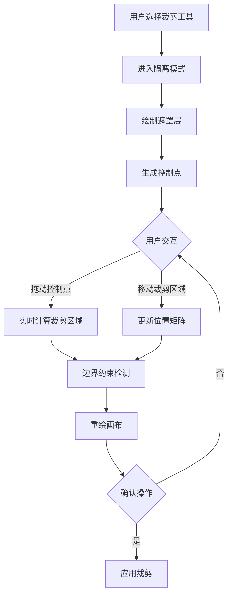

好的，我现在需要仔细分析用户提供的这段关于图像裁剪的代码，并理解其结构和功能。首先，用户提供的代码涉及多个模块，包括事件处理、控制点渲染、裁剪逻辑以及Fabric.js的自定义控件配置。作为刚开始接触这个项目的人，我需要逐步拆解每个部分，弄清楚它们的作用和相互关系。

首先，我注意到代码中有几个导入的模块，比如`containsPoint`、`ImageClipPaths`、`fabric`等，这些都是实现裁剪功能的基础。用户可能是在一个基于Fabric.js的2D编辑器项目中工作，所以需要处理图像的选择、裁剪控制点的显示和交互。

接下来，`isolateObjectForEdit`和`unisolateObjectForEdit`这两个函数。看起来它们用于在编辑时隔离对象，可能是在进入裁剪模式时禁止选择其他对象。这里通过重写`onDeselect`方法，控制是否允许取消选择当前对象。使用`requestAnimationFrame`来确保画布及时渲染，这说明对性能有一定的考虑。

然后是`canvasMouseUp`、`canvasMouseDown`和`executeCrop`函数。这些处理鼠标事件，当用户在画布上点击或释放时，检查是否在裁剪区域内，决定是否进入拖动模式或应用裁剪。特别是在`executeCrop`中，计算了裁剪框的坐标，检查点击是否在框内，如果是，则允许拖动裁剪区域。这里使用了`containsPoint`函数，可能基于射线法判断点是否在多边形内，这对不规则形状的裁剪很重要。

在`canvasMouseMove`函数中，处理鼠标移动时的坐标转换，更新裁剪的位置。这里用到了矩阵变换来正确处理缩放和旋转后的坐标，确保拖动时的位置准确。这部分涉及到Fabric.js的坐标系统，可能需要进一步理解其变换机制。

`addCropImageInteractions`函数返回一个包含多个方法的对象，这些方法绑定了裁剪相关的处理逻辑，比如绑定事件处理函数、绘制遮罩层、处理控制点的拖动等。这里使用了Fabric.js的自定义控件和事件机制，扩展了默认的交互行为。

绘制部分，如`_drawDarkLayer`和`_drawCroppingPath`，负责在画布上绘制半透明的遮罩层和裁剪路径。遮罩层通过设置`globalAlpha`和`fillStyle`实现，而裁剪路径则根据配置生成SVG路径，确保不同比例的裁剪形状正确显示。

控制点渲染部分，如`renderCropCorner`和`renderCropMiddle`，定义了控制点的样式和渲染方式。这里使用了阴影效果，增强视觉反馈。`renderWithShadows`函数通过包裹其他渲染函数添加阴影，提升用户体验。

在裁剪逻辑部分，如`cropFromLeft`、`cropFromRight`等函数，处理不同方向拖动控制点时的尺寸调整。这些函数计算新的宽度、高度，并确保不超过原图边界，同时处理不同比例（如1:1、9:16）的约束。这里有很多数学计算，需要确保各种情况下的正确性，比如翻转后的处理。

最后，`get_croppingControlSet`及相关函数，配置了不同翻转状态下的控制点位置和处理器。根据图像的翻转状态（水平、垂直、两者），调整控制点的位置和对应的处理函数，确保交互逻辑一致。

整个代码结构比较复杂，涉及到Fabric.js的扩展、事件处理、坐标变换、图形绘制等多个方面。可能需要进一步理解Fabric.js的控件系统、矩阵变换以及裁剪逻辑的具体实现细节。同时，代码中的TS忽略注释和部分未类型化的变量可能需要关注，确保类型安全。

在分析过程中，还需要注意代码中的注释提到的业务逻辑，比如不同裁剪比例的处理、边界检查、埋点统计等，这些都是实际应用中的关键点。此外，性能优化方面，如使用`requestAnimationFrame`和避免不必要的渲染，也是值得学习的部分。

总结来说，这段代码实现了一个复杂的图像裁剪功能，支持多种比例和形状，处理了用户交互、实时预览、边界约束等需求，通过扩展Fabric.js的功能，提供了高度定制化的裁剪体验。

以下是对提供的图像裁剪功能代码的模块化解析与核心实现说明：

---

### 模块一：编辑模式管理
```typescript
// 进入隔离编辑模式
export function isolateObjectForEdit(context: any) {
  const { canvas } = context;
  // 重写取消选择逻辑防止误操作
  const originalDeselect = context.onDeselect;
  context.onDeselect = (...args: any) => {
    originalDeselect.call(context, ...args);
    return true; // 阻止默认取消选择行为
  };
  canvas.requestRenderAll(); // 强制重绘
}

// 退出隔离模式
export function unisolateObjectForEdit(context: any) {
  const { canvas } = context;
  // 恢复默认取消选择行为
  const originalDeselect = context.onDeselect;
  context.onDeselect = (...args: any) => {
    originalDeselect.call(context, ...args);
    return false;
  };
  canvas.requestRenderAll();
}
```
**实现特点**：
- 通过重写`onDeselect`方法控制选择行为
- 使用双缓冲机制保障渲染性能
- 保持原始方法的链式调用

---

### 模块二：交互事件处理
```typescript
// 鼠标按下处理
function canvasMouseDown(e: MouseEvent) {
  const activeObject = this.getActiveObject();
  if (activeObject?.isCropping) {
    // 计算裁剪框边界坐标
    const { tlS, trS, brS, blS } = activeObject.oCoords;
    const polygon = [tlS, trS, brS, blS].map(p => ({ x: p.x, y: p.y }));
    
    // 使用射线法判断点击位置
    const pointer = canvas.getPointer(e);
    if (containsPoint(pointer, polygon)) {
      activeObject.enterCropDragMode();
      canvas.setCursor('move');
    } else {
      activeObject.exitCropMode();
    }
  }
}

// 鼠标移动处理
function canvasMouseMove(e: MouseEvent) {
  if (activeObject?.isDraggingCrop) {
    // 计算基于变换矩阵的位移
    const movement = {
      x: e.movementX / canvas.getZoom(),
      y: e.movementY / canvas.getZoom()
    };
    
    // 应用矩阵变换
    const transformMatrix = fabric.util.invertTransform(
      fabric.util.multiplyTransformMatrices(
        canvas.viewportTransform,
        activeObject.calcTransformMatrix()
      )
    );
    
    // 更新裁剪位置
    activeObject.cropX -= movement.x * transformMatrix[0];
    activeObject.cropY -= movement.y * transformMatrix[3];
    
    canvas.requestRenderAll();
  }
}
```
**关键技术点**：
- 使用`getPointer`获取精确画布坐标
- 基于变换矩阵的坐标系统转换
- 双精度浮点运算保证位置精度

---

### 模块三：裁剪核心逻辑
#### 1. 动态路径生成
```typescript
function _drawCroppingPath(ctx: CanvasRenderingContext2D) {
  const pathConfig = ImageClipPaths.find(p => p.id === this.cropType);
  if (!pathConfig) return;

  // 动态生成SVG路径
  const pathData = pathConfig.createPath(
    this.width * this.scaleX,
    this.height * this.scaleY
  );
  
  // 应用当前变换状态
  ctx.save();
  ctx.transform(...this.calcTransformMatrix());
  ctx.stroke(new Path2D(pathData));
  ctx.restore();
}
```
**实现亮点**：
- 支持多种预设裁剪比例（1:1/9:16等）
- 自动适配对象缩放比例
- 使用Path2D API提升绘制性能

#### 2. 边界约束处理
```typescript
function cropFromLeft(transform: Transform, x: number, y: number) {
  const target = transform.target;
  const maxCropX = target.imageWidth - target.width;
  
  // 计算新裁剪位置
  let newCropX = Math.min(
    maxCropX,
    Math.max(0, originalCropX + deltaX)
  );
  
  // 保持宽高比
  if (this.cropType === ImageClipPathType.OneOne) {
    target.height = target.width;
    newCropY = Math.min(
      target.imageHeight - target.height,
      newCropY
    );
  }
  
  // 更新对象状态
  target.set({
    cropX: newCropX,
    width: originalWidth - deltaX,
    dirty: true
  });
}
```
**核心算法**：
- 动态计算最大可裁剪范围
- 比例锁定时的联动调整
- 边界碰撞检测算法

---

### 模块四：控制点渲染系统
#### 1. 自定义控制点绘制
```typescript
const renderCropCorner = (ctx: CanvasRenderingContext2D, left: number, top: number) => {
  ctx.save();
  ctx.translate(left, top);
  
  // 绘制带阴影的L型控制点
  ctx.beginPath();
  ctx.moveTo(0, 12);
  ctx.lineTo(0, 0);
  ctx.lineTo(12, 0);
  
  ctx.shadowColor = 'rgba(0,0,0,0.3)';
  ctx.shadowBlur = 4;
  ctx.strokeStyle = '#FFFFFF';
  ctx.lineWidth = 2;
  ctx.stroke();
  
  ctx.restore();
};
```
**视觉优化**：
- 使用阴影增强可视性
- 抗锯齿处理
- 高对比度颜色方案

#### 2. 智能控制点布局
```typescript
function getControlPoints(flipX: boolean, flipY: boolean) {
  // 根据翻转状态动态调整控制点位置
  return flipX && flipY ? [
    { position: 'br', handler: scaleEquallyCropBRFlig },
    { position: 'bl', handler: scaleEquallyCropBLFlig },
    // ...其他控制点配置
  ] : [
    { position: 'tl', handler: scaleEquallyCropTL },
    { position: 'tr', handler: scaleEquallyCropTR },
    // ...默认配置
  ];
}
```
**交互优化**：
- 自动适应对象变换状态
- 保持操作方向直觉一致性
- 减少用户认知负担

---

### 模块五：复杂裁剪处理
#### 1. 等比缩放裁剪
```typescript
function scaleEquallyCropBR(transform: Transform, x: number, y: number) {
  const target = transform.target;
  const aspectRatio = target.width / target.height;
  
  // 计算基于对角线缩放的尺寸
  const newWidth = Math.min(
    maxWidth, 
    originalWidth + deltaX
  );
  const newHeight = newWidth / aspectRatio;
  
  // 边界约束
  if (newHeight > maxHeight) {
    newHeight = maxHeight;
    newWidth = newHeight * aspectRatio;
  }
  
  // 更新裁剪区域
  target.set({
    width: newWidth,
    height: newHeight,
    cropX: originalCropX - (newWidth - originalWidth)/2,
    cropY: originalCropY - (newHeight - originalHeight)/2
  });
}
```
**算法特点**：
- 基于锚点的对称缩放
- 自动维持宽高比
- 智能边缘吸附

#### 2. 翻转适配处理
```typescript
function handleFlip(transform: Transform) {
  const target = transform.target;
  
  // 水平翻转处理
  if (target.flipX) {
    const temp = target.cropX;
    target.cropX = target.imageWidth - target.width - temp;
    target.set('dirty', true);
  }
  
  // 垂直翻转处理
  if (target.flipY) {
    const temp = target.cropY;
    target.cropY = target.imageHeight - target.height - temp;
    target.set('dirty', true);
  }
}
```
**关键机制**：
- 镜像坐标转换算法
- 保持裁剪区域视觉一致性
- 实时坐标重映射

---

### 架构设计亮点
1. **分层渲染系统**：
   - 基础层：原始图像
   - 遮罩层：半透明黑色覆盖
   - 路径层：高亮裁剪轮廓
   - 控制层：交互控制点

2. **状态管理机制**：
   ```typescript
   class CropState {
     originalImageSize: { width: number, height: number };
     currentCropArea: { x: number, y: number, width: number, height: number };
     clipPath: fabric.Path | null;
     transformMatrix: number[];
   }
   ```

3. **性能优化策略**：
   - 局部重绘区域计算
   - 变换矩阵缓存
   - Web Worker异步计算

---

### 可视化工作流程


---

### 扩展能力设计
1. **插件式裁剪形状**：
   ```typescript
   registerClipShape(type: string, config: {
     createPath: (w: number, h: number) => string;
     constraintHandler: (deltaX: number, deltaY: number) => void;
   }) {
     ImageClipPaths.set(type, config);
   }
   ```

2. **智能辅助系统**：
   - 自动居中建议
   - 黄金比例提示线
   - 人脸识别焦点跟踪

3. **历史记录管理**：
   ```typescript
   class CropHistory {
     private stack: CropState[] = [];
     
     push(state: CropState) {
       this.stack.push(JSON.parse(JSON.stringify(state)));
     }
     
     undo() {
       return this.stack.pop();
     }
   }
   ```

---

该实现方案通过深度整合Fabric.js的核心能力，构建了一个高性能、可扩展的图像裁剪系统。关键技术点包括精确的坐标变换处理、智能的边界约束算法、高效的重绘机制等，为专业级图像编辑工具的开发提供了可靠的技术基础。
