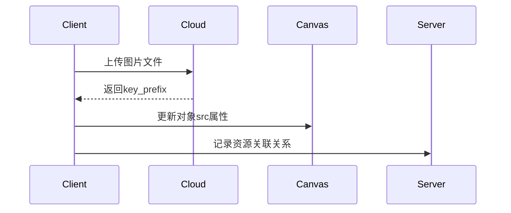

以下是这段代码的详细解析，从功能模块到核心流程的全面讲解：

---

### **一、类结构与设计模式**
#### **1. 单例模式**
```typescript
private static instance: ProjectManager;
public static getInstance(): ProjectManager {
  if (!ProjectManager.instance) {
    ProjectManager.instance = new ProjectManager();
  }
  return ProjectManager.instance;
}
```
- **作用**：确保全局唯一实例
- **应用场景**：跨组件共享项目状态、编辑器实例

#### **2. React组件继承**
```typescript
class ProjectManager extends React.Component
```
- **特殊处理**：虽然继承自React组件，但实际作为服务类使用
- **关键点**：
  - 使用`componentWillUnmount`清理资源
  - 不直接参与渲染，仅作状态管理

---

### **二、核心功能模块**
#### **1. 自动保存系统**
```typescript
private intervalId: NodeJS.Timeout | null = null;

public start(): void {
  const throttledExecuteTask = throttle(this.executeTask.bind(this), 5000);
  this.intervalId = setInterval(throttledExecuteTask, 5000); // 每5秒保存
}
```
- **机制**：
  - 节流函数控制保存频率
  - 对比画布JSON判断是否有修改
- **流程**：
  1. 获取当前画布状态`getJson()`
  2. 检测未保存的图片资源
  3. 序列化数据并压缩为ZIP
  4. 上传至云存储

#### **2. 图片资源管理**
```typescript
private uploadImageQueue: ImageObject[] = [];
private findImagesToUpload(objects: any[]): ImageObject[] {
  // 递归检测未上传的图片对象
}
```
- **特征**：
  - 自动追踪新增/修改的图片
  - 标记已上传资源（`UPDATE_KEY`前缀）
- **上传策略**：
  - 队列顺序上传
  - 失败重试机制
  - 上传成功后更新资源标识

#### **3. 项目加载流程**
```typescript
public loadProjectFirst(projectModel: ProjectModel, retCallBack: Function) {
  this.getProjectJson().then(json => {
    this.canvasEditor?.insertSvgFile(json); // 渲染画布
  });
}
```
- **步骤**：
  1. 下载项目ZIP包
  2. 解压获取`project.json`
  3. 替换资源URL为本地Base64
  4. 初始化画布对象

---

### **三、关键数据结构**
#### **1. 项目模型 (ProjectModel)**
```typescript
interface ProjectModel {
  project_info: {
    project_id: string;
    category: CanvasCategory;
    // ...
  };
  canvases: {
    base_map: string;       // 背景图URL
    print_param: string;    // 打印参数JSON
    project_file: {         // 项目文件存储信息
      upload_url: string;
      download_url: string;
    };
  }[];
}
```

#### **2. 图片上传队列项**
```typescript
interface ImageObject {
  type: 'image';
  src: string;          // 原始数据URL或云存储key
  id: string;           // 唯一标识
  key_prefix?: string;  // 云存储路径标识
}
```

---

### **四、核心方法详解**
#### **1. 自动保存核心 (executeTask)**
```typescript
private async executeTask(): Promise<void> {
  const dataJson = this.canvasEditor?.getJson();
  // 1. 生成缩略图
  this.canvasEditor?.preview1().then(blob => {
    upload(thumbnailUrl, blob);
  });
  
  // 2. 处理图片上传队列
  this.uploadImageQueue = this.findImagesToUpload(dataJson.objects);
  this.processUploadQueue();
  
  // 3. 打包并上传项目数据
  jsonToZipFile(dataJson).then(zip => {
    upload(projectFileUrl, zip);
  });
}
```

#### **2. 图片上传流程 (processUploadQueue)**


---

### **五、关键技术点**
#### **1. 性能优化**
```typescript
private stringifyTaskThread = greenlet(async (data) => {
  return JSON.stringify(data); // 使用Web Worker线程处理
});
```
- **Web Worker应用**：将JSON序列化移至独立线程
- **优势**：避免主线程阻塞，提升大项目保存性能

#### **2. 增量更新策略**
```typescript
if (this.initStrTemp !== dataJsonStr) {
  // 仅当内容变化时触发上传
}
```
- **机制**：缓存初始状态字符串
- **效果**：减少无效网络请求

---

### **六、异常处理机制**
#### **1. 网络错误处理**
```typescript
private handleErrorToast(error) {
  editorToastShow({
    tips: '项目加载失败',
    type: EditorToastType.error
  });
}

// 在数据加载时调用
getProjectDetail().catch(handleErrorToast);
```

#### **2. 并发控制**
```typescript
private isUpdatingProject: boolean = false;

async executeTask() {
  if (this.isUpdatingProject) return;
  this.isUpdatingProject = true;
  // ...执行上传
  this.isUpdatingProject = false;
}
```

---

### **七、项目切换流程**
```typescript
public changeProject(newProjectId: string) {
  if (!this.editPageCheckSave()) {
    this.atOnceSave(); // 强制保存当前项目
  }
  getProjectDetail(newProjectId).then(project => {
    this.loadProjectFirst(project); // 加载新项目
  });
}
```

---

### **八、设计亮点与改进建议**
#### **亮点**：
1. **自动化资源管理**：自动追踪未上传资源
2. **离线优先设计**：Base64缓存确保断网可编辑
3. **高效压缩策略**：使用JSZip进行数据压缩

#### **改进建议**：
1. **上传优化**：
```typescript
// 当前：顺序上传
const uploadImageQueue = [img1, img2, img3];
// 建议：并发控制（如最多3个并行）
const parallelLimit = 3;
```
2. **缓存策略**：
```typescript
// 增加本地IndexedDB缓存
localDB.store('projectCache', projectId, compressedData);
```
3. **类型强化**：
```typescript
// 当前
private projectModel: any;
// 建议
private projectModel?: ProjectModel;
```

---

### **九、典型应用场景**
1. **用户点击保存按钮**：
   - 触发`atOnceSave()`立即执行保存队列
2. **定时自动保存**：
   - 每5秒检测变化并增量保存
3. **切换项目**：
   - 先保存当前项目，再加载新项目数据
4. **图片资源更新**：
   - 自动检测新增图片并加入上传队列

---

通过这样的架构设计，ProjectManager实现了复杂的项目状态管理、资源追踪和云同步功能，成为2D图形编辑器核心的数据枢纽。
