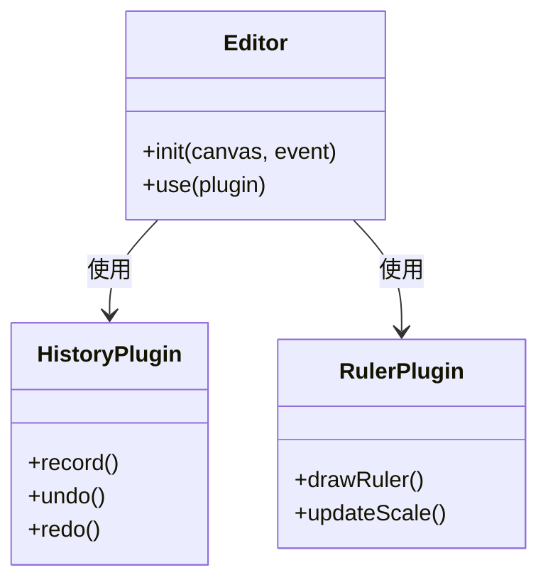
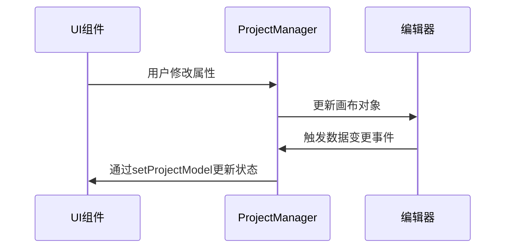
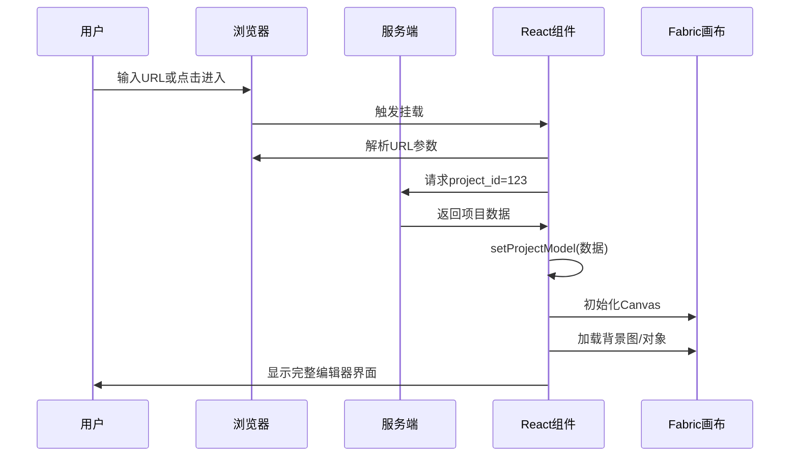

以下是项目加载流程的逐步详解：

---

### **项目加载流程全解析**

#### **1. 组件挂载阶段**
```typescript
useEffect(() => {
  // 组件挂载时执行
  const params = new URLSearchParams(window?.location?.search || location?.location?.search);
  const project_id = params.get('project_id') || '';
  const fromSourceType = params.get('type') || '';
  
  // 分支1：从PC端进入
  if (location?.state?.EditorParmas?.key === '2dStudio') {
    // 使用location.state中的预加载数据
    const projectId = project_id || location.state.EditorParmas.data.project_id;
    getProjectDetail({ project_id: projectId }).then(resp => {
      setProjectModel({ ...resp.data, canvasesIndex: 0 });
    });
  }
  
  // 分支2：从移动端/my-project进入
  else if (location?.state?.EditorParmas?.key === 'userPublished') {
    getProjectDetail({ project_id }).then(resp => {
      setProjectModel({ ...resp.data, canvasesIndex: 0 });
    });
  }
  
  // 分支3：直接访问URL
  else if (!fromSourceType) {
    setSelectDialogVisible(true); // 显示项目选择弹窗
  }
}, []); // 空依赖数组，仅执行一次
```

**关键操作**：
- 解析URL参数获取`project_id`
- 根据进入路径类型选择加载方式
- 未登录时跳转登录，已登录显示项目选择对话框

---

#### **2. 获取项目数据**
```typescript
const getProjectDetail = async ({ project_id }) => {
  try {
    const resp = await fetch(`/api/projects/${project_id}`);
    if (!resp.ok) throw new Error('项目加载失败');
    
    // 数据标准化处理
    const data = {
      ...resp.data,
      canvasesIndex: 0, // 默认显示第一个画布
      project_info: {
        ...resp.data.project_info,
        project_id // 确保ID正确性
      }
    };
    
    return data;
  } catch (error) {
    handleErrorToast(error); // 显示错误提示
    setNetLoading(false);
  }
};
```

**数据结构示例**：
```json
{
  "project_info": {
    "project_id": "123",
    "category": "杯子",
    "is_standard_product": true
  },
  "canvases": [
    {
      "base_map": "背景图URL",
      "base_map_width": 800,
      "base_map_height": 600,
      "print_param": "{...}"
    }
  ]
}
```

---

#### **3. 初始化编辑器**
当`projectModel`状态更新后触发：
```typescript
useEffect(() => {
  if (!projectModel) return;

  // 动态加载核心模块
  Promise.all([
    import('./core'),       // 编辑器核心
    import('./utils/event/notifier'), // 事件系统
    import('fabric')        // Canvas库
  ]).then(([core, notifier, fabric]) => {
    
    // 初始化Fabric画布
    const canvas = new fabric.Canvas('canvas', {
      fireRightClick: true, // 启用右键
      selectionColor: 'rgba(112,216,116,0.1)'
    });
    
    // 创建编辑器实例
    const editor = new core.default();
    editor.init(canvas, new notifier.CanvasEventEmitter());
    
    // 加载插件
    editor.use(core.HistoryPlugin);    // 历史记录
    editor.use(core.RulerPlugin);      // 标尺
    editor.use(core.AlignGuidLinePlugin); // 对齐辅助线
    
    // 设置工作区
    editor.updateWorkspace({
      width: projectModel.canvases[0].base_map_width,
      height: projectModel.canvases[0].base_map_height,
      url: projectModel.canvases[0].base_map
    });
    
    // 状态更新
    setCanvas(canvas);
    setCanvasEditor(editor);
  });
}, [projectModel]); // 依赖projectModel变化
```

**插件系统架构**：


---

#### **4. 加载项目内容**
```typescript
useEffect(() => {
  if (!canvasEditor || !projectModel) return;

  // 初始化项目管理器
  ProjectManager.getInstance().init(canvasEditor, event, projectModel);
  
  // 加载具体内容
  ProjectManager.getInstance().loadProjectFirst(projectModel, () => {
    setNetLoading(false); // 关闭加载状态
  });

  // 事件监听
  eventBus.on(EventNameCons.EventCanvasChangeImg, handleReplaceByChangeImg);
  
  return () => {
    ProjectManager.getInstance().stop(); // 清理资源
    eventBus.off(EventNameCons.EventCanvasChangeImg, handleReplaceByChangeImg);
  };
}, [canvasEditor]); // 依赖编辑器实例
```

**ProjectManager核心方法**：
```typescript
class ProjectManager {
  // 单例模式
  static getInstance() {
    if (!this.instance) this.instance = new ProjectManager();
    return this.instance;
  }

  init(editor, event, project) {
    this.editor = editor;
    this.currentProject = project;
  }

  loadProjectFirst(project, callback) {
    // 加载背景图
    this.editor.setBackground(project.canvases[0].base_map);
    
    // 加载预设对象
    project.objects.forEach(obj => {
      this.editor.addObject(new fabric[obj.type](obj.config));
    });
    
    callback?.();
  }
}
```

---

#### **5. 异常处理流程**
```typescript
const handleErrorToast = (error) => {
  editorToastShow({
    tips: getTranslation(TranslationsKeys.string_project_not_found),
    type: EditorToastType.error
  });
  setNetLoading(false);
};

// 在数据加载时调用
getProjectDetail(params).catch(handleErrorToast);
```

**错误处理策略**：
1. 网络请求失败 → 显示"项目加载失败"
2. 数据格式错误 → 显示"数据解析失败"
3. 权限不足 → 跳转登录页

---

#### **6. 状态同步与更新**
```typescript
// 项目数据变更时更新状态
const updateProjectDataOnly = (newProject) => {
  setProjectModel(newProject); // React状态更新
  ProjectManager.getInstance().updateProjectData(newProject); // 同步到管理器
};

// 通过事件监听触发更新
eventBus.on(EventNameCons.EventUpdateDetailProjectDataOnly, updateProjectDataOnly);
```

**状态同步机制**：


---

### **总结：完整加载时序图**


通过这个流程，项目数据从服务端加载到前端，经过规范化处理后初始化编辑器界面，最终为用户提供可交互的编辑环境。
