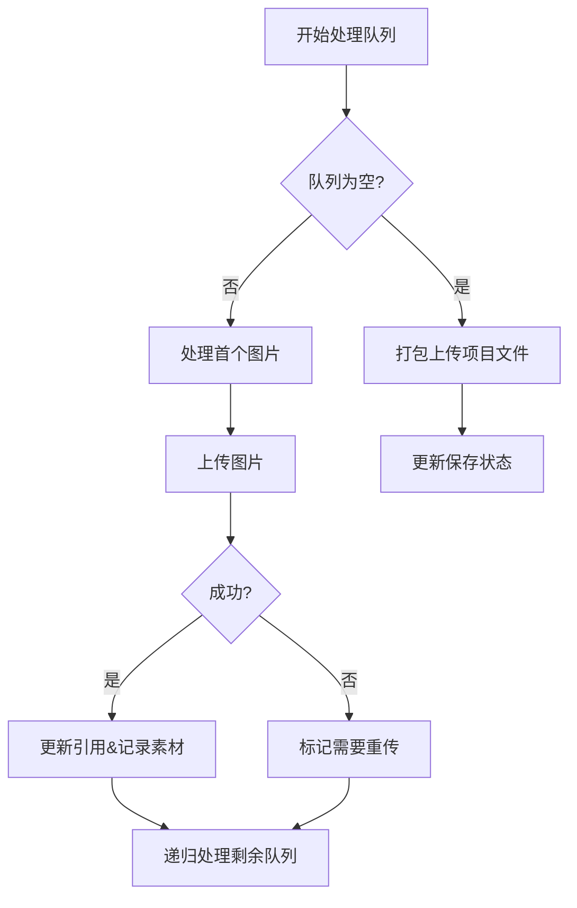

# findImagesTo Upload

---

### **代码核心作用**
**在画布对象树中扫描需要上传的图片资源**，主要处理三种情况：
1. 新添加的本地图片（需上传）
2. 已上传的云端图片（更新引用）
3. 标记跳过的图片（特殊处理）

---

### **代码逐行解析**

```typescript
private findImagesToUpload(objects: any[]): ImageObject[] {
  // 存储需要上传的新图片对象
  const imagesToUpload: ImageObject[] = [];
  // 存储需要记录到项目的已存在素材key
  const addMaterials: string[] = [];

  // 递归检查函数
  const checkAndAddImage = (obj: any) => {
    // 条件1：必须是图片对象
    // 条件2：有有效src
    // 条件3：未标记为已上传（无UPDATE_KEY前缀）
    // 条件4：不在工作区背景层
    if (
      obj.type === 'image' &&
      obj.src &&
      !obj.src.startsWith(this.UPDATE_KEY) &&
      !obj.id?.includes(WorkspaceID.WorkspaceCavas)
    ) {
      // 情况1：标记为跳过上传
      if (obj[CustomKey.skip_upload] === true) {
        this.isJsonUpLoadAgain = true; // 需要重新生成JSON
      }
      // 情况2：已存在云端资源
      else if (obj.key_prefix) {
        Console.log(`已上传图片=导入==:`);
        if (!this.md5List.includes(obj.key_prefix)) {
          this.md5List.push(obj.key_prefix); // 记录素材指纹
          addMaterials.push(obj.key_prefix); // 标记需要关联到项目
        }
        obj.src = `${this.UPDATE_KEY}${obj.key_prefix}`; // 更新为云端引用格式
      }
      // 情况3：外部图片（不做处理）
      else if (obj.src.startsWith('http')) {
        // 保留原始URL
      }
      // 情况4：新增本地图片
      else if (obj.src) {
        imagesToUpload.push(obj); // 加入上传队列
      }
    }

    // 递归处理分组对象
    if (obj.type === 'group' && obj.objects) {
      obj.objects.forEach(checkAndAddImage);
    }
  };

  // 遍历所有顶层对象
  objects.forEach(checkAndAddImage);

  // 同步新增素材到项目
  if (addMaterials.length > 0) {
    const request: ProjectCavasUpdateRequestModel = {
      project_id: this.projectModel!.project_info.project_id,
      canvases: [{
        canvas_id: this.projectModel!.canvases[this.projectModel!.canvasesIndex].canvas_id,
        add_materials: addMaterials // 添加素材关联关系
      }]
    };
    updateProjectCavas(request); // API调用
  }

  return imagesToUpload;
}
```

---

### **关键逻辑说明**

#### **1. 四种图片处理策略**
| 条件 | 处理方式 | 示例 |
|------|---------|------|
| `obj[CustomKey.skip_upload] === true` | 标记需要重新生成项目JSON | 模板占位图 |
| `obj.key_prefix`存在 | 更新为云存储引用格式 | `UPDATE_KEY:abcd123` |
| `src`以http开头 | 保留原始URL | 外部图床图片 |
| 其他本地图片 | 加入上传队列 | `data:image/png;base64,...` |

#### **2. 递归扫描机制**
- **处理嵌套结构**：使用递归遍历`group`类型对象的所有子对象
- **性能优化**：通过`md5List`缓存已处理素材，避免重复操作

#### **3. 云端引用格式**
- **UPDATE_KEY作用**：标识已上传资源，格式示例：`updateToken:abcd123`
- **转换逻辑**：将本地资源引用转换为带前缀的云存储Key

---

### **技术亮点与潜在问题**

#### **亮点设计**
1. **增量更新**：通过`md5List`追踪已上传资源
2. **关联管理**：`addMaterials`同步素材与项目关系
3. **安全过滤**：排除工作区背景层对象（`WorkspaceCavas`）

#### **注意事项**
1. **副作用问题**：直接修改传入对象的`src`属性
   - **建议**：使用深拷贝避免污染原始数据
2. **空值风险**：`this.projectModel!`的非空断言
   - **改进**：增加空值检查`if (!this.projectModel) return [];`
3. **递归性能**：深层嵌套对象可能导致栈溢出
   - **优化**：改用迭代方式遍历

---

### **应用场景示例**
假设用户操作：
1. 添加本地图片A（未上传）
2. 插入云端图片B（已存在`key_prefix`）
3. 拖入分组包含图片C

**处理过程**：
1. 图片A → 加入`imagesToUpload`
2. 图片B → 更新src为`UPDATE_KEY:xxx`，记录到`addMaterials`
3. 图片C → 递归扫描后按上述逻辑处理
4. 最终调用`updateProjectCavas`关联素材B到项目

---

通过这样的设计，系统实现了高效的资源追踪和差异化管理，确保只有新增内容需要上传，已存在资源直接复用。

以下是这段代码的详细分步解析：

---

### **一、方法总体流程**


---

### **二、核心代码段解析**
#### **1. 上传队列处理入口**
```typescript
private processUploadQueue(data: any, jsonDataTemp: string): void {
  // 条件判断：所有图片上传完成且存在项目文件上传地址
  if (this.uploadImageQueue.length === 0 && projectFileUrl) {
    // 打包并上传项目文件
    this.handleProjectUpload(data, jsonDataTemp);
    return;
  }
  
  // 获取队列首项
  const imageObject = this.uploadImageQueue.shift();
  if (imageObject) {
    this.uploadAndProcessImage(imageObject, data, jsonDataTemp);
  }
}
```

---

#### **2. 项目文件上传处理**
```typescript
private handleProjectUpload(data: any, jsonDataTemp: string) {
  // 并行序列化数据
  Promise.all([
    this.stringifyTaskThread(data),      // 当前状态
    this.stringifyTaskThread(jsonDataTemp) // 初始状态
  ]).then(([dataJsonStr, initJsonStr]) => {
    // 压缩为ZIP
    jsonToZipFile(dataJsonStr, 'project.json').then(zip => {
      // 上传到云存储
      upload(projectFileUrl, zip).then(() => {
        this.isUpdatingProject = false;
        // 更新初始状态缓存
        if (!this.isJsonUpLoadAgain) {
          this.initStrTemp = initJsonStr; 
        }
      }).catch(error => {
        this.handleUploadError(error);
      });
    });
  });
}
```

**关键点**：
- **双序列化**：同时处理当前数据和初始数据，用于比较变更
- **ZIP压缩**：减少网络传输量
- **状态更新**：
  - `isUpdatingProject`：标记上传结束
  - `initStrTemp`：缓存最新状态用于差异比较

---

#### **3. 单个图片上传处理**
```typescript
private uploadAndProcessImage(imageObject: ImageObject, data: any, jsonDataTemp: string) {
  this.uploadImage(imageObject).then(resp => {
    if (resp) {
      // 成功上传
      const keyPrefix = resp.key_prefix;
      
      // 更新所有相关引用
      this.updateImageReferences({
        objects: data.objects, 
        tempObjects: JSON.parse(jsonDataTemp).objects,
        canvasObjects: this.canvasEditor.canvas.getObjects()
      }, imageObject, keyPrefix);
      
      // 记录素材关联
      this.recordMaterialAssociation(keyPrefix);
    } else {
      // 失败处理
      this.isJsonUpLoadAgain = true; // 触发下次全量上传
    }
    
    // 递归处理下个元素
    this.processUploadQueue(data, jsonDataTemp);
  });
}
```

**核心操作**：
1. **资源上传**：调用`uploadImage`上传到CDN
2. **引用更新**：
   - 当前数据对象
   - 临时JSON数据
   - 画布实时对象
3. **关联记录**：通过API更新项目素材清单

---

### **三、关键技术点**

#### **1. 递归队列处理**
```typescript
this.processUploadQueue(data, jsonDataTemp);
```
- **优势**：简单直观处理队列
- **风险**：可能引发栈溢出（需确保队列长度可控）
- **优化建议**：改用迭代方式处理长队列

#### **2. 引用更新机制**
```typescript
private updateImageReferences(context, imageObject, keyPrefix) {
  // 更新三个数据源的引用
  this.updateImageObjectSrc(context.objects, imageObject, keyPrefix);
  this.updateImageObjectSrc(context.tempObjects, imageObject, keyPrefix);
  this.updateCanvasObjectKey(imageObject.id, keyPrefix);
}
```
**数据一致性**：
- **运行时数据**：保证画布显示正确
- **持久化数据**：确保保存的JSON包含正确引用
- **临时数据**：维护初始状态对比基准

#### **3. 状态管理策略**
| 状态变量 | 作用 | 变化时机 |
|---------|------|---------|
| `isUpdatingProject` | 防止并发上传 | 上传开始/结束时切换 |
| `isJsonUpLoadAgain` | 标记需要全量上传 | 上传失败时设置 |
| `initStrTemp` | 用于差异比较 | 上传成功时更新 |

---

### **四、错误处理机制**
#### **上传失败处理**
```typescript
.catch((error) => {
  this.isUpdatingProject = false;
  this.isJsonUpLoadAgain = true; // 触发全量重传
  ConsoleUtil.error('Upload error:', error);
  this.getProjectDetailInterval(); // 刷新项目数据
});
```
**设计考量**：
1. **状态回滚**：重置上传状态
2. **重传策略**：标记需要下次全量上传
3. **数据同步**：重新获取项目最新状态

---

### **五、性能优化点**
1. **Web Worker应用**：
```typescript
private stringifyTaskThread = greenlet(/* JSON序列化 */);
```
- 避免主线程阻塞
- 提升大项目处理性能

2. **差异比较**：
```typescript
if (this.initStrTemp !== currentJsonStr) {
  // 仅上传变更内容
}
```
- 减少不必要的网络传输

3. **并行处理**：
```typescript
Promise.all([task1, task2]).then(...)
```
- 最大化利用IO等待时间

---

### **六、潜在问题与改进**
#### **问题1：递归深度限制**
- **现象**：长队列可能导致栈溢出
- **解决方案**：改用循环处理
```typescript
while(this.uploadImageQueue.length > 0) {
  const img = this.uploadImageQueue.shift();
  // 处理逻辑
}
```

#### **问题2：内存泄漏风险**
- **风险点**：持续增长的md5List
- **改进方案**：设置最大长度或LRU缓存
```typescript
// 最大保留1000个指纹
this.md5List = this.md5List.slice(-1000);
```

#### **问题3：错误重试机制**
- **现状**：失败直接标记重传
- **优化建议**：实现指数退避重试
```typescript
let retryCount = 0;
const retry = () => {
  if(retryCount++ < 3) {
    setTimeout(upload, 1000 * Math.pow(2, retryCount));
  }
};
```

---

### **七、应用场景示例**
**用户操作流程**：
1. 添加5张新图片
2. 编辑后触发自动保存
3. 系统依次上传每张图片
4. 全部完成后打包上传项目文件
5. 更新最后保存状态

**异常情况处理**：
- **图片3上传失败**：标记需要全量重传，下次保存时重新尝试
- **网络中断**：通过`getProjectDetailInterval`重新同步数据

---

通过这样的设计，实现了可靠的资源上传管理和项目状态同步机制，确保编辑内容能够安全持久化到云端，同时兼顾了性能和用户体验。
