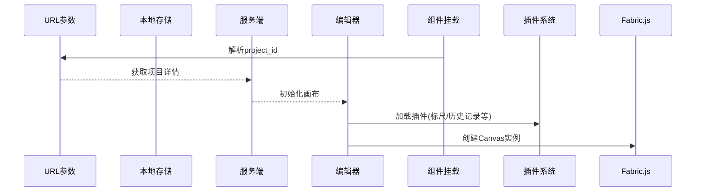
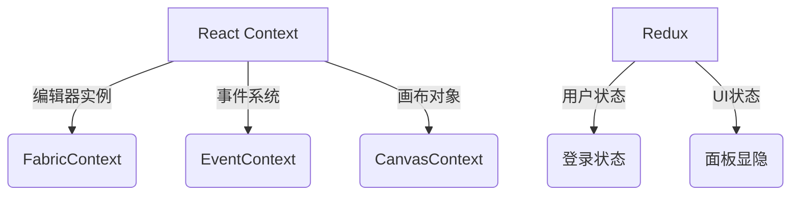

---

### **第一步：整体架构分析**
这是一个基于React的2D图形编辑器核心组件，主要功能包括：
- 画布编辑（使用Fabric.js）
- 项目管理（创建/加载/保存）
- 插件系统（标尺、对齐线等）
- 多面板UI（左侧工具、顶部菜单、右侧属性）
- 状态管理（React Context + Redux）

```jsx
// 组件结构
<上下文提供者>
  <布局容器>
    <头部> <左侧工具> <画布区域> <右侧面板>
    <对话框> <右键菜单> <提示组件>
```

---

### **第二步：核心依赖解析**
1. **Fabric.js**  
   - 处理Canvas绘图的核心库
   - 创建画布：`new fabric.Canvas()`
   - 管理图形对象：矩形、文字、图片等

2. **React Context**  
   - 跨组件共享编辑器状态：
   ```jsx
   <FabricContext.Provider> // Fabric实例
   <EventContext.Provider>  // 事件系统
   <CanvasEditorContext.Provider> // 编辑器核心
   ```

3. **Redux**  
   - 管理全局状态如登录状态、UI显示等
   - `useDispatch()` 和 `useSelector()` 的使用

---

### **第三步：核心初始化流程**
组件挂载时按以下顺序初始化：



关键代码段：
```typescript
useEffect(() => {
  // 1. 从URL获取项目ID
  const params = new URLSearchParams(window?.location?.search);
  const project_id = params.get('project_id') || '';

  // 2. 加载项目数据
  getProjectDetail({ project_id }).then(resp => {
    // 3. 初始化编辑器
    const canvas = new fabric.Canvas('canvas', {
      fireRightClick: true, // 启用右键
      selectionColor: 'rgba(112, 216, 116, .1)' // 选择框颜色
    });

    // 4. 加载插件
    _canvasEditor.use(AlignGuidLinePlugin); // 对齐辅助线
    _canvasEditor.use(HistoryPlugin);       // 撤销重做
  });
}, []);
```

---

### **第四步：核心功能模块**

#### **1. 画布系统**
```typescript
// 创建主画布和背景画布
const canvas = new fabric.Canvas('canvas', options);
const canvas_bg = new fabric.Canvas('canvas_bg', options);

// 典型图形操作
canvas.add(new fabric.Rect({ 
  width: 100, 
  height: 100,
  fill: 'red' 
}));
```

#### **2. 插件系统**
通过`_canvasEditor.use()`加载的插件：
- **RulerPlugin**: 画布标尺
- **HistoryPlugin**: 操作历史记录
- **AlignGuidLinePlugin**: 对象对齐辅助线
- **ImagePlugin**: 图片处理功能

#### **3. 项目管理**
```typescript
class ProjectManager {
  // 核心方法
  loadProject()    // 加载项目
  saveProject()    // 保存项目
  createProject()  // 创建新项目
}
```

#### **4. 事件系统**
```typescript
// 自定义事件总线
eventBus.on(EventNameCons.EventCanvasChangeImg, callback);
eventBus.emit(EventNameCons.EventUpdateDetailProject);

// 原生事件监听
window.addEventListener('beforeunload', handleBeforeUnload);
```

---

### **第五步：UI布局分析**
```jsx
<div className="layoutContainer">
  <Header/>       {/* 顶部菜单栏 */}
  <div className="uiContainer">
    <LeftToolbar/> {/* 左侧工具面板 */}
    <CenterCanvas/> {/* 主画布区域 */}
    <RightPanel/>  {/* 右侧属性面板 */}
  </div>
  <Dialog/>       {/* 各种弹出对话框 */}
  <ContextMenu/>  {/* 右键菜单 */}
</div>
```

---

### **第六步：关键功能实现**

#### **1. 文件保存验证**
```typescript
// 在窗口关闭前检查未保存更改
window.addEventListener('beforeunload', (event) => {
  if (!ProjectManager.getInstance().editPageCheckSave()) {
    event.preventDefault(); // 阻止关闭
  }
});
```

#### **2. 画布更新逻辑**
```typescript
const handleReplace = (newProject) => {
  // 更新工作区设置
  canvasEditor.updateWorkspace({
    width: newProject.baseWidth,
    height: newProject.baseHeight,
    url: newProject.backgroundImage
  });
  
  // 更新项目数据
  setProjectModel(newProject);
};
```

#### **3. 状态管理架构**


---

### **第七步：新手学习路径建议**
1. **先掌握基础**：
   - 学习Fabric.js核心概念：`Canvas`、`Object`、`Group`
   - 理解React Context工作机制

2. **重点调试区域**：
   ```typescript
   // 初始化流程（50-135行）
   useEffect(() => { /* 初始化逻辑 */ }, [projectModel]);

   // 项目加载流程（138-249行）
   useEffect(() => { /* 项目加载 */ }, []);
   ```

3. **推荐调试方法**：
   - 在Chrome中安装React DevTools和Fabric.js调试插件
   - 使用`ConsoleUtil.log()`输出的调试信息

---

### **第八步：代码优化建议**
1. **类型安全改进**：
```typescript
// 当前
const [canvasEditor, setCanvasEditor] = useState<any>(undefined);

// 建议
interface CanvasEditor {
  init: (canvas: fabric.Canvas) => void;
  use: (plugin: Plugin) => void;
}
const [canvasEditor, setCanvasEditor] = useState<CanvasEditor>();
```

2. **代码拆分**：
   - 将300行的`useEffect`拆分为：
     - `useInitEditor()`
     - `useLoadProject()`
     - `useEventListeners()`

3. **性能优化**：
```typescript
// 避免重复渲染
const projectModel = useMemo(() => formatProject(rawData), [rawData]);
```

---

