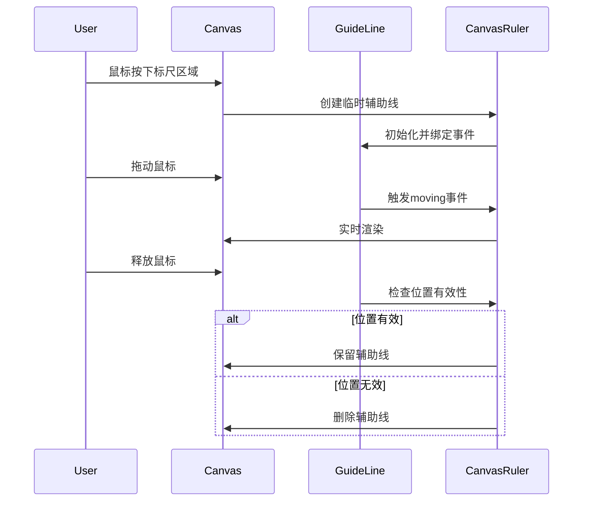

以下是2D编辑器中标尺插件的设计思路及代码详细注释：

### 一、整体设计思路
该标尺插件由三大核心模块组成：
1. **辅助线系统**（GuideLine）：实现可拖拽的参考线及其交互逻辑
2. **标尺主体**（CanvasRuler）：负责标尺的绘制、坐标计算和事件处理
3. **工具函数**：包含绘图工具和计算工具


### 二、核心模块详解

#### 1. 辅助线系统 (GuideLine)
```typescript
export function setupGuideLine() {
  if (fabric.GuideLine) return;

  fabric.GuideLine = fabric.util.createClass(fabric.Line, {
    type: 'GuideLine',
    selectable: false,
    stroke: '#4bec13',
    axis: 'horizontal',  // 轴线方向

    initialize(points, options) {
      // 初始化逻辑：
      // 1. 根据方向设置无限长的线段坐标
      // 2. 绑定鼠标事件处理
      // 3. 设置移动限制（水平线只能垂直移动，垂直线只能水平移动）
    },

    getBoundingRect() {
      // 扩大选择区域，方便鼠标操作
    },

    isPointOnRuler(e) {
      // 判断是否在标尺区域内
    }
  });
}
```

#### 2. 标尺主体 (CanvasRuler)
```typescript
class CanvasRuler {
  constructor(options) {
    // 初始化配置：
    // - 标尺尺寸（默认20px）
    // - 字体大小（默认10px）
    // - 颜色配置（背景/文字/高亮）
    // - 绑定Canvas事件监听
  }

  render() {
    // 核心渲染逻辑：
    // 1. 计算缩放比例和视图变换
    // 2. 绘制水平/垂直标尺背景
    // 3. 绘制刻度线和数字
    // 4. 绘制选中对象的高亮区域
  }

  // 事件处理流程图
  [事件处理] => 
    |-- mouseDown：开始创建辅助线
    |-- mouseMove：实时更新辅助线位置
    |-- mouseUp：确认辅助线位置或删除
    |-- 对象选择：计算并显示高亮区域
}
```

#### 3. 工具函数
```typescript
// 刻度间隔计算（根据缩放级别动态调整）
function getGap(zoom) {
  // 缩放级别与物理尺寸的映射关系
  const zooms = [0.02, 0.05, 0.1...];
  const gaps = [1000, 250, 100...]; // 单位：毫米
}

// 线段合并算法（优化渲染性能）
function mergeLines(rects, isHorizontal) {
  // 1. 按坐标排序
  // 2. 合并重叠/相邻的线段
  // 3. 返回优化后的线段集合
}
```

### 三、关键实现细节

#### 1. 坐标系转换
```typescript
// 处理画布视图变换
const vpt = canvas.viewportTransform;
const startCalibration = -(vpt[4] / vpt[0]); // 水平标尺起始点
const zoom = canvas.getZoom();

// 物理尺寸与像素转换
StringUtil.mmToPixel(value, dpi); // 毫米转像素
StringUtil.pixelToMm(value, dpi); // 像素转毫米
```

#### 2. 动态刻度计算
```typescript
// 根据缩放级别动态调整刻度密度
const gap = getGap(zoom);
const pixelGap = StringUtil.mmToPixel(gap, DPI);

// 绘制循环：
for (let i = 0; i + startOffset <= unitLength; i += pixelGap) {
  // 绘制刻度线和数字
}
```

#### 3. 高亮区域计算
```typescript
// 获取选中对象的边界框
calcObjectRect() {
  const activeObjects = canvas.getActiveObjects();
  // 处理分组对象坐标转换
  // 合并相邻的矩形区域
  this.objectRect = {
    x: mergeLines(horizontalRects),
    y: mergeLines(verticalRects)
  };
}
```

#### 4. 辅助线交互


### 四、性能优化策略

1. **节流处理**：对mousemove事件使用lodash的throttle
2. **局部渲染**：通过requestAnimationFrame优化渲染
3. **对象缓存**：复用计算后的标尺参数
4. **线段合并**：减少不必要的绘制操作

### 五、扩展性设计

1. **配置系统**：通过RulerOptions支持自定义样式
```typescript
interface RulerOptions {
  ruleSize?: number;   // 标尺宽度
  fontSize?: number;   // 文字大小
  enabled?: boolean;   // 启用开关
  // 颜色配置...
}
```

2. **事件系统**：提供完整的生命周期事件
```typescript
canvas.on('guideline:moving', callback);
canvas.on('guideline:mouseup', callback);
```

3. **扩展点**：通过类继承支持自定义标尺
```typescript
class CustomRuler extends CanvasRuler {
  override render() {
    // 自定义渲染逻辑
  }
}
```

该标尺插件通过精心的坐标计算和事件处理，实现了与Fabric.js深度集化的专业级标尺功能，既保证了精确的尺寸标注，又提供了流畅的用户交互体验。
嗯，好的，我需要详细解释一下这个2D编辑器中的标尺插件是如何设计的，以及代码的详细注释。首先，我得先理解用户提供的代码结构和各部分的功能。

看起来整个标尺插件分为几个部分：GuideLine（辅助线）、CanvasRuler（标尺主体）、以及一些工具函数。首先，我会从setupGuideLine函数开始，它创建了fabric.GuideLine类，用于处理辅助线的绘制和交互。辅助线可以水平或垂直拖动，当用户拖动到标尺外时会被删除，同时有各种事件处理，比如移动时的限制和光标变化。

接下来是initRuler函数，它初始化CanvasRuler实例，并处理辅助线与工作区的关系，比如当辅助线被拖出工作区时自动删除。CanvasRuler类是整个标尺的核心，负责绘制标尺、处理鼠标事件、计算高亮区域以及管理辅助线。

工具函数部分包括绘制矩形、文本、线条和渐变遮罩，以及合并线段和计算间距的函数。这些工具函数帮助标尺正确地在Canvas上渲染标尺刻度、数字和高亮区域。

我需要一步步分析每个模块的作用和交互。首先，GuideLine继承自fabric.Line，添加了特定于辅助线的逻辑，比如锁定移动方向、处理鼠标事件、判断是否在标尺上等。CanvasRuler类处理标尺的绘制逻辑，包括刻度、数字、高亮选中对象的位置，以及与Canvas的交互，如鼠标拖拽创建辅助线。

在详细注释代码时，需要注意每个方法的功能，参数的作用，以及关键逻辑的实现。例如，在CanvasRuler的render方法中，会根据缩放比例计算刻度间隔，并绘制水平和垂直标尺。同时，高亮显示选中对象的边界，这涉及到计算对象的位置和尺寸，并合并相邻的线段以避免重复绘制。

另外，事件处理部分也很重要，比如鼠标按下、移动和释放时如何创建和移动辅助线，如何更新标尺的显示，以及如何与Canvas的视图变换（viewportTransform）交互，确保标尺的刻度正确对应画布内容的位置。

可能还需要考虑性能优化，比如使用throttle来限制事件处理的频率，避免频繁重绘导致的卡顿。同时，处理对象分组（group）时的坐标转换，确保标尺正确反映组合对象的位置。

最后，工具函数如getGap根据缩放级别动态调整刻度间隔，确保在不同缩放级别下标尺的刻度清晰可读。mergeLines函数用于合并相邻的线段，优化渲染性能，避免过多的绘制操作。

总结来说，标尺插件的设计涉及以下几个关键点：

1. 辅助线的创建和交互处理。

2. 标尺的绘制，包括刻度和数字的动态生成。

3. 与Canvas视图变换的同步，确保标尺正确反映画布内容的位置。

4. 鼠标事件的处理，实现辅助线的拖拽创建和删除。

5. 高亮显示选中对象的边界，提供视觉反馈。

6. 性能优化，确保标尺在高负载下仍能流畅运行。

在代码注释时，需要详细说明每个类、方法和函数的作用，关键参数的含义，以及复杂逻辑的实现思路。此外，需要指出代码中使用的关键fabric.js API和设计模式，比如继承、事件监听、Canvas渲染流程等。
