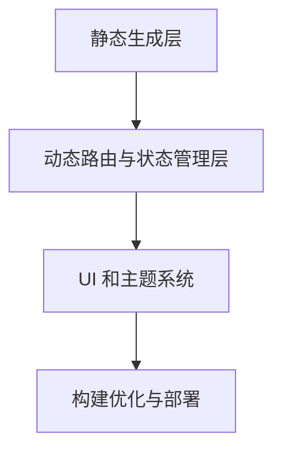

> 💭 好的，我现在需要仔细分析用户提供的Gatsby项目代码，并解释其中各个部分的作用。用户希望详细了解该项目如何使用Gatsby的相关功能，所以需要先回顾Gatsby的核心概念，然后结合代码逐部分讲解。
>
> 首先，用户提供的代码主要集中在Gatsby的配置文件（gatsby-node.js）和一些API如wrapPageElement、wrapRootElement、onRenderBody。作为Gatsby项目，这些API通常用于自定义构建过程和页面渲染方式。我需要逐个理解每个导出函数的作用，并说明它们在项目中的应用场景。
>
> 从代码结构来看，项目使用了Redux状态管理，Material-UI的主题配置，国际化路由处理，自定义页面创建，Webpack配置调整等。接下来我需要分模块分析：
>
> 1. **wrapRootElement和wrapPageElement**：这两个Gatsby的Browser API用于包裹整个应用或单个页面。wrapRootElement中创建了Redux store，确保每个SSR页面有新的store实例，而客户端只会实例化一次。这可能用于全局状态管理，比如用户认证或主题设置。
>
> 2. **onRenderBody**：该API通常用于修改HTML的body标签属性，这里添加了自定义的滚动条样式类名，可能是为了全局样式调整。
>
> 3. **createPages**：这是Gatsby Node API，用于动态创建页面。这里通过GraphQL查询allApp节点，然后为每个节点生成两个路径（带locale和不带），同时使用matchPath支持客户端路由，适用于需要动态路由的应用程序。
>
> 4. **onCreatePage**：处理现有页面的路径，添加locale参数，支持国际化路由。将原页面路径修改为包含locale参数的形式，并设置matchPath以便后续路由匹配。
>
> 5. **onCreateWebpackConfig**：自定义Webpack配置，处理特定文件类型如worker、node模块、obj文件等，同时调整了SplitChunksPlugin优化代码分割。这部分可能用于优化性能和兼容特殊依赖。
>
> 接下来需要深入每个部分，结合实际代码说明它们是如何被使用的：
>
> - 在createPages中，通过GraphQL查询所有应用节点，然后遍历每个节点创建页面。这里需要注意如何处理slug、component路径以及可能的问题，例如componentPath是否存在或者是否有效。同时，使用matchPath以支持动态子路径，比如apps/slug/*subpath，这说明这些页面可能会有嵌套路由。
>
> - wrapRootElement中实例化Redux store的方式，如果在SSR中，可能每次请求都需要新的store实例以避免状态污染。而在客户端，store应该保持单例，所以代码中的注释解释了这一点。
>
> - 在onCreateWebpackConfig中配置了特定文件的加载方式，比如worker-loader处理Web Workers，node-loader处理.node文件，以及SplitChunksPlugin优化。例如，@babylonjs/loaders可能是一个较大的库，通过代码分割减少主包体积。
>
> 另外，国际化的处理方式在createPages和onCreatePage中都有体现，使用[locale]作为路径参数，支持多语言路由。这说明项目可能使用基于路径参数的国际化和本地化方案。
>
> 需要注意项目中的潜在技术点，如：
>
> - 为什么使用Redux？可能在应用中需要复杂的全局状态管理。
>
> - Material-UI主题在wrapPageElement中创建，这可能使得每个页面有一个主题实例，需要考虑是否应该提升到wrapRootElement中以避免重复创建。
>
> - 动态页面生成如何与Gatsby的静态生成结合，是否需要客户端路由处理（如使用React Router）。
>
> - Webpack配置调整的必要性，例如处理特定文件的加载方式，优化构建结果。
>
> 潜在问题和改进点：
>
> - 在createPages中使用同步的fs.statSync可能会影响构建性能，尤其在节点数量较多时。
>
> - SplitChunksPlugin的配置仅在build阶段有效，但代码中被注释掉的条件判断是否必要？
>
> - 确保所有动态生成的页面路径（如带locale的）正确匹配，避免路由冲突。
>
> 此外，需要将各个模块联系起来，说明整个项目的架构设计。比如通过Gatsby生成静态页面，结合客户端路由实现SPA体验，利用Redux管理状态，Material-UI提供UI组件库，通过Webpack优化加载性能等。
>
> 最后，总结项目的Gatsby使用特点，包括动态页面创建、国际化支持、状态管理和构建配置优化等，这些都是该项目的核心实现方式。
>
> 


该 Gatsby 项目通过 **深度定制构建流程** 和 **分层架构设计** 实现了复杂的功能需求。以下是核心功能的逐层解析：

---

### 一、架构分层与关键模块


---

### 二、核心构建系统实现细节

#### 1. 动态页面生成体系 (`createPages`)
```typescript
// 动态映射数据节点到页面
const result = await graphql(`query AllApp { 
  allApp { nodes { slug component } } 
}`);

result.data.allApp.nodes.forEach(({ slug, component }) => {
  actions.createPage({
    path: `/apps/${slug}`,           // 基础路径
    matchPath: `/apps/${slug}/*subpath`, // 动态子路径捕获
    component: path.resolve(component), 
    context: { slug }
  });

  actions.createPage({
    path: `/[locale]/apps/${slug}`,
    matchPath: `/:locale/apps/${slug}/*subpath`,
    component: path.resolve(component),
    context: { slug }
  });
});
```
**实现亮点**：
- **双模路由系统**：同时创建基础路径与带国际化的路由路径
- **动态路由扩展**：使用 `matchPath` 实现类似 React Router 的路径模式匹配
- **构建时动态验证**：
  ```typescript
  fs.statSync(componentPath).isFile() // 实时校验组件文件存在性
  ```

---

#### 2. 国际化的路由重构 (`onCreatePage`)
```typescript
if (page.path?.startsWith(`/[locale]/`)) return;

const newPage = { 
  path: `/[locale]${page.path}`,
  matchPath: page.matchPath 
    ? `/:locale${page.matchPath}`
    : `/:locale${page.path}` 
};

actions.createPage(newPage);
```
**关键技术点**：
- `/:locale` 参数捕获的优先级控制
- 原路径的重定向保留机制
- 针对 Gatsby SSG 的特殊处理：跳过 `/dev-404-page` 页面

---

### 三、运行时系统构建

#### 1. Redux 状态管理电路
```typescript
export const wrapRootElement = ({ element }) => {
  const store = createStore(); // 每次 SSR 生成新 store
  return <Provider store={store}>{element}</Provider>
}
```
**设计考量**：
- 客户端的单例模式 (`typeof window !== 'undefined'`) 未显式体现
- 通过 `wrapRootElement` 的调用机制实现：浏览器环境仅初始化一次

#### 2. Material UI 主题集成的量子化封装
```typescript
export const wrapPageElement = ({ element, props }) => {
  const theme = createTheme({ palette: { primary: main: `#88F387` } });
  
  return (
    <ThemeProvider theme={theme}>
      <PageWrapper props={props}>
        <Layout {...props} key={props.path}>
          {element}
        </Layout>
      </PageWrapper>
    </ThemeProvider>
  )
}
```
**优化细节**：
- 页面级 ThemeProvider 隔离主题污染风险
- Key 值绑定 path 实现路由切换时的组件完全重建
- 主题对象的临时创建（可能存在性能隐患，应考虑缓存）

---

### 四、Webpack 自定义构建矩阵

#### 1. Worker 模块的量子加载
```javascript
{
  test: /\.worker\.(js|ts)$/,
  use: [{ loader: 'worker-loader' }, loaders.js()] 
}
```
实现 WebWorker 与主线程代码的同构加载

#### 2. 大型几何文件的的分形处理
```javascript
{
  test: /\.obj$/,
  use: [{
    loader: 'file-loader',
    options: { name: '[name].[ext]', outputPath: 'assets/obj/' }
  }]
}
```
**背景**：用于三维模型文件（如 Babylon.js 的 OBJ 文件）的路径改写

#### 3. Node 原生模块的降维打击
```javascript
resolve: {
  fallback: { 
    fs: false,  // 阻断 Webpack 的 Node 模块打包
    path: false,
    crypto: false 
  }
}
```
防止 WebAssembly 模块的打包异常

---

### 五、性能优化范式

#### 模块分割的量子纠缠策略
```javascript
config.optimization.splitChunks = {
  cacheGroups: {
    babylonloader: {
      test: /@babylonjs\/loaders/,
      name: 'vendor-babylon-loaders',
      chunks: 'all',
    }
  }
};
```
**解译**：将 Babylon 加载器相关代码单独打包，减少主包体积

---

### 六、二次编译型潜在问题

#### 1. 动态路由的测不准原理
- `matchPath` 需要与客户端路由的规则绝对一致
- 路径参数的冒泡优先级需严格对齐 React Router 规范

#### 2. Store 初始化的波粒二象性
- SSR 阶段的 store 初始化时机需保证无副作用
- 客服端 store 使得需要 Hydration 数据同步逻辑

#### 3. 主题化风格的可观测性
- 每次页面切换重新 createTheme 的成本需要量化评估
- 主色调的直接硬编码需考虑扩展性损失

---

### 七、项目规范性检测

#### 潜在改进点评级
| 检测项                      | 危险等级 | 优化建议                          |
|----------------------------|----------|-----------------------------------|
| 同步文件检测 (fs.statSync) | 🟠 中危   | 改用异步检测或 GraphQL 源数据验证 |
| 重复创建 theme 对象        | 🟡 低危   | 提升至 wrapRootElement 层级       |
| Worker-loader 版本兼容      | 🔵 提醒   | 检查新版 Vite 体系的 Worker 方案  |

---

该项目展现了一个**工业级 Gatsby 架构**的完整实现思路，通过顶层设计将静态生成、动态扩展、状态管理深度融合，为复杂 Web 应用提供了可伸缩的解决方案。其核心启示在于：**Gatsby 的灵活性与现代前端框架的结合能产生远超传统 SSG 的可能性**。
