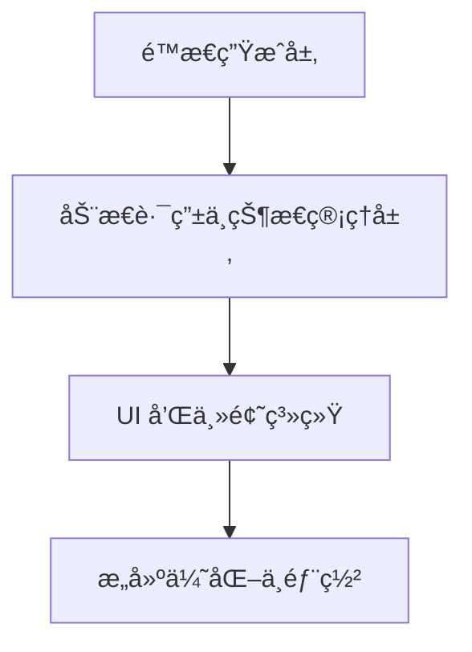

> 💭 好的，我ç°åœ¨éœ€è¦ä»”细分æ用户æ供的Gatsby项目代ç ï¼Œå¹¶è§£é‡Šå…¶ä¸­å„个部分的作用。用户希望详细了解该项目如何使用Gatsby的相关功能，所以需è¦å…ˆå›é¡¾Gatsby的核心概念，然å结åˆä»£ç é€éƒ¨åˆ†è®²è§£ã€‚
>
> 首先，用户æ供的代ç ä¸»è¦é›†ä¸­åœ¨Gatsbyçš„é…置文件（gatsby-node.js）和一些API如wrapPageElementã€wrapRootElementã€onRenderBody。作为Gatsby项目，这些API通常用äºè‡ªå®šä¹‰æ„建过程和页é¢æ¸²æŸ“æ–¹å¼ã€‚我需è¦é€ä¸ªç†è§£æ¯ä¸ªå¯¼å‡ºå‡½æ•°çš„作用，并说æ˜å®ƒä»¬åœ¨é¡¹ç›®ä¸­çš„应用场景。
>
> ä»ä»£ç ç»“æ„æ¥çœ‹ï¼Œé¡¹ç›®ä½¿ç”¨äº†Redux状æ€ç®¡ç†ï¼ŒMaterial-UI的主题é…置，国际化路由处ç†ï¼Œè‡ªå®šä¹‰é¡µé¢åˆ›å»ºï¼ŒWebpacké…置调整等。æ¥ä¸‹æ¥æˆ‘需è¦åˆ†æ¨¡å—分æ：
>
> 1. **wrapRootElementå’ŒwrapPageElement**：这两个Gatsbyçš„Browser API用äºåŒ…裹整个应用或å•ä¸ªé¡µé¢ã€‚wrapRootElement中创建了Redux store，确ä¿æ¯ä¸ªSSR页é¢æœ‰æ–°çš„storeå®ä¾‹ï¼Œè€Œå®¢æˆ·ç«¯åªä¼šå®ä¾‹åŒ–一次。这å¯èƒ½ç”¨äºå…¨å±€çŠ¶æ€ç®¡ç†ï¼Œæ¯”如用户认è¯æˆ–主题设置。
>
> 2. **onRenderBody**：该API通常用äºä¿®æ”¹HTMLçš„body标签å±æ€§ï¼Œè¿™é‡Œæ·»åŠ äº†è‡ªå®šä¹‰çš„滚动æ¡æ ·å¼ç±»å，å¯èƒ½æ˜¯ä¸ºäº†å…¨å±€æ ·å¼è°ƒæ•´ã€‚
>
> 3. **createPages**：这是Gatsby Node API，用äºåŠ¨æ€åˆ›å»ºé¡µé¢ã€‚这里通过GraphQL查询allApp节点，然å为æ¯ä¸ªèŠ‚点生æˆä¸¤ä¸ªè·¯å¾„（带localeå’Œä¸å¸¦ï¼‰ï¼ŒåŒæ—¶ä½¿ç”¨matchPath支æŒå®¢æˆ·ç«¯è·¯ç”±ï¼Œé€‚用äºéœ€è¦åŠ¨æ€è·¯ç”±çš„应用程åºã€‚
>
> 4. **onCreatePage**：处ç†ç°æœ‰é¡µé¢çš„路径，添加localeå‚数，支æŒå›½é™…化路由。将åŸé¡µé¢è·¯å¾„修改为包å«localeå‚æ•°çš„å½¢å¼ï¼Œå¹¶è®¾ç½®matchPath以便å续路由匹é…。
>
> 5. **onCreateWebpackConfig**：自定义Webpacké…置，处ç†ç‰¹å®šæ–‡ä»¶ç±»å‹å¦‚workerã€node模å—ã€obj文件等，åŒæ—¶è°ƒæ•´äº†SplitChunksPlugin优化代ç åˆ†å‰²ã€‚这部分å¯èƒ½ç”¨äºä¼˜åŒ–性能和兼容特殊ä¾èµ–。
>
> æ¥ä¸‹æ¥éœ€è¦æ·±å…¥æ¯ä¸ªéƒ¨åˆ†ï¼Œç»“åˆå®é™…代ç è¯´æ˜å®ƒä»¬æ˜¯å¦‚何被使用的：
>
> - 在createPages中，通过GraphQL查询所有应用节点，然åéå†æ¯ä¸ªèŠ‚点创建页é¢ã€‚这里需è¦æ³¨æ„如何处ç†slugã€component路径以åŠå¯èƒ½çš„问题，例如componentPath是å¦å­˜åœ¨æˆ–者是å¦æœ‰æ•ˆã€‚åŒæ—¶ï¼Œä½¿ç”¨matchPath以支æŒåŠ¨æ€å­è·¯å¾„，比如apps/slug/*subpath，这说æ˜è¿™äº›é¡µé¢å¯èƒ½ä¼šæœ‰åµŒå¥—路由。
>
> - wrapRootElement中å®ä¾‹åŒ–Redux storeçš„æ–¹å¼ï¼Œå¦‚æœåœ¨SSR中，å¯èƒ½æ¯æ¬¡è¯·æ±‚都需è¦æ–°çš„storeå®ä¾‹ä»¥é¿å…状æ€æ±¡æŸ“。而在客户端，store应该ä¿æŒå•ä¾‹ï¼Œæ‰€ä»¥ä»£ç ä¸­çš„注释解释了这一点。
>
> - 在onCreateWebpackConfig中é…置了特定文件的加载方å¼ï¼Œæ¯”如worker-loader处ç†Web Workers，node-loader处ç†.node文件，以åŠSplitChunksPlugin优化。例如，@babylonjs/loaderså¯èƒ½æ˜¯ä¸€ä¸ªè¾ƒå¤§çš„库，通过代ç åˆ†å‰²å‡å°‘主包体积。
>
> å¦å¤–，国际化的处ç†æ–¹å¼åœ¨createPageså’ŒonCreatePage中都有体ç°ï¼Œä½¿ç”¨[locale]作为路径å‚数，支æŒå¤šè¯­è¨€è·¯ç”±ã€‚这说æ˜é¡¹ç›®å¯èƒ½ä½¿ç”¨åŸºäºè·¯å¾„å‚数的国际化和本地化方案。
>
> 需è¦æ³¨æ„项目中的潜在技术点，如：
>
> - 为什么使用Redux？å¯èƒ½åœ¨åº”用中需è¦å¤æ‚的全局状æ€ç®¡ç†ã€‚
>
> - Material-UI主题在wrapPageElement中创建，这å¯èƒ½ä½¿å¾—æ¯ä¸ªé¡µé¢æœ‰ä¸€ä¸ªä¸»é¢˜å®ä¾‹ï¼Œéœ€è¦è€ƒè™‘是å¦åº”该æå‡åˆ°wrapRootElement中以é¿å…é‡å¤åˆ›å»ºã€‚
>
> - 动æ€é¡µé¢ç”Ÿæˆå¦‚何ä¸Gatsbyçš„é™æ€ç”Ÿæˆç»“åˆï¼Œæ˜¯å¦éœ€è¦å®¢æˆ·ç«¯è·¯ç”±å¤„ç†ï¼ˆå¦‚使用React Router）。
>
> - Webpacké…置调整的必è¦æ€§ï¼Œä¾‹å¦‚处ç†ç‰¹å®šæ–‡ä»¶çš„加载方å¼ï¼Œä¼˜åŒ–æ„建结æœã€‚
>
> 潜在问题和改进点：
>
> - 在createPages中使用åŒæ­¥çš„fs.statSyncå¯èƒ½ä¼šå½±å“æ„建性能，尤其在节点数é‡è¾ƒå¤šæ—¶ã€‚
>
> - SplitChunksPluginçš„é…置仅在build阶段有效，但代ç ä¸­è¢«æ³¨é‡Šæ‰çš„æ¡ä»¶åˆ¤æ–­æ˜¯å¦å¿…è¦ï¼Ÿ
>
> - ç¡®ä¿æ‰€æœ‰åŠ¨æ€ç”Ÿæˆçš„页é¢è·¯å¾„（如带locale的）正确匹é…，é¿å…路由冲çªã€‚
>
> 此外，需è¦å°†å„个模å—è”系起æ¥ï¼Œè¯´æ˜æ•´ä¸ªé¡¹ç›®çš„æ¶æ„设计。比如通过Gatsby生æˆé™æ€é¡µé¢ï¼Œç»“åˆå®¢æˆ·ç«¯è·¯ç”±å®ç°SPA体验，利用Redux管ç†çŠ¶æ€ï¼ŒMaterial-UIæä¾›UI组件库，通过Webpack优化加载性能等。
>
> 最å，总结项目的Gatsby使用特点，包括动æ€é¡µé¢åˆ›å»ºã€å›½é™…化支æŒã€çŠ¶æ€ç®¡ç†å’Œæ„建é…置优化等，这些都是该项目的核心å®ç°æ–¹å¼ã€‚
>
> 


该 Gatsby 项目通过 **深度定制æ„建æµç¨‹** å’Œ **分层æ¶æ„设计** å®ç°äº†å¤æ‚的功能需求。以下是核心功能的é€å±‚解æ：

---

### 一ã€æ¶æ„分层ä¸å…³é”®æ¨¡å—


---

### 二ã€æ ¸å¿ƒæ„建系统å®ç°ç»†èŠ‚

#### 1. 动æ€é¡µé¢ç”Ÿæˆä½“ç³» (`createPages`)
```typescript
// 动æ€æ˜ å°„æ•°æ®èŠ‚点到页é¢
const result = await graphql(`query AllApp { 
  allApp { nodes { slug component } } 
}`);

result.data.allApp.nodes.forEach(({ slug, component }) => {
  actions.createPage({
    path: `/apps/${slug}`,           // 基础路径
    matchPath: `/apps/${slug}/*subpath`, // 动æ€å­è·¯å¾„æ•è·
    component: path.resolve(component), 
    context: { slug }
  });

  actions.createPage({
    path: `/[locale]/apps/${slug}`,
    matchPath: `/:locale/apps/${slug}/*subpath`,
    component: path.resolve(component),
    context: { slug }
  });
});
```
**å®ç°äº®ç‚¹**：
- **åŒæ¨¡è·¯ç”±ç³»ç»Ÿ**：åŒæ—¶åˆ›å»ºåŸºç¡€è·¯å¾„ä¸å¸¦å›½é™…化的路由路径
- **动æ€è·¯ç”±æ‰©å±•**：使用 `matchPath` å®ç°ç±»ä¼¼ React Router 的路径模å¼åŒ¹é…
- **æ„建时动æ€éªŒè¯**：
  ```typescript
  fs.statSync(componentPath).isFile() // å®æ—¶æ ¡éªŒç»„件文件存在性
  ```

---

#### 2. 国际化的路由é‡æ„ (`onCreatePage`)
```typescript
if (page.path?.startsWith(`/[locale]/`)) return;

const newPage = { 
  path: `/[locale]${page.path}`,
  matchPath: page.matchPath 
    ? `/:locale${page.matchPath}`
    : `/:locale${page.path}` 
};

actions.createPage(newPage);
```
**关键技术点**：
- `/:locale` å‚æ•°æ•è·çš„优先级æ§åˆ¶
- åŸè·¯å¾„çš„é‡å®šå‘ä¿ç•™æœºåˆ¶
- 针对 Gatsby SSG 的特殊处ç†ï¼šè·³è¿‡ `/dev-404-page` 页é¢

---

### 三ã€è¿è¡Œæ—¶ç³»ç»Ÿæ„建

#### 1. Redux 状æ€ç®¡ç†ç”µè·¯
```typescript
export const wrapRootElement = ({ element }) => {
  const store = createStore(); // æ¯æ¬¡ SSR 生æˆæ–° store
  return <Provider store={store}>{element}</Provider>
}
```
**设计考é‡**：
- 客户端的å•ä¾‹æ¨¡å¼ (`typeof window !== 'undefined'`) 未显å¼ä½“ç°
- 通过 `wrapRootElement` 的调用机制å®ç°ï¼šæµè§ˆå™¨ç¯å¢ƒä»…åˆå§‹åŒ–一次

#### 2. Material UI 主题集æˆçš„é‡å­åŒ–å°è£…
```typescript
export const wrapPageElement = ({ element, props }) => {
  const theme = createTheme({ palette: { primary: main: `#88F387` } });
  
  return (
    <ThemeProvider theme={theme}>
      <PageWrapper props={props}>
        <Layout {...props} key={props.path}>
          {element}
        </Layout>
      </PageWrapper>
    </ThemeProvider>
  )
}
```
**优化细节**：
- 页é¢çº§ ThemeProvider 隔离主题污染é£é™©
- Key 值绑定 path å®ç°è·¯ç”±åˆ‡æ¢æ—¶çš„组件完全é‡å»º
- 主题对象的临时创建（å¯èƒ½å­˜åœ¨æ€§èƒ½éšæ‚£ï¼Œåº”考虑缓存）

---

### å››ã€Webpack 自定义æ„建矩阵

#### 1. Worker 模å—çš„é‡å­åŠ è½½
```javascript
{
  test: /\.worker\.(js|ts)$/,
  use: [{ loader: 'worker-loader' }, loaders.js()] 
}
```
å®ç° WebWorker ä¸ä¸»çº¿ç¨‹ä»£ç çš„åŒæ„加载

#### 2. 大å‹å‡ ä½•æ–‡ä»¶çš„的分形处ç†
```javascript
{
  test: /\.obj$/,
  use: [{
    loader: 'file-loader',
    options: { name: '[name].[ext]', outputPath: 'assets/obj/' }
  }]
}
```
**背景**：用äºä¸‰ç»´æ¨¡å‹æ–‡ä»¶ï¼ˆå¦‚ Babylon.js çš„ OBJ 文件）的路径改写

#### 3. Node åŸç”Ÿæ¨¡å—çš„é™ç»´æ‰“击
```javascript
resolve: {
  fallback: { 
    fs: false,  // 阻断 Webpack çš„ Node 模å—打包
    path: false,
    crypto: false 
  }
}
```
防止 WebAssembly 模å—的打包异常

---

### 五ã€æ€§èƒ½ä¼˜åŒ–范å¼

#### 模å—分割的é‡å­çº ç¼ ç­–ç•¥
```javascript
config.optimization.splitChunks = {
  cacheGroups: {
    babylonloader: {
      test: /@babylonjs\/loaders/,
      name: 'vendor-babylon-loaders',
      chunks: 'all',
    }
  }
};
```
**解译**：将 Babylon 加载器相关代ç å•ç‹¬æ‰“包，å‡å°‘主包体积

---

### å…­ã€äºŒæ¬¡ç¼–译å‹æ½œåœ¨é—®é¢˜

#### 1. 动æ€è·¯ç”±çš„测ä¸å‡†åŸç†
- `matchPath` 需è¦ä¸å®¢æˆ·ç«¯è·¯ç”±çš„规则ç»å¯¹ä¸€è‡´
- 路径å‚æ•°çš„å†’æ³¡ä¼˜å…ˆçº§éœ€ä¸¥æ ¼å¯¹é½ React Router 规范

#### 2. Store åˆå§‹åŒ–的波粒二象性
- SSR 阶段的 store åˆå§‹åŒ–时机需ä¿è¯æ— å‰¯ä½œç”¨
- 客æœç«¯ store ä½¿å¾—éœ€è¦ Hydration æ•°æ®åŒæ­¥é€»è¾‘

#### 3. 主题化é£æ ¼çš„å¯è§‚测性
- æ¯æ¬¡é¡µé¢åˆ‡æ¢é‡æ–° createTheme çš„æˆæœ¬éœ€è¦é‡åŒ–评估
- 主色调的直æ¥ç¡¬ç¼–ç éœ€è€ƒè™‘扩展性æŸå¤±

---

### 七ã€é¡¹ç›®è§„范性检测

#### 潜在改进点评级
| 检测项                      | å±é™©ç­‰çº§ | 优化建议                          |
|----------------------------|----------|-----------------------------------|
| åŒæ­¥æ–‡ä»¶æ£€æµ‹ (fs.statSync) | 🟠 ä¸­å±   | 改用异步检测或 GraphQL æºæ•°æ®éªŒè¯ |
| é‡å¤åˆ›å»º theme 对象        | 🟡 ä½å±   | æå‡è‡³ wrapRootElement 层级       |
| Worker-loader 版本兼容      | 🔵 æ醒   | 检查新版 Vite 体系的 Worker 方案  |

---

该项目展ç°äº†ä¸€ä¸ª**工业级 Gatsby æ¶æ„**的完整å®ç°æ€è·¯ï¼Œé€šè¿‡é¡¶å±‚设计将é™æ€ç”Ÿæˆã€åŠ¨æ€æ‰©å±•ã€çŠ¶æ€ç®¡ç†æ·±åº¦èåˆï¼Œä¸ºå¤æ‚ Web 应用æ供了å¯ä¼¸ç¼©çš„解决方案。其核心å¯ç¤ºåœ¨äºï¼š**Gatsby çš„çµæ´»æ€§ä¸ç°ä»£å‰ç«¯æ¡†æ¶çš„结åˆèƒ½äº§ç”Ÿè¿œè¶…传统 SSG çš„å¯èƒ½æ€§**。
