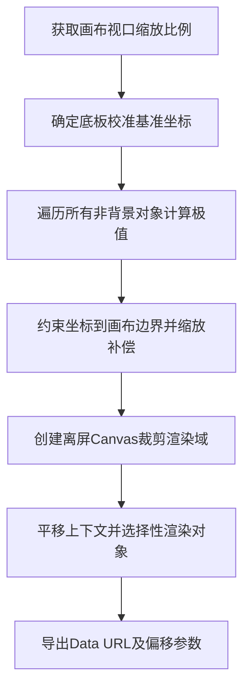

> 💭 嗯，用户给了一段Fabric.js相关的代码，想要详细讲解这段代码。首先，我需要理解代码的大致功能。看起来这段代码是为了生成画布中对象的缩略图，并且处理了边界计算、坐标系转换、离屏渲染等问题。
>
> 我需要先分步骤解析代码的各个部分。首先，用户从canvas的viewportTransform获取缩放比例，然后遍历所有图层计算边界，调整坐标，创建离屏Canvas进行渲染，最终导出数据URL。这一系列步骤需要逐个弄清楚。
>
> 接下来要考虑用户可能的背景。他可能在开发一个基于Fabric.js的图形编辑器，需要实现截图或缩略图生成功能，但遇到了问题，比如边界计算不正确，或者图片生成的位置有偏差。或者对Fabric.js的一些概念不太清楚，比如viewportTransform、对象的坐标获取等。
>
> 用户提供的代码中有一些特殊的处理，比如计算gap的调整，可能是因为底板存在偏移，需要手动调整。用户可能在开发中发现生成的缩略图位置不对，底板周围有多余的空间，需要裁剪掉这部分，所以有关于gap的计算。
>
> 另外，在处理坐标的时候，用户提到底板左上角是(-6,-6)，右下角是(6,6)，这可能暗示底板的位置有偏移，需要通过调整gap来补偿。这部分可能需要结合具体项目中的底板设计来理解，但用户没有给出全部代码，所以需要基于现有代码进行推断。
>
> 在遍历对象时，跳过带有特定ID的对象（比如WorkspaceCavas），可能是为了不将背景层包含在缩略图中。然而代码中注释显示用户尝试过获取底板的coordsOne，但后来改为使用第一个对象的坐标，这可能存在潜在的问题，比如第一个对象不一定总是底板，导致后续计算错误。
>
> 关于坐标系的变换，用户用到了viewportTransform的缩放因子xScale和yScale，这涉及到Fabric画布的缩放和视口变换。计算minX, maxX时除以缩放因子可能是为了将当前缩放后的坐标转换回原始尺寸，确保离屏Canvas正确捕获实际内容。
>
> 用户可能存在一些错误的认识，例如认为coordsOne是底板的坐标，但实际上代码中使用了this.canvas.getObjects()[0].getCoords()，这取决于对象添加的顺序，如果第一个对象不是底板，后续的坐标调整可能会出错。比如，后面处理每个对象时，都减去coordsOne[0].x和y，这可能是为了将所有对象相对于底板进行定位，但如果第一个对象不是底板，就会导致所有坐标错误。
>
> 另外，gap的计算部分，用户假设x<0或y<0的情况，可能是底板周围存在一定的内边距或偏移，需要动态计算这个间隙，但代码中的逻辑如果遇到其他对象坐标不在负值区域，可能会导致gap计算不正确，从而影响最终的maxX和maxY的调整。例如，如果底板的坐标为负，其他对象坐标为正，调整后的最大坐标可能会错误地减去不正确的gap，导致离屏Canvas的尺寸计算有误。
>
> 在离屏Canvas渲染部分，用户遍历所有对象，排除特定ID的对象，使用obj.render方法在离屏上下文绘制。需要注意的是，在Fabric.js中，直接调用render可能不会考虑某些状态或变换，可能需要手动处理。例如，是否需要应用视口变换或对象的变换矩阵，如果没有正确处理，可能导致渲染的位置不正确。
>
> 还有，用户在导出的dataURL中返回了minX和minY，这可能是用于定位生成的图片在原始画布中的位置，以便进行后续处理。但在代码中是否正确地处理了这些值的缩放和限制到画布尺寸（通过Math.min和Math.max）需要验证，避免出现负数或超过画布大小的情况。
>
> 潜在的问题可能包括：依赖第一个对象作为底板可能不可靠，导致坐标计算的基准错误；gap的动态计算逻辑是否覆盖所有可能的边界情况；视口缩放因子的应用是否正确，尤其是在存在多级缩放或变形的情况下；离屏渲染时是否处理了所有必要的上下文状态，如缩放、旋转等。
>
> 最后，用户需求可能是希望正确生成所有可见对象（排除背景）的缩略图，并且正确裁剪到内容区域。可能需要建议改进坐标基准的获取方式，确保稳定地定位到底板，或者考虑其他方法（如使用Fabric的toDataURLWithMultiplier或clipPath功能），或者处理视口变换对整个画布的影响，使生成的缩览图与实际显示一致。
>
> 


这段代码主要用于从 Fabric.js 画布中提取可视内容的缩略图，属于典型的多图层截取逻辑。下面逐步拆解核心功能：

---

### 一、坐标体系预处理
#### 1. 获取视口变换矩阵
```typescript
const viewportTransform = this.canvas.viewportTransform; // 画布的平移/缩放矩阵
xScale = viewportTransform[0]; // X轴缩放因子
yScale = viewportTransform[3]; // Y轴缩放因子
```
- **作用**：记录画布当前的缩放比例，用于补偿后续坐标计算

#### 2. 基准点校准
```typescript
// 获取第一个图层（通常是底板）的坐标集（4个角坐标）
let coordsOne = this.canvas.getObjects()[0].getCoords(); 

// 估算底板周围的内边距（gap）
let gap = (coordsOne[0].x < 0) ? -coordsOne[0].x * 2 : 12; 
```
- **假设**：底板可能有负坐标偏移，如 `(-6,-6)` 到 `(6,6)` 存在默认12px padding
- **问题**：若第一个对象不是底板，后续所有计算可能会产生偏差

---

### 二、动态边界探测
#### 分层遍历逻辑
```typescript
this.canvas.getObjects().forEach((obj: any) => {
  if (!obj.id?.includes(WorkspaceID.WorkspaceCavas)) { // 跳过背景层
    const coords = obj.getCoords();
    coords.forEach(({ x, y }) => { // 处理每个对象的四个角点
      // 使用第一个对象坐标为基准校正全局坐标
      x = x - coordsOne[0].x; 
      y = y - coordsOne[0].y;

      // 更新连续型边界极值
      minX = Math.min(minX, x);
      minY = Math.min(minY, y);
      ...
    });
  }
});
```
- **边界收缩**：通过遍历所有对象的所有坐标，计算内容实际占据的最大矩形区域
- **特殊处理**：根据动态计算的 `maxX -= gap` 补偿内边距

---

### 三、视口缩放补偿
```typescript
// 将相对坐标转换回原始比例
minX = Math.max(minX / xScale, 0);        // 避免负值
maxX = Math.min(maxX / xScale, bgWidth);  // 限制在画布宽度内
...
```
- **关键约束**：所有的坐标必须基于原始缩放比例（1x）和画布尺寸进行约束

---

### 四、离屏渲染流程
#### 1. Canvas初始化
```typescript
offscreenCanvas.width = maxX - minX;      // 动态尺寸
offscreenCanvas.height = maxY - minY;
offscreenCtx.translate(-minX, -minY);     // 坐标原点平移
```

#### 2.选择性渲染
```typescript
this.canvas.getObjects().forEach(obj => {
  if (!obj.id?.includes('WorkspaceCavas')) {
    obj.render(offscreenCtx!); // 手动触发Fabric对象绘制
  }
});
```
- **跳过机制**：通过对象ID过滤背景图层（WorkspaceID.WorkspaceCavas）

---

### 五、潜在风险点
1. **基准坐标依赖**：硬编码依赖第一个对象（`this.canvas.getObjects()[0]`）作为校准基准，需确保底板始终是第一个对象
2. **Gap计算逻辑**：`gap = -x * 2` 的启发式算法可能在某些场景失效（如镜像翻转后的坐标）
3. **缩放补偿问题**：直接除法（`x / xScale`）未考虑矩阵其他项（如斜切）
4. **未处理旋转**：`obj.render()` 可能未正确处理对象旋转角度（需应用完整变换矩阵）

---

### 六、优化建议
```typescript
// 建议: 通过Fabric内置方法获取对象包围盒
obj.getBoundingRect(); // 直接返回 { left, top, width, height }
```
```typescript
// 建议: 使用原始尺寸渲染优化画质
this.canvas.setViewportTransform([1,0,0,1,0,0]); // 临时重置视口变换
```

---

### 流程总结


这个实现的核心难点在于动态内容边界的精准裁剪 + 多图层渲染的坐标转换控制，实际应用中建议结合 Fabric.js 的特性进一步优化精度。
