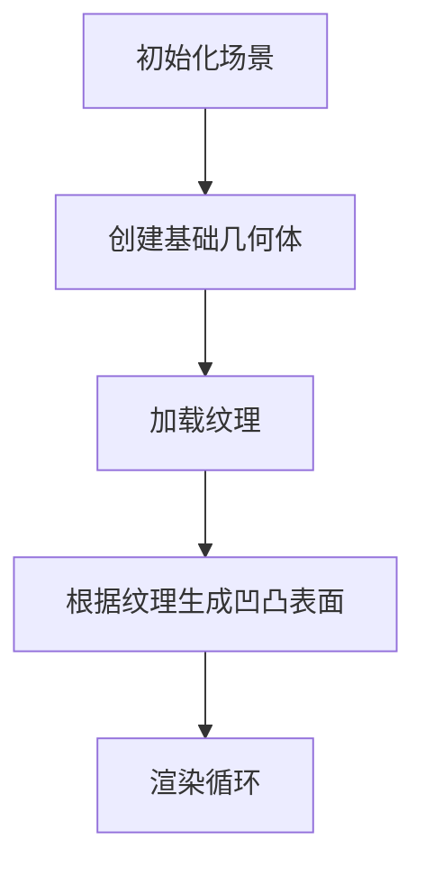

---

### **第一步：认识Three.js的三大核心组件**
任何Three.js程序都围绕这三个核心对象展开：

1. **场景（Scene）**  
   - 相当于一个3D舞台，所有物体都放在这里  
   - 代码中的 `this.scene = new THREE.Scene()`

2. **相机（Camera）**  
   - 相当于观众的眼睛，决定看到什么画面  
   - 示例中的透视相机：  
   ```typescript
   new THREE.PerspectiveCamera(30, 宽高比, 1, 4000)
   ```

3. **渲染器（Renderer）**  
   - 负责把3D场景转换成2D画面显示在网页上  
   - 创建代码：  
   ```typescript
   new THREE.WebGLRenderer({ antialias: true })
   ```

---

### **第二步：代码整体结构解析**
这段代码是一个 **旋转体生成器**（比如生成杯子、花瓶等圆形物体）。核心流程：



---

### **第三步：逐模块拆解**

#### **1. 初始化阶段 (`init`方法)**
```typescript
// 创建相机（观众的眼睛）
const camera = new THREE.PerspectiveCamera(
  30, // 视野角度（类似人眼的视野）
  container.offsetWidth / container.offsetHeight, // 屏幕宽高比
  1, // 最近可见距离
  4000 // 最远可见距离
)
camera.position.set(0, 60, 350 + max) // 设置相机位置

// 创建场景（舞台）
const scene = new THREE.Scene()

// 添加灯光（让物体可见）
scene.add(new THREE.AmbientLight(0x666666, 2)) // 环境光
scene.add(new THREE.DirectionalLight(0xffffff, 2.7)) // 方向光

// 创建渲染器（摄影师）
const renderer = new THREE.WebGLRenderer({ 
  antialias: true // 开启抗锯齿
})
renderer.setSize(容器宽度, 容器高度) // 设置画布大小
```

#### **2. 创建几何体 (`create`方法)**
代码中创建了多种基础几何体组合成一个杯子：

| 几何体类型          | 作用                  | 示例参数                           |
|---------------------|-----------------------|-----------------------------------|
| 圆柱体 (Cylinder)   | 杯身主体              | 上半径、下半径、高度              |
| 圆环 (Torus)        | 杯口和杯底的金属环    | 主半径、环半径                    |
| 圆形平面 (Circle)   | 杯底                  | 半径                              |
| 管道 (Tube)         | 杯把手                | 路径曲线、粗细                    |

**关键代码示例**：
```typescript
// 创建杯身
const cylinderGeometry = new THREE.CylinderGeometry(
  upperRadius, // 上口半径
  lowerRadius, // 底部半径
  height,      // 高度
  60,          // 圆周分段数（值越大越圆滑）
  60,          // 高度分段数
  true         // 是否生成底面
)
const cylinder = new THREE.Mesh(cylinderGeometry, material)
scene.add(cylinder)
```

#### **3. 动态纹理处理 (`getTextureGeometry`)**
这是代码最复杂的部分，但核心思路很简单：

1. 加载一张灰度图（黑白图片）  
   - 白色代表凸起，黑色代表凹陷
   - 示例灰度图：  
   

2. 通过Canvas分析每个像素的灰度值  
```typescript
// 创建Canvas分析像素
const canvas = document.createElement('canvas')
const ctx = canvas.getContext('2d')!
ctx.drawImage(image, 0, 0, canvas.width, canvas.height)

// 获取像素数据
const imageData = ctx.getImageData(0, 0, canvas.width, canvas.height)
const pixels = imageData.data // 包含RGBA值的数组
```

3. 根据灰度值调整3D模型的顶点位置  
```typescript
for (let i = 0; i < vertices.length; i += 3) {
  const gray = 获取对应像素的灰度值
  vertices[i] += gray * 缩放系数 // 调整X坐标
  vertices[i+1] += gray * 缩放系数 // 调整Y坐标
  vertices[i+2] += gray * 缩放系数 // 调整Z坐标
}
```

#### **4. 交互与控制**
```typescript
// 添加轨道控制器（允许鼠标拖拽旋转）
const controls = new OrbitControls(camera, renderer.domElement)
controls.target.set(0, 0, 0) // 设置旋转中心

// 窗口大小变化时自适应
window.onresize = () => {
  renderer.setSize(容器新宽度, 容器新高度)
}
```

#### **5. 资源清理 (`removeScene`)**
当不需要显示时，必须手动释放资源：
```typescript
// 示例释放一个物体
scene.traverse(obj => {
  if (obj instanceof THREE.Mesh) {
    obj.geometry.dispose() // 删除几何体
    obj.material.dispose() // 删除材质
  }
})
```

---

### **第四步：学习Three.js的步骤建议**
如果想进一步学习，建议按照这个路径：

1. **基础入门**  
   - 官方示例：https://threejs.org/examples  
   - 推荐教程：Three.js Journey（付费但质量极高）

2. **核心概念**  
   - 坐标系系统（X/Y/Z轴方向）
   - 几何体与材质的关系
   - 光照与阴影设置

3. **调试工具**  
   - 使用dat.GUI快速创建控制面板  
   ```typescript
   import { GUI } from 'dat.gui'
   const gui = new GUI()
   gui.add(camera.position, 'z', 0, 1000).name('相机距离')
   ```

4. **性能优化**  
   - 合并几何体（Geometry Merging）
   - 使用实例化渲染（InstancedMesh）
   - 纹理压缩

---

### **第五步：这段代码的运行效果**
最终生成的3D物体大致是这样的结构：  


1. **主体结构**：多个圆柱体叠加形成杯壁  
2. **表面细节**：通过灰度图生成的凹凸纹理  
3. **附加组件**：把手、杯口金属环等装饰物

---

现在你已经对这段代码有了基本的理解！接下来如果想实际运行：  
1. 安装依赖：`npm install three @types/three`  
2. 在网页中创建一个`<div>`作为容器  
3. 调用`new RotatingBodyScene(容器).init(参数)`  

遇到具体问题可以再深入讨论某个细节~
