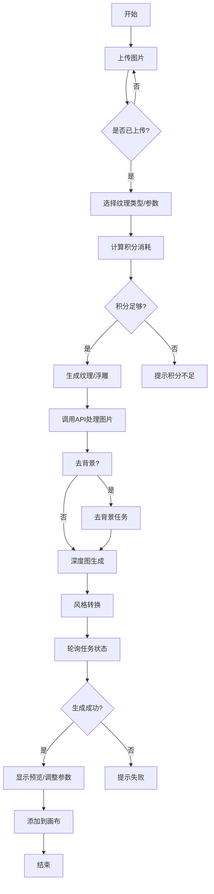

以下是对代码的详细讲解及逻辑流程图：

---
### 流程图


---
### 代码逻辑详解

#### 1. 组件初始化与状态管理
- **导入依赖**：使用React Hooks、UI组件（Radio/Slider）、工具类（图片处理、API调用）等。
- **状态变量**：
  - `downUpload`：存储用户上传的图片数据。
  - `textureStyle`：当前选择的纹理类型（Color/Gloss/Relief）。
  - `thicknessValue`/`contrastValue`：控制厚度和对比度的参数。
  - `isCreating`：标记生成过程是否进行中。

#### 2. 图片上传逻辑
- **上传方式**：支持点击上传和拖拽上传。
  ```javascript
  const uploads_click = () => {/* 创建input元素处理文件选择 */}
  const handleDragOver = () => {/* 阻止默认拖拽行为 */}
  const uploadIamge = () => {/* 处理拖拽文件 */}
  ```
- **格式限制**：仅允许JPEG/PNG/WEBP/SVG，大小≤50MB。

#### 3. 参数调整与实时预览
- **Slider控件**：调整厚度和对比度，触发`handleThicknessChange`和`handleContrastChange`。
  ```javascript
  <Slider value={thicknessValue} onChange={handleThicknessChange} />
  ```
- **反色开关**：`Switch`组件控制`isInvert`状态，实时更新灰度图。

#### 4. 生成逻辑
- **积分检查**：根据操作类型（去背景/深度图）动态计算积分。
  ```javascript
  const fun = (removeBg) => {/* 计算积分消耗 */}
  ```
- **API调用链**：
  1. **去背景任务**（可选）：调用`removebgTask`。
  2. **深度图生成**：使用`createTask`和轮询`getTask`。
  3. **风格转换**：通过`createStyleTask`和`getCreateStyleTask`。
- **轮询机制**：定时检查任务状态，更新进度条。
  ```javascript
  const pollInterval = setInterval(() => {/* 更新进度 */}, 100);
  ```

#### 5. 结果处理
- **预览渲染**：使用`TextureScene`组件展示3D效果。
  ```javascript
  textureScene.current.init({ grayData, colorBase64 });
  ```
- **添加到画布**：将生成的纹理/浮雕导入Canvas编辑器。
  ```javascript
  canvasEditor.addTextureImage(textureUrl, { textureType, grayscale });
  ```

#### 6. 异常处理
- **超时机制**：API调用设置超时（10秒），失败时提示用户。
  ```javascript
  const timeoutPromise = new Promise((_, reject) => 
    setTimeout(reject, 10000));
  ```
- **错误提示**：使用`editorToastShow`显示错误信息。

#### 7. 数据缓存与同步
- **参数缓存**：使用`useDataCache`存储滑块值，离开页面时同步更新。
  ```javascript
  setCacheItem('thicknessValue', newValue);
  ```
- **资产刷新**：生成成功后触发`eventBus`更新“我的资产”列表。

---
### 关键函数说明

| 函数名                | 功能描述                               |
|-----------------------|----------------------------------------|
| `handleCreate`        | 整合API调用链，处理生成逻辑            |
| `updateTextureHandler`| 更新纹理参数并同步到后端               |
| `addToCanvasHandler`  | 将生成的纹理添加到画布                 |
| `aiPicReport`         | 记录AI生图统计信息                     |
| `handleCacheData`     | 更新本地缓存，确保数据持久化           |

---
### 总结
该组件实现了一个完整的纹理/浮雕生成流程，涵盖图片上传、参数调整、异步任务处理、状态管理和结果预览。通过结合轮询机制和实时参数更新，提供了流畅的用户体验。积分系统和异常处理增强了功能的健壮性。
