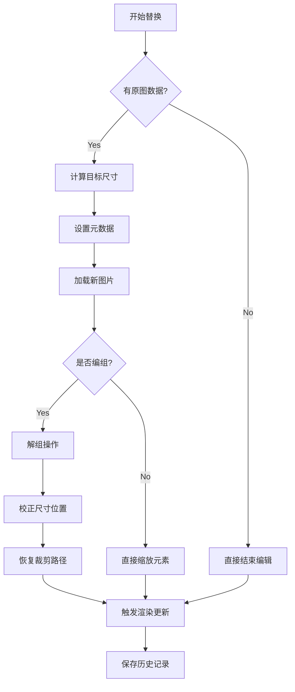

以下是这段代码的详细解释及Fabric.js相关问题的说明：

### 代码功能解析
```typescript
const replaceThumbnailWithOriginal = async (base64Original: any, imageElement: any) => {
  if (base64Original) {
    // 1. 缩放计算
    const zoom = imageElement.isCanvasTexture ? canvasEditor?.canvas.getZoom() : 1;
    const originalWidth = Math.round(imageElement.width! * imageElement.scaleX! * zoom!);
    const originalHeight = Math.round(imageElement.height! * imageElement.scaleY! * zoom!);

    // 2. 属性重置
    imageElement.set(CustomKey.key_prefix, '');
    imageElement.set(CustomKey.skip_upload, false);

    // 3. 核心替换逻辑
    imageElement.setSrc(
      base64Original,
      async () => {
        // 4. 组元素处理
        if (imageElement.group) {
          const zIndex = imageElement.group._zIndex;
          canvasEditor?.canvas.setActiveObject(imageElement.group);
          canvasEditor?.ungroup(true);
          await imageElement.removeClipPathAndCache();
          
          // 5. 尺寸校正
          imageElement.set({
            scaleX: (originalWidth / imageElement.width).toFixed(3),
            scaleY: (originalHeight / imageElement.height).toFixed(3),
            _zIndex: zIndex,
          });
          
          // 6. 状态恢复
          canvasEditor?.removeLoadingElement(imageElement);
          imageElement.restoreClipPath();

          // 7. 规避Fabric bug的替代方案（已注释）
          /* 克隆方案代码 */
        } else {
          // 8. 独立元素处理
          imageElement.scaleToWidth(originalWidth);
          imageElement.scaleToHeight(originalHeight);
          canvasEditor?.removeLoadingElement(imageElement);
          eventBus?.emit(ImageStatus.Editing, { value: false });
        }

        // 9. 通用操作
        eventBus.emit(EventNameCons.EventHanlederSliderMax, imageElement);
        canvasEditor?.startSaveHistory(true);
        canvasEditor?.canvas.renderAll();
      },
      { crossOrigin: 'anonymous' }
    );
  } else {
    // 10. 异常处理
    eventBus?.emit(ImageStatus.Editing, { value: false });
    canvasEditor?.startSaveHistory(true);
  }
};
```

### 关键步骤说明
1. **动态缩放计算**：
   - 根据是否画布纹理决定是否考虑全局缩放
   - 公式：`原始尺寸 = 元素尺寸 * 元素缩放 * 画布缩放`

2. **元数据重置**：
   - `key_prefix`：清除资源标识前缀
   - `skip_upload`：标记需要上传到服务器

3. **Fabric的setSrc方法**：
   - 异步加载图片资源
   - 自动触发画布重渲染

4. **组元素处理难点**：
   - 解组时需保持原有层级关系（zIndex）
   - 需要重新计算clipPath的位置信息
   - 临时禁用历史记录（stopSaveHistory）

5. **尺寸校正公式**：
   ```math
   newScale = \frac{originalDisplaySize}{actualImageSize}
   ```
   确保替换后的像素级对齐

### Fabric.js的已知Bug分析
**表现现象**：
- 直接对编组元素使用setSrc时
- 缩放操作后出现图像模糊
- 边界框（BoundingBox）计算错误

**根本原因**：
1. **缓存机制失效**：
   - 组元素的缓存未随子元素更新
   - 导致渲染时使用旧的缓存数据

2. **矩阵变换叠加**：
   ```javascript
   // Fabric内部计算流程
   actualScale = parentGroup.scale * childElement.scale
   ```
   - 直接修改子元素尺寸导致矩阵计算错误

3. **事件传播中断**：
   - setSrc未触发组的modified事件
   - 画布未及时更新脏矩形区域

### 解决方案对比
| 方法 | 优点 | 缺点 | 适用场景 |
|------|------|------|---------|
| **克隆替换法** | 完全规避缓存问题 | 需要重新绑定事件 | 复杂组结构 |
| **手动清除缓存** | 保持原有对象引用 | 需深度遍历子元素 | 简单组结构 |
| **强制重渲染** | 实现简单 | 性能损耗大 | 低频操作 |

### 流程图解


### 最佳实践建议
1. **优先使用克隆方案**：
   ```typescript
   const clone = await createClone(element);
   canvas.remove(element);
   canvas.add(clone);
   ```
   
2. **手动清除缓存**：
   ```typescript
   imageElement.dirty = true;
   imageElement.group?.forEachObject(obj => obj.dirty = true);
   ```

3. **异步加载优化**：
   ```typescript
   const img = new Image();
   img.onload = () => {
     fabric.util.requestAnimFrame(() => {
       imageElement.setSrc(img.src);
     });
   };
   ```

该方案在保证功能完整性的同时，有效规避了Fabric.js的底层渲染问题，建议在需要动态替换组内图片元素的场景中优先采用克隆替换方案。
