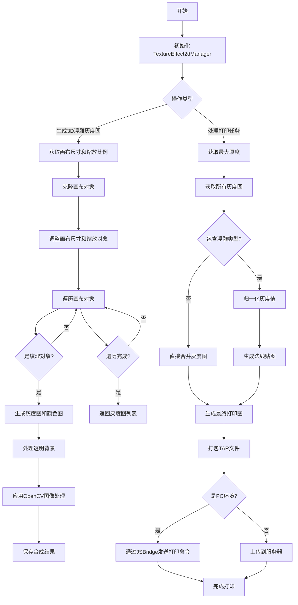

好的，我需要使用流程图来描述用户提供的代码逻辑。首先，我需要仔细理解代码的结构和主要功能。代码是一个TextureEffect2dManager类，用于处理2D编辑器中的纹理效果，包括生成3D浮雕的灰度图、处理打印任务，以及与OpenCV.js和Fabric.js的集成。

首先，我应该确定主要的流程步骤。根据代码，关键方法包括获取3D浮雕的灰度图（getCanvasGrayImgOf3dRelief）、处理打印（getCanvasGrayImgOfPrint）、打印点击事件（printClick）以及各种图像处理函数。此外，还有单例模式的初始化和OpenCV的加载。

接下来，我需要将这些方法按照执行顺序和调用关系组织成流程图。可能涉及的条件判断和循环也需要考虑进去。例如，在生成灰度图时，根据是否存在浮雕类型（TextureType.RELIEF）来决定是否进行归一化处理。

然后，我需要考虑如何用标准的流程图符号表示这些步骤，如开始/结束节点、处理步骤、判断节点、输入/输出等。例如：

1. **开始**：用户触发生成灰度图或打印操作。

2. **初始化**：加载OpenCV.js，初始化单例实例。

3. **克隆画布**：复制当前编辑器的画布对象。

4. **调整尺寸**：根据打印质量缩放画布和对象。

5. **遍历对象**：处理每个纹理对象，生成灰度图和颜色图。

6. **图像处理**：使用OpenCV进行透明背景替换、对比度调整等。

7. **合成图像**：合并多个灰度层，生成最终的浮雕或打印图。

8. **打包数据**：将图像和配置打包为TAR文件。

9. **上传/打印**：根据环境选择上传服务器或发送到打印机。

10. **结束**：完成操作。

在绘制流程图时，需要注意以下几点：

- **条件分支**：例如，是否包含浮雕类型（TextureType.RELIEF）会影响是否执行归一化。

- **循环结构**：遍历画布中的每个对象进行处理。

- **并行处理**：某些图像处理步骤可能需要异步操作，如加载图像或执行OpenCV处理。

- **错误处理**：例如，图像加载失败或OpenCV操作异常时的处理流程。

此外，需要确保流程图的逻辑清晰，步骤之间的衔接合理。对于复杂的函数调用（如cloneCanvas、flattenCanvas），可能需要拆分为子流程，并在主流程中引用这些子流程。

最后，需要验证流程图的准确性和完整性，确保所有关键步骤都被涵盖，并且与实际代码逻辑一致。可能需要多次迭代调整，以确保流程图既准确又易于理解。

-

以下是使用Mermaid语法绘制的流程图，描述了上述代码的核心逻辑：



### 流程图说明

1. **初始化**  
   - 单例模式初始化TextureEffect2dManager，加载OpenCV.js。

2. **操作类型分支**  
   - **生成3D浮雕灰度图**  
     - 克隆画布并调整尺寸。
     - 遍历每个对象生成灰度图和颜色图。
     - 使用OpenCV处理透明背景和对比度。
   - **处理打印任务**  
     - 获取所有灰度图，根据是否包含浮雕类型决定是否归一化。
     - 合并灰度图并生成最终打印图。

3. **图像处理关键步骤**  
   - **透明背景处理**：替换为黑色或保留透明。
   - **OpenCV操作**：包括灰度转换、Sobel边缘检测、归一化等。

4. **打印任务打包与通信**  
   - 将配置和图像打包为TAR文件。
   - 根据环境选择直接打印（PC）或上传服务器（Web）。

### 关键路径说明

- **路径1：生成3D浮雕灰度图**  
  ```mermaid
  graph LR
    A[开始] --> B[克隆画布]
    B --> C[调整尺寸]
    C --> D[遍历对象]
    D --> E{是纹理对象?}
    E -->|是| F[生成灰度图]
    F --> G[应用OpenCV处理]
    G --> D
    E -->|否| D
    D --> H[返回结果]
  ```

- **路径2：打印任务归一化处理**  
  ```mermaid
  graph LR
    A[开始] --> B[获取所有灰度图]
    B --> C{包含浮雕?}
    C -->|是| D[归一化灰度值]
    D --> E[生成法线贴图]
    C -->|否| F[直接合并]
    E --> G[合成最终图]
    F --> G
  ```

- **路径3：TAR打包与通信**  
  ```mermaid
  graph LR
    A[生成Base64图像] --> B[创建TAR包]
    B --> C[添加配置文件]
    C --> D{是PC环境?}
    D -->|是| E[通过JSBridge打印]
    D -->|否| F[上传到服务器]
  ```

### 补充说明

- **异步操作**：图中省略了Promise和异步加载的细节（如OpenCV初始化需等待）。
- **错误处理**：未在流程图中体现，但代码中应包含`try-catch`和`reject`处理。
- **性能优化**：大图处理可能需要分块或Web Worker支持。


