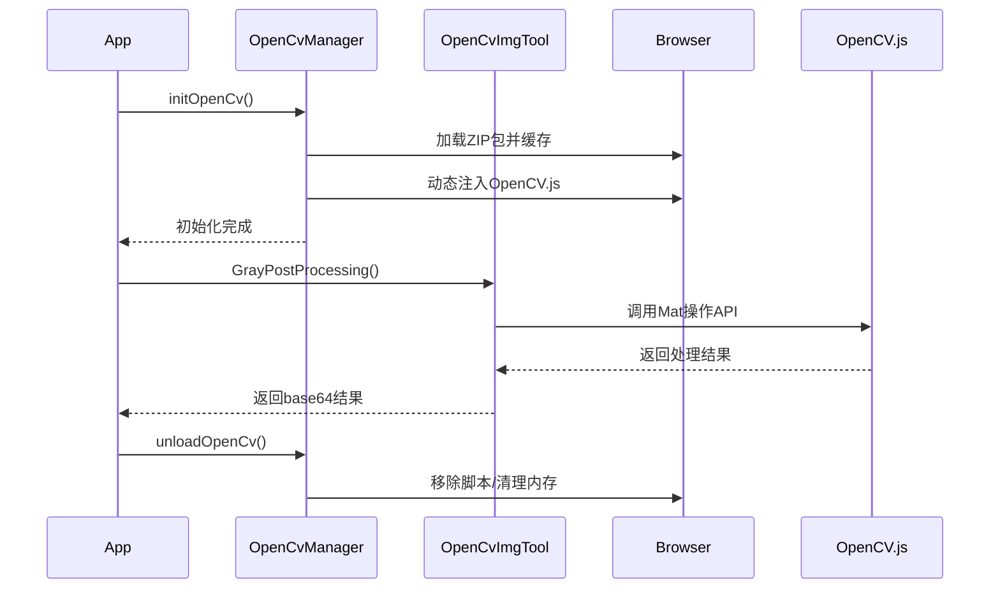

以下是这两段代码的详细功能解析，分为模块说明和协作关系两部分：

### 一、模块说明

#### 1. OpenCvImgToolMangager 图像处理工具类
**核心功能**: 提供基于OpenCV.js的浏览器端图像处理能力，封装常用图像操作。

##### 关键方法：
* **灰度后处理 (GrayPostProcessing)**
```typescript
// 冰箱贴专用：结合去背图Alpha通道与灰度图，生成边缘透明的灰度图
输入：去背图base64、灰度图base64
输出：合成后的base64（透明区域变黑）
流程：
1. 分离去背图的Alpha通道 → 获取透明区域蒙版
2. 将蒙版与灰度图相乘 → 保留有效区域的灰度值
3. 叠加到黑色背景 → 生成最终效果
```

* **最小外接矩形裁剪 (getImgExternalRect)**
```typescript
// 自动裁剪图像内容区域
输入：任意图像base64
输出：裁剪后的base64
流程：
1. 转灰度 → 二值化 → 找轮廓
2. 计算最大轮廓的外接矩形 → 裁剪原图
```

* **格式转换工具**
```typescript
base64 ↔ Mat ↔ Blob ↔ File 互转
支持：RGBA/RGB通道处理、尺寸调整、质量压缩
```

* **内存管理**
```typescript
显式调用delete()释放Mat对象
自动清理Canvas等浏览器资源
```

#### 2. OpenCvManager OpenCV引擎管理类
**核心功能**: 管理OpenCV.js的加载/卸载，提供Wasm模块的缓存优化。

##### 关键技术点：
* **按需加载**
```typescript
动态创建<script>标签加载OpenCV.js
首次加载后缓存到IndexedDB，后续加载秒开
```

* **Wasm优化**
```typescript
将OpenCV.js打包为ZIP（体积减少70%）
通过JSZip实时解压，避免服务器配置问题
```

* **Safari兼容**
```typescript
使用MutationObserver监听cv对象注入
特殊处理Promise解析问题，避免卡死
```

* **资源释放**
```typescript
unloadOpenCv() 移除脚本、删除全局cv
防止SPA应用内存泄漏
```

### 二、协作关系

#### 典型工作流程


#### 设计亮点
1. **性能优化**
   - Wasm缓存使二次加载速度提升5-10倍
   - 异步流水线处理避免界面卡顿

2. **跨浏览器兼容**
   - 动态加载机制兼容IE11+ 
   - Safari特殊处理保障稳定性

3. **工程化封装**
   - 单例模式避免重复初始化
   - 统一错误处理链
   - 类型安全的TypeScript接口

#### 典型应用场景
1. 在线图片编辑器 - 实现专业级滤镜
2. 智能证件照 - 自动裁剪/背景处理
3. 工业质检系统 - 浏览器端实时缺陷检测
4. 医疗影像查看器 - DICOM图像增强处理

> **注**：实际开发中建议添加以下增强：
> 1. 增加OpenCV版本管理
> 2. 实现Web Worker多线程处理
> 3. 添加GPU加速支持（通过WebGL）
> 4. 完善单元测试覆盖率
