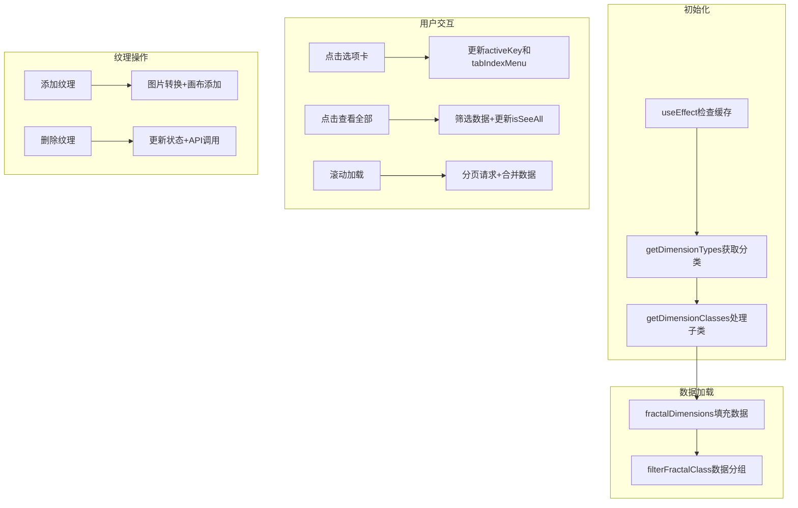
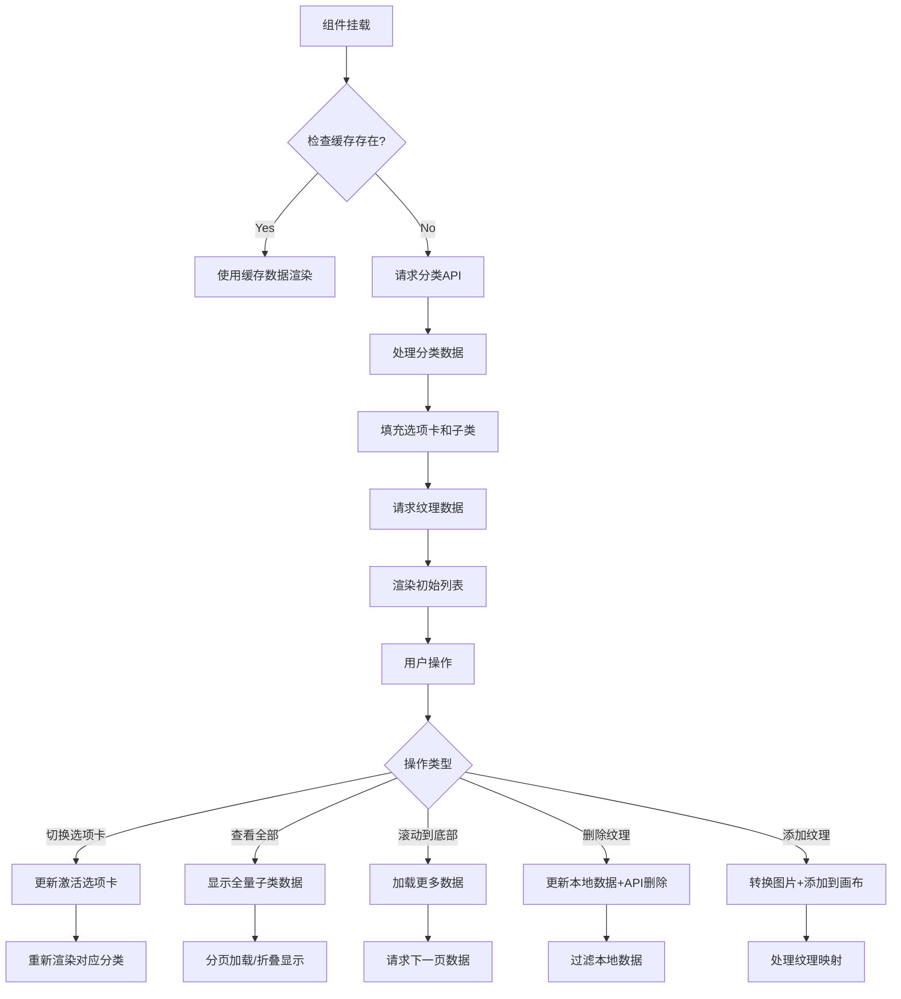

以下是代码逻辑的详细讲解和流程图表示：

### 逻辑分析
1. **组件结构**：
   - 顶部导航栏（返回按钮 + 标题）
   - 创建新纹理按钮
   - 选项卡切换区域（显示大类）
   - 数据列表区域（显示纹理列表）

2. **核心功能**：
   - 分类展示纹理（CMYK/Gloss/Relief）
   - 查看全部功能（分页加载）
   - 纹理添加至画布
   - 纹理删除
   - 我的资产管理（用户上传的纹理）

3. **数据流**：
   ```mermaid
   graph TD
   A[初始化] --> B{检查缓存}
   B -- 有缓存 --> C[使用缓存数据渲染]
   B -- 无缓存 --> D[API请求分类数据]
   D --> E[处理分类数据]
   E --> F[填充选项卡和子类]
   F --> G[渲染界面]
   G --> H[用户交互]
   H --> I[切换选项卡/查看全部]
   H --> J[滚动加载]
   H --> K[删除纹理]
   H --> L[添加纹理到画布]
   I --> M[更新状态/重新渲染]
   J --> N[分页请求数据]
   K --> O[更新本地状态+API删除]
   L --> P[图片处理+画布操作]
   ```

4. **关键函数流程**：


### 流程图


### 关键代码逻辑说明
1. **数据初始化**：
   - 通过`useEffect`检查缓存，没有缓存则调用`getDimensionTypes`
   - `getDimensionTypes`获取纹理大类（Color/Gloss等）
   - `getDimensionClasses`获取子类数据并结构化为可渲染格式

2. **动态加载**：
   - 使用`Intersection Observer`模式监听滚动事件
   - 滚动到底部时触发`getMoreMyAssetsData`分页加载
   - 通过`useRef`保持分页页码状态

3. **纹理操作**：
   - **添加**：转换图片为Base64，调用Canvas编辑器API添加
   - **删除**：同时更新本地状态和调用后端API
   - **替换**：加载高清图时使用Worker处理对比度调整

4. **状态管理**：
   - 使用`useState`管理界面状态（是否查看全部、加载中等）
   - 使用`useDataCache`缓存分类数据减少重复请求
   - 通过`eventBus`实现跨组件通信（如刷新列表）

5. **性能优化**：
   - 使用`useCallback`和`useMemo`缓存函数/计算结果
   - 分页加载使用`debounce`防止重复请求
   - 图片加载使用Web Worker处理Base64转换

这个组件通过分层的数据加载策略和精细的状态管理，实现了高效的纹理库展示和操作功能。核心亮点是将API数据转换为可渲染的树形结构，同时处理复杂的用户交互场景。
