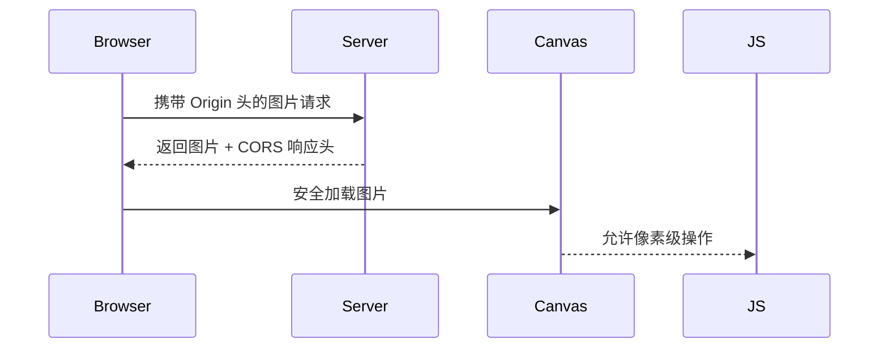

在代码中，图片跨域问题主要通过以下方式进行处理：

### 1. 跨域属性设置
在 `replaceThumbnailWithOriginal` 函数中，通过 `crossOrigin: 'anonymous'` 参数处理跨域：

```typescript
imageElement.setSrc(
  base64Original,
  async () => {
    // ...回调逻辑
  },
  { crossOrigin: 'anonymous' } // 关键跨域配置
)
```

### 2. 工作原理
| 机制 | 说明 | 效果 |
|------|------|------|
| CORS 请求 | 通过 `crossOrigin` 属性发起带 Origin 头的跨域请求 | 浏览器自动添加 `Origin` 请求头 |
| 服务端配合 | 需要图片服务器返回 `Access-Control-Allow-Origin` 响应头 | 允许指定域或通配符 `*` 访问资源 |
| Canvas 安全 | 使用合法跨域方式加载的图片不会污染 Canvas | 允许后续像素级操作 |

### 3. 实现流程图


### 4. 关键代码解析
```typescript
// 设置跨域属性
const imageOptions = {
  crossOrigin: 'anonymous', // 关键配置
  // 其他参数...
};

// 加载图片时
imageElement.setSrc(url, callback, imageOptions);
```

### 5. 注意事项
1. **服务端配置要求**：
   ```http
   Access-Control-Allow-Origin: *
   Access-Control-Allow-Methods: GET
   ```

2. **安全限制**：
   - 使用 `anonymous` 模式时不发送 Cookies
   - 需要 HTTPS 环境下的安全加载

3. **备选方案**：
   ```typescript
   // 使用代理服务中转
   const proxyUrl = `https://cors-proxy/${encodeURIComponent(originalUrl)}`;
   
   // Base64 转换（需注意内存消耗）
   const base64 = await convertToBase64(url);
   ```

### 6. 常见问题处理
| 问题现象 | 解决方案 |
|---------|----------|
| 403 Forbidden | 检查服务端 CORS 配置 |
| Canvas 污染 | 确保使用正确的 crossOrigin 属性 |
| 图片加载失败 | 添加错误处理回调 |

这种处理方式在保证安全性的前提下，既遵守了浏览器的安全策略，又满足了图像编辑功能对像素级操作的需求。实际应用中需要确保图片服务器的 CORS 配置与前端加载方式相匹配。
